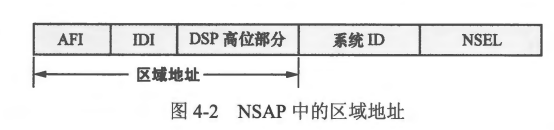
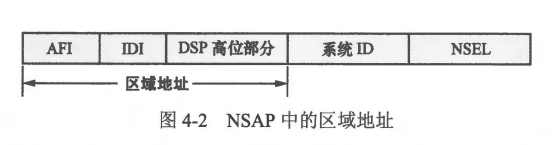
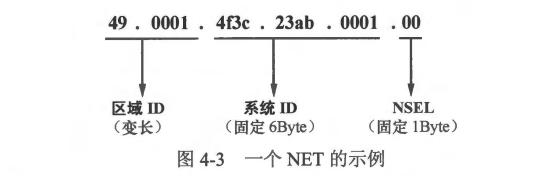

### 4.1.3  本章内容概述和教学目标
- IS-IS (Intermediate System to Intermediate System， 中间系统到中间系统）是一种链路状态路由协议，在服务提供商网络中被广泛应用。IS-IS 与 OSPF 在许多方面非常相似，例如运行 IS-IS 的直连设备之间会通过 Hello 报文发现彼此，然后建立邻居关系，并交互链路状态信息，这些链路状态信息表现为 LSP (Link-State Packet， 链路状态报文）。每一台运行 IS-IS 的设备都会产生 ISP，设备产生的 LSP 会被泛洪到网络中适当的范围，所有的设备都将自己产生的、以及网络中泛洪的LSP 存储在自己的 LSDB 中。IS-IS 设备基于自己的LSDB 采用 SPF (Shortest Path First， 最短路径优先）算法进行计算，最终得到 IS-IS 路由信息。另外，与OSPF 一样，IS-IS 也支持层次化的网络架构，支持 VLSM,支持手工路由汇总等功能。
- IS-IS 早期被 ISO (International Organization for Standardization，国际标准化组织）标准化时，是为OSI (Open Syster Interconnection， 开放式系统互联）协议栈服务的，它是为 CLNP (ConnectionLess Network Protocol，无连接网络协议）设计的动态路由协议。需注意的是 OSI 与TCP/IP 是两个不同的协议栈。到目前为止，本书所讨论的内容都是围绕 TCP/P 协议栈展开的，关于该协议栈相信大家已经非常熟悉了。我们可以简单地将 OSI 协议栈中的 CINP 理解为 TCP/IP 协议栈中的卫协议，两者实现的功能非常类似。最初的 IS-IS 是无法工作在TCP/IP 环境中的，随着 TCP/IP 风靡全球，IETF (InternetEngineering Task Force， Internet 工程任务组）对 IS-IS 进行了扩展，使得它能够同时支持 IP 路由，这种 IS-IS 被称为集成 IS-IS(Integrated IS-IS)。由于在当今的通信网络中，TCP/IP 己经成了绝对的主流协议栈，因此如今我们所讨论的 IS-IS 几乎都指的是集成 IS-IS。在本书的后续章节中，除非特别说明，否则IS-IS 指的就是集成 IS-IS。


- 本章学习目标:
<br>
<br>


### 4.1.1 常用术语
- 在正式学习 IS-IS 之前，有几个术语需要大家提前熟悉。这些术语中，有许多是与OSI 协议栈相关的，这些术语被沿用下来。
  - ISO (International Organization for Standardization， 国际标准化组织): 这是一个全球性质的非政府组织，成立于 1946 年，从其名称可以看出该组织的使命，即在国际上促进各领域的标准化实现。ISO 的一个广为人们所知的成果便是ISO9000 质量体系，另外，大家非常熟悉的 OSI 参考模型也是 ISO 的杰作。
  - IS (Inter mediate System，中间系统): 指的是 OSI 中的路由器。 
  - IS-IS (Intermediate System to Intermediate System， 中间系统到中间系统): 用于在 IS 之间实现动态路由信息交互的协议。
  - CINP (Comnection-Less Network Protocol，无连接网络协议）: 这是 OSI 的无连接网络协议，它与 TCP/I P中的卫协议的功能类似。
  - LSP (Link-State Packet，链路状态报文)：这是 IS-IS 用于描述链路状态信息的关键数据，类似 OSPF 的 LSA。IS 将网络中的 LSP 搜集后装载到自己的 LSDB(Link State Database，链路状态数据库)中，然后基于这些 LSP 进行路由计算。- LSP 分为两种：
    - Level-1 LSP  
    - Level-2 LSP

<br>
<br>


### 4.1.2 OSI 地址
- 在 TCP/IP 协议栈中，卫地址用于标识网络中的设备，从而实现网络层寻址。一台设备如果存在多个接口，那么该设备便可能拥有多个 IP 地址，每个接口均可使用一个独立的 IP 地址；当然，有的时候，在一台设备的某个接口上，可能还会存在多个 IP 地址。
- 在 OSI 协议栈中，NSAP （Network Service Access Point， 网络服务接入点）被视为 CLNP 地址，它是一种用于在 OSI 协议栈中定位资源的地址。IP 地址只用于标识设备，而并不标识该设备的上层协议类型或服务类型，而 NSAP 地址中除了包含用于标识设备的地址信息，还包含用于标识上层协议类型或服务类型的内容，因此从这个层面上看，OSI 中的NSAP 地址类似于 TCP/IP 中的 IP地址与 TCP 或 UDP 端口号的组合。
- 一个 NSAP 地址由 IDP (Initial Domain Part， 初始域部分）和 DSP (Domain Specific Part，域指定部分）两部分构成，而 IDP 及 DSP 这两部分叉被进一步划分，如 图4-1 所示。在NSAP 地址中，IDP 和 DSP 都是可变长的，这使得 NSAP 地址的总长度并不固定，最短为 8byte，最长则可以达到 20byte。
 
- 关于 IDP 及 DSP 中各个字段的含义，描述如下:
  - AFI (Authority and Format Identifier，授权组织和格式标识符): 长度为 1byte,用于标识地址分配机构。另外，该字段值同时也指定了地址的格式。一个在实验室环境中经常被使用到的 AFI 值是 49，该值表示本地管理，也即私有地址空间。
  - IDI (Initial Domain Identifier，初始域标识符）:该字段用于标识域 (Domain)，其长度是可变的。
  - DSP 高位部分 (High Order DSP): 也就是 DSP 中的高比特位部分（在二进制数值中，最靠近左边的比特位被视为高位），该字段的长度是可变的，它用于在一个域中进一步划分区域。
  - 系统D(System Identification）: 用于在一个区域内标识某台设备。在华为路由器上，系统卫D的长度固定为 6byte,而且通常采用16进制格式呈现，例如 0122.a2f1.0031。
  - 在网络部署过程中，必须保证域内设备的系统 D 的唯一性。考虑到在以太网环境中，设备的 MAC 地址具有全局唯一性，而且正好长度也是 6byte，因此使用设备的 MAC 地址作为其系统 DD 也是一个不错的方案。
  - NSEL (NSAP-Selector): 长度为 1byte，用十标识上层协议类型或服务类型。在 IS-IS 中，基于路由的目的，NSAP 的 IDP 及 DSP 高位部分加在一起被称为区域地址，如 图4-2 所示，该地址是可变长的，最短为 1byte。对于 IS-IS 而言，区域地址就是区域 DD (Area Identification，区域标识符)。
   
- 在 OSI 协议栈中，还有另外一种非常重要的地址，它就是 NET (Network Entity Title,网络实体名称），NET 用于在网络层标识一合设备，可以简单地看作 NSEL 为 0x00 的 NSAP。由于NSEL 为 0x00，因此 NET 不标识任何上层协议（或服务）类型，只用于标识该设备本身。即使在纯 TCP/IP 环境中部署 IS-IS，我们也必须为每一合准备运行 IS-IS 的设备分配 NET，否则 IS-IS 将无法正常工作。一旦网络管理员为一合设备指定了 NET,该设备便可以从 NET 中解析出区域 DD，以及设备的系统 DD。通常情况下，我们只会为设备的一个 IS-IS 进程指定一个 NET，当然，在一些特殊场景中，我们也可能会为一个 IS-IS 进程指定多个 NET，此时这些 NET 中的系统 DD 必须相同。在 IS-IS 中，系统 DD 相当于 OSPF 中的 Router-ID。
- 在NET 中，区域ID的长度是可变的，因此 NET 的长度并不固定。那么，既然 NET 是可变长的，设备该如何从中识别出区域 ID 及系统 ID呢？以 **49.0001.4f3c.23ab.0001.00** 这个 NET 为例，图4-3 展示了它的结构。NET 的最后一个字节为 NSEL，它对应的值必须为 0x00，与 NSEL 相邻的6个字节为系统 ID，而其余的部分便是区域ID，处于同一个区域的两台 IS-IS 设备，其 NET 中的区域 ID 必须相同，而系统 ID 则必须不同。
 
- 在 Cisco 路由器上，创建一个 IS-IS 进程并为该进程分配 NET 的配置如下：
```shell
R1(config)#router isis 10
R1(config-router)#net 49.ac21.32a1.00e0.fc43.f212.00
```
- 在以上配置中，ISIS 命令用于创建 IS-IS 进程并进入该进程的配置视图，ISIS 命令中可指定该进程的 Process-ID，本例中所创建的 IS-IS 进程的 Process-ID 为 1。如果使用 ISIS
命令创建 IS-IS 进程时未指定 Process-1D，则系统会自动为该进程分配一个缺省值作为 Process-ID。另外，在 IS-IS 进程的配置视图中，net 命令用于为该进程分配 NET，在本例中我们为该进程分配的 NET 为 49.ac21.32a1.00e0.fc43.f212.00，其中设备的系统 ID 为 00e0.fc43.f212，该值实际上是取白该设备某个以太网接口的MAC 地址；另外设备所属区域的区域ID 为49.ac21.32a1。
