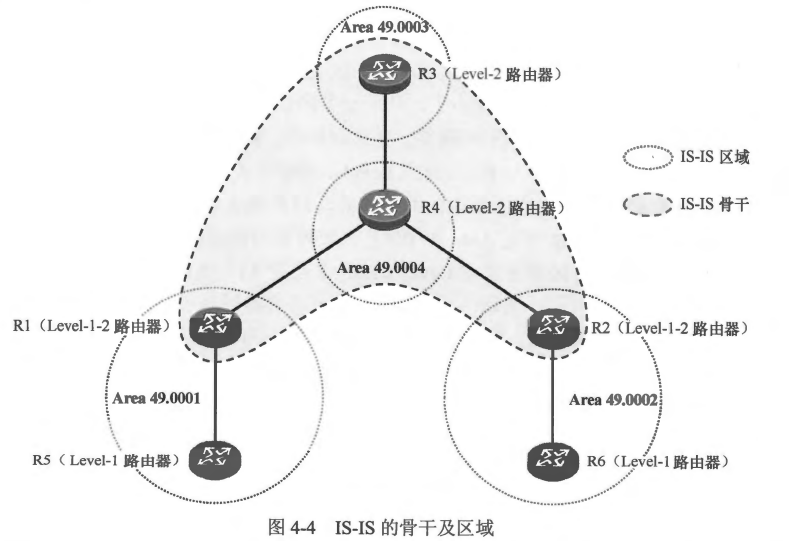
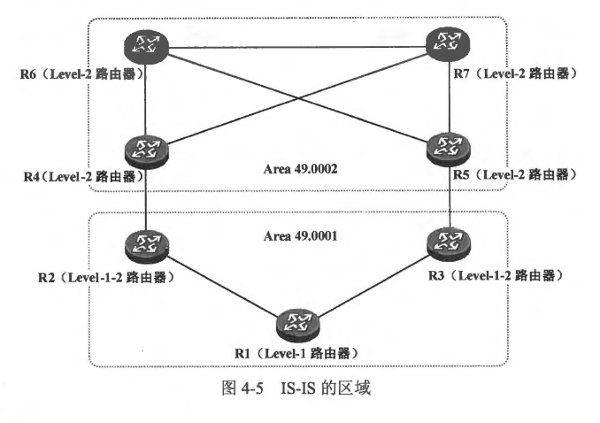
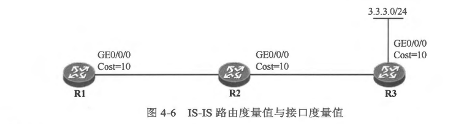
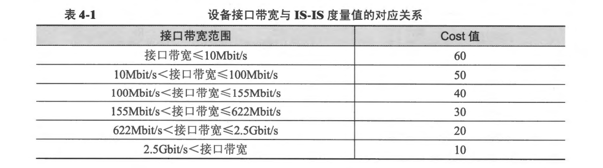

### 4.2 IS-IS 的基本概念
- 4.2.1 IS-IS 的层次化设计
- 在学习 OSPF 的过程中，相信大家已经体会到了多区域、层次化网络设计的好处。对于链路状态路由协议而言，运行了该协议的设备会向网络中通告链路状态信息，同时也收集网络中所泛洪的链路状态信息然后加以储存，并最终以这些信息为基础进行计算，从而得到路由信息。如果不采用多区域的部署方式，那么随着网络的规模逐渐增大，网络中所泛洪的链路状态信息势必会越来越多，所有的设备都将承受更重的负担，路由计算及收敛将逐渐变得更加缓慢，这也使得网络的可扩展性变差。
- IS-IS 能够部署在规模非常大的运营商骨干网络中，这得益于它对层次化网络的支持。我们能够根据需要将一个 IS-IS 域（Domain）切割成多个区域，然后使用骨干路由器将这些区域连接起来。简单地说，IS-IS 采用两级分层结构：骨干网络及常规区域。
- 如图4-4所示，R1 及 R5 处于 Area 49.0001， R2 及 R6 处于 Area 49.0002，R3 处于 Area 49.0003， R4 则处于 Area 49.0004。 IS-IS 的区域 ID 与 OSPF 是截然不同的。对于
IS-IS 来说，其骨干网络并不像 OSPF 那样是一个唯一的、具体的区域（Area 0），而是由一系列连续的 Level-2 及 Level-1-2 路由器所构成的范围。在本例中，R1、R2、R3 及 R4 便构成了该IS-IS 域的骨干网络。


- 我们将连续的 Level-1（含 Level-1-2）路由器构成的区 域称为 Level-1 区域，例如 图4-4 中的 Area 49.0001 和 Area 49.0002;而 Area 49.0003 及 Area 49.0004 则为 Level-2区域，一个 Level-2 区域由连续的、同属一个区域的 Level-2（含Ievel-1-2）路由器构成。
- 在OSPF 中，直连的设备之间如果要建立邻居关系，那么双方互联的接口必领在相同的区域中，两个直连接口如果不在相同的区域中激活 OSPF，那么邻居关系是无法建立的，而IS-IS 则有所不同。IS-IS 的区域设定是体现在设备上的，当我们在一台设备上配置 IS-IS 时，就需要指定该设备所属的区域(区域 ID 在为该设备所分配的 NET 中体现，一个设备可以同时属于多个区域），值得注意的是，完成上达配置后，设备的所有接口都属于该区域。在本例中，R1 及 R5 同属一个区域，它们之间建立 Level-1 的 IS-IS 邻居关系，而 R3 及 R4 属于不同的区域，它们都是 Level-2 路由器，因此它们之间建立 Level-2的邻居关系。
- 对于 OSPF 来说，两个区域的交界是出现在 OSPF 设备上的。例如一台拥有两个接口的路由器，如果分别将这两个接口在不同的 OSPF 区域（例如 Area 0 及 Area 1） 中激活，那么该路由器就处于 Area 0 及 Area 1 的交界处。而对于 IS-IS 而言，两个区域的交界处却并不在设备上，而是在链路上，例如图 4-4中 ATea 49.0001 与 Area 49.0004 的交界处是在R1 与R4 之间的互联链路上。
- 需要强调的是，IS-IS 的每个 Level-1 区域必须与骨干网络直接相连，以 Area 49.0001 为例，该区域通过 Level-1-2 路由器R1 连接到了骨干网络。IS-IS 的 Level-1 区域与 OSPF
中的 Totally NSSA 非常类似。Level-1-2 路由器作为 Level-1 区域与骨干网络之间的桥梁，将其通过 Level-1 区域内泛洪的 Level-1 ISP 计算得出的路由以 Level-2 IsP 的形式通告给骨干网络，使得骨干网络中的路由器能够计算出到达该区域内相应网段的路由。另一方面，缺省情况下 Level-1-2 路由器并不会将其从骨干网络学习到的路由，包括到达其他区域的路由向本地 Level-1 区域进行通告，就像OSPF 不会向某个 Totally NSSA 下发描述区域间路由的 Type-3 LSA一样。因此一个区域内的 Level-1路由器仅知晓到达本区域内各个网段的路由，而对于区域外的网络，它是一无所知的，它只能通过指向本区域的 Level-1-2路由器的默认路由来到达区域外部。IS-IS 的这个设计使得 Level-1路由器的 LSDB 及路由表规模极大程度地减小了，从而设备的性能得到了优化。
- 图4-5 展示了一个典型的 IS-IS 网络。在该网络中，R1、R2及R3属于 Leve1-1 区域 Area 49.0001，R2与R1、R3 与 R1 均建立 Level-1 的邻居关系。R1 能够根据本区域内所泛洪的 Level-1 LSP 计算出本区域内的网络拓扑，以及到达本区域内各网段的路由。而缺省时，R2 及 R3 不会将到达 Area 49.0001 区域外部的路由信息注入到该区域中，R2 及 R3 都在其向49.0001 区域下发的 Level-1 LSP 中设置 ATT 比特位，而该区域内的Level-1 路由器则基于该 Level-1 LSP 应生一条指向 R2 及 R3 的默认路由。因此R1不会学习到去往 Area 49.0002 的路由，但是它可以通过指向 R2 及 R3 的默认路由来到达 Area 49.0002 内的各个网段。与此同时，R1、R2及R3是允许将外部路由引入 IS-IS 的。因此从以上所描达的特性来看，IS-IS 的常规区域的确很像 OSPF 的 Totally NSSA。
- 当然，在某些场景中，我们可能期望 Level-1 区域内的路由器获知到达其他区域的具体路由，IS-IS 考虑到了这种需求，它允许网络管理员通过特定的配置，向 Level-1 区域注入到达其他区域的路由，这个特性被称为路由渗透，


<br>
<br>

### 4.2.2 1S-IS 路由器的分类
- 运行了 IS-IS 的路由器，根据其全局 Level（级别）属性的不同，可以分为两种类型，分别是 Level-1 及 Level-2。一台 IS-IS 的路由器可以是 Level-1 类型，或者是 Level-2 类型，还可以同时是 Level-1 和 Level-2 类型，对于同时为 Level-1 和 Level-2 类型的 IS-IS 路由器，我们将其称为 Level-1-2 路由器，实际上这并不是一种单独的 IS-IS 路由器类型。
- Level-1 路由器: 
  - Level-1 路由器（如图4-5中的R1）是一种 IS-IS 区域内部路由器，它只能够与同属一个区域的其他Level-1路由器，或者同属一个区域的 Level-1-2 路由器建立 IS-IS 邻居关系，我们将这种邻居关系称为 Level-1 邻居关系。Level-1 路由器无法与 Level-2 路由器建立邻居关系。Level-1 路由器只维护 Level-1 的LSDB，它能够根据 LSDB 中所包含的链路状态信息计算出区域内的网络拓扑及到达区域内各网段的最优路由。值得一提的是，Level-1 路由器必须通过 Level-1-2 路由器接入 IS-IS 骨干网络从而访问其他区域。
- Level-2 路由器
  - Level-2 路由器（如图4-5中的R4、R5、R6 及R7）可以简单地视为 IS-IS 骨干网络路由器，实际上 IS-IS 的骨干网络是由一系列连续的 Level-2 路由器(及 Level-1-2 路由器）组成的。
Level-2 路由器只能与 Level-1-2 或 Level-2 路由器建立 IS-IS 邻居关系，我们将这种邻居关系称为 Level-2 邻居关系。Level-2 路由器只维护 Level-2 的 LSDB。 在一个典型的 IS-IS 网络中，Level-2 路由器通常拥有整个 IS-IS 域(包括该域内所有的 Level-1 区域及Level-2 区域）的所有路由信息。
- Level-1-2 路由器
  - 所谓的 Level-1-2 路由器是同时为 Level-1 及Level-2 级别的路由器（如 图4-5 中的 R2 及R3），它能够与同属一个区域的 Level-1 、Level-1-2 路由器建立 Level-1 邻居关系，也可与Level-2 路由器或 Level-1-2路由器建立 Level-2 的邻居关系。Level-1-2 路由器与 OSPF 中的 ABR 非常相似，它也是IS-IS 骨干网络的一个组成部分。Level-1-2路由器可以同时维护 Level-1 的LSDB 及 Level-2 的LSDB，这两个 LSDB 分别用于 Level-1 路由及 Level-2 路由计算。在一个典型的 IS-IS 网络中，Level-1-2 路由器通常连接着一个Level-1 区域，也连接着骨千网络，它将作为该 Level-1 区域与其他区域实现通信的桥梁，它将在其向该Level-1 区域下发的 Level-1 LSP 中设置 ATT 比特位，来告知区域内的 Level-1 路由器可以通过自己到达区域外部，而区域内的 Level-1 路由器则根据该 ATT 比特置位的 LSP 产生一条指向该 Level-1-2 路由器的默认路由。

<br>
<br>


### 4.2.3 度量值
- IS-IS 使用 Cost(开销)作为路由度量值，所谓开销，亦可理解为成本或者代价，Cost 值越小，则路径(路由）越优。IS-IS 路由的 Cost 与设备的接口有关，与 OSPF 类似，每一个激活了 IS-IS 的接口都会维护接口 Cost。 然而与 OSPF 不同的是，IS-IS 接口的 Cost 在缺省情况下并不与接口的带宽相关，无论该接口的带宽如何，缺省时其 Cost 值均为 10，当然，您可以根据实际需要修改接口的 Cost 值。这种接口 Cost 的设计显然在某些场景下会存在一些问题，例如可能会导致设备选择 Cost 更优的低带宽路径，而不是选择 Cost 更劣的高带宽路径。
- 一条 IS-IS 路由的 Cost 等于本路由器到目标网段沿途的所有出接口的 Cost 总和。在 图4-6 所示的网络中，如果全网运行了 IS-IS，则R1 将通过 IS-IS 获知到达 3.3.3.0/24 的路由，而在R1 的路由表中，3.3.3.0/24 路由的 Cost 值为 30，也就是R3的GE0/0/0 接口 Cost 加上 R1 及 R2 的 GE0/0/0 接口 Cost。

**说明: 其实 IS-IS 定义了四种类型的度量值：缺省(Default）度量值、时延（Delay）度量值、开销(Expense）度量值以及差错（Error）度量值，其中时延、开销及差错度量值在现今的 IS-IS 实现中几乎都不再支持，本书讨论的度量值指的是缺省度量值，该种类型的度量值是每一台 IS-IS 设备都必须支持的。**
- 缺省时，Cisco 路由器使用的 IS-IS Cost 类型为 Narrow（窄），当使用该类 Cost 时，IS-IS 接口 Cost的长度为6bit， 这意味着一个接口所支持的 Cost 值范围是 1~63。另外，IS-IS 路由 Cost 的长度为 10bit， 这意味着接收到的路由最大的 Cost 值为 1023。显然，在面对大规模的网络时，这种 Cost 的限制会成为 IS-IS 的瓶颈。正因如此，IS-IS 引入了 Wide（宽）类型的 Cost， 当 IS-IS 使用 Wide 类型的 Cost 时，接口 Cost 变成了 24bit， 这使得设备的接口支持更大的 Cost 值范围，与此同时一条路由的 Cost 值范围也有了相当大的扩展。IS-IS 在 Cost 值上的扩展，使得它突破了前面所提到的瓶颈，从而能够支持更大规模的网络，而且在组网时，基于 Cost 的路由控制也变得更加灵活。
使用如下命令，可以将 IS-IS 的 Cost 类型修改为 Wide:
```shell
R1(config)#router isis 10
R1(config-router)#metric-style wide
```
- 缺省时，Cisco 路由器使用的 IS-IS Cost 类型为 Narrow，这意味着路由器只能接收和发送 Cost 类型为 Narrow 的路由，使用 metric-style wide 命令将设备的 Cost 类型修改为 Wide 后，该设备只能接收和发送 Cost 类型为 Wide 的路由。在现实网络中，需确保 IS-IS 域内所有的路由器配置一致的 IS-IS Cost 类型。在 Cisco 路由器上，除了能将 IS-IS Cost 类型指定为 Narrow 或 Wide， 还能将其指定为特定的兼容模式。
- 正如上文所说，在 Cisco 的路由器上部署 IS-IS 时，缺省状态下 IS-IS Cost 类型为 Narrow， 并且接口的缺省 Cost 值为 10，无论接口的带宽是多少，其 Cost 值缺省均为 10，这在某些场景下可能会导致 IS-IS 的路由优选不尽如人意。其中一个简单的改进方法是，根据组网的实际需求去手工修改设备的接口 Cost。另一个可选的方法则是使用 IS-IS 自动计算接口 Cost 的功能。这个功能被激活后，设备将自动根据接口的带宽值进行该接口 Cost 值的计算，这与 OSPF 的接口度量值计算就非常相似了，设备将使用一个参考带宽值除以接口的带宽值，再将所得结果乘以 10，得到接口的 Cost 值。例如千兆以太网接口缺省的带宽值为 1000Mbps， 100/1000×10 得到的结果是 1，因此千兆以太网接口在激活 IS-IS 自动计算 Cost值的功能后，Cost 值为 1。值得一提的是，只有当设备的 IS-IS Cost 类型指定为 Wide 时，上述计算才会发生，如果设备的 IS-IS Cost 类型为 Narrow，则激活了 自动接口 Cost 计算功能后，设备将采用如 表 4-1 所示的对应关系为接口设置缺省 Cost 值。

- 如需手工指定设备的接口 Cost 值，可在接口视图下使用 isis metric 命令，例如使用isis metric 20，可将接口的 Cost 值从缺省值修改为 20。需注意的是该命令中有两个可选关键字，它们分别是 level-1 及level-2，如果在 isis metric 命令中使用了 level-1 关键字，那么该命令配置的是接口的 Level-1 Cost 值，例如 isis metric 20 level-1。同理，如果在 isis metric 命令中使用了 Level-2 关键字，那么该命令配置的是接口的 Level-2 Cost 值。而如果没有使用 level-1 或 level-2关键字，那么该命令配置的是接口的 Level-1 及 Level-2 Cost值。