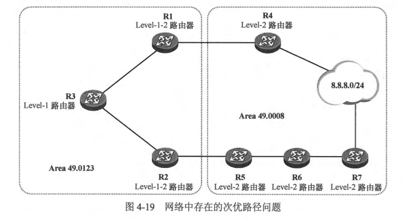
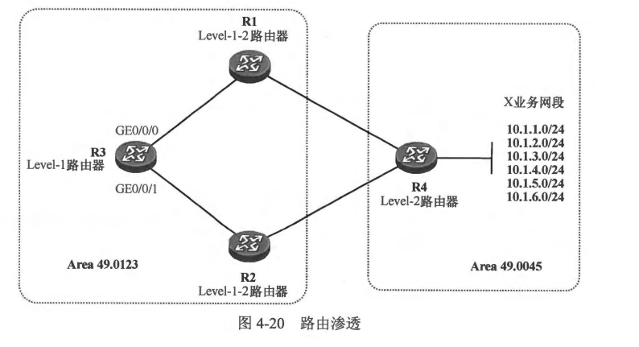
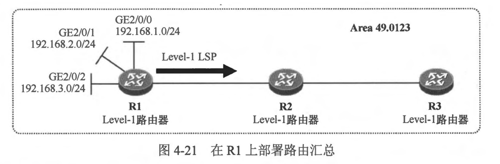

### 4.3.1 路由渗透
- 我们已经知道，在 IS-IS 中 Level-1-2 路由器是连接 Level-1 区域与骨干网络的桥梁，它会将到达所在 Level-1 区域的路由信息通过 Level-2 LSP 通告到骨干网络，从而让其他的 Level-1-2 或 Level-2 路由器学习到相关路由，然而缺省时它却并不将到达其他 Level-1 区域的路由信息以及到达 Level-2 区域的路由信息通告到本 Level-1 区域中，这样虽然可以简化 Level-1 区域中设备的路由表，从而节省设备资源，但是这种特性在某些场景下却也会带来一些问题，例如次优路径问题等。
- 在 图 4-19中，网络中的设备已经运行了 IS-IS，所有设备的接口的 IS-IS Cost 值都是相等的。R4 及 R7 都连接着 8.8.8.0/24 网段，并且都将到达该网段的路由发布到了 IS-IS 中。缺省时，Level-1 路由器 R3 是无法学习到 8.8.8.0/24 路由的，R1 及 R2 作为 Level-1-2 路由器，会在它们向 Area 49.0123 下发的 Level-1 LSP 中设置 ATT 比特位，而 R3 则根据该 ATT 比特位置位的 Level-1 LSP 生成默认路由。R3 会根据自己到达这两台路由器的度量值来决定默认路由的下一跳，由于 R3 到达 R1 及 R2 的 Cost 值相等，因此 R3 产生的默认路由将在 R1 及 R2 这两个下一跳执行等价负载分担。如此一来，R3 将认为从 R1 及 R2 均可到达区域外部，因此当其转发到达 8.8.8.0/24 的报文时，完全有可能将报文转发给 R2，报文将沿着 R2-R5-R6-R7 这条路径最终到达目的地，这就产生了次优路径问题。之所以出现这样的问题，是因为 R3 无法学习到去往 8.8.8.0/24 的路由，而且并不知晓从本地到达目的网段的实际 Cost 值。使用IS-IS 的路由渗透功能可以解决该问题。在本例中，可以在 R1 及 R2 上部署路由渗透，将 Level-2 路由 8.8.8.0/24 渗透到本地 Level-1 区域，使得 R3 能够通过它们学习到 8.8.8.0/24 路由。 
 
- 下面再看看路由渗透功能的另一个应用场景。在图 4-20 中，完成IS-IS 部署后，R1 及 R2 能够学习到去往 Area 49.0045 中的 X 业务网段的路由，然而它们并不会在自己向 Area 49.0123 下发的 Level-1 LSP 中描述关于这些网段的可达性信息。R3 通过产生指向 R1 及 R2 的默认路由来到达这些网段。
 
- 现在，该网络要求实现这样的需求：R3 转发到达 10.1.1.0/24、10.1.2.0/24 及 10.1.3.0/24 这三个 X 业务网段的报文时，将它们转发到 R1，而转发到达其他 X 业务网段的报文时，将其转发到 R2。由于缺省时，R3 只能够通过默认路由到达 X 业务网段，因此要实现上述需求，就必须让 R3 获得到达目标网段的具体路由，此时便可以使用 IS-IS 的路由渗透功能。我们可以在 R1 上部署路由渗透功能，将到达 10.1.1.0/24、10.1.2.0/24 及 10.1.3.0/24 这三个网段的路由渗透到 Area 49.0123 中，R1 通过向该区域下发描述这三条路由的 Level-1 LSP 来实现这个目的。这样一来，R3 便能够基于这些 LSP 计算出到达这三个网段的路由，并且路由的下一跳为 R1。现在，R3 转发去往这三个网段的报文时，根据最长前缀匹配原则，便会将报文发往 R1，而对于目的卫地址是 X 业务其他网段的报文，则匹配默认路由进行转发，此时可以通过将 R3 的 GE0/0/0 接口 IS-IS 度量值修改得比 GE0/0/1 接口更大，使 R3 将默认路由的下一跳指向 R2，来实现上述需求中的第二条。
- 在 Level-1-2 路由器的 IS-IS 配置视图中，执行 redistribute isis ip level-2 into level-1 命令，可以将 Level-2 区域中的路由信息渗透到本地 Level-1 区域中。在该命令中可以增加 distribute-list 关键字，从而对渗透的路由进行筛选或过滤，也可以增加 tag(route-map) 关键字，从而对渗透的路由进行标记。
- 需要特别说明的是，Level-1-2 路由器缺省时将自己从 Level-1 区域中学习到的路由信息全部通告到 Level-2 区域，实际上在这个过程中，我们也能够部署路由渗透，使得 Level-1-2 路由器只将特定的 Level-1 区域路由通告到 Level-2 区域。在 IS-IS 配置视图中使用 redistribute isis ip level-1 into level-2 命令，可部署 Level-1 区域到 Level-2 区域的路由渗透。

 
 

### 4.3.2 路由汇总
- 在开始本小节之前，先来回顾一下路由汇总的概念。所谓路由汇总就是将一组有规律的路由汇聚成一条路由，从而达到减小路由表规模以及优化设备资源利用率的目的，我们把汇聚之前的这组路由称为明细路由，把汇聚之后的路由称为汇总路由（或聚合路由)。
- 众所周知，RIP 及 OSPF 都是支持路由汇总的，而 IS-IS 同样支持路由汇总；作为链路状态路由协议，IS-IS 的路由汇总特性与 OSPF 颇为类似，但是又存在明显的差异。IS-IS
被广泛部署在运营商骨干网络中，这些网络的规模是非常庞大的，因此合理地规划网络并部署路由汇总是非常有必要的。与 OSPF 类似，IS-IS 也不支持路由自动汇总，网络管理员需根据实际需求在设备上执行手工配置来实现路由汇总。接下来看看 IS-IS 的几种路由汇总场景。
- 在Level-1 路由器上部署路由汇总
  - IS-IS 是一种典型的链路状态路由协议，在一个 Level-1 区域内，每一台 IS-IS 路由器都会产生自己的 Level-1LSP；使用这些LSP，路由器能够发现区域内的网络拓扑，从而计算出到达区域内各个网段的最短路径。IS-IS 允许设备对其始发的路由执行汇总。
  - 在图 4-21 中，R1 、R2 及 R3 属于相同的 Level-1 区域，初始时，R1 在其所有接口上都激活了 IS-IS，那么 R2 及 R3 都应该能通过 R1 在区域内泛洪的 Level-1 LSP 计算出到达 192.168.1.0/24、192.168.2.0/24 及 192.168.3.0/24 网段的路由，此时为了简化 R2 及 R3的路由表，可以在 R1 上部署路由汇总，将其发布的这三条路由汇总成 192.168.0.0/22。在 R1 的 IS-IS 配置视图下使用 summary 192.168.0.0 255.255.252.0 level-1 命令即可实现该需求。
   