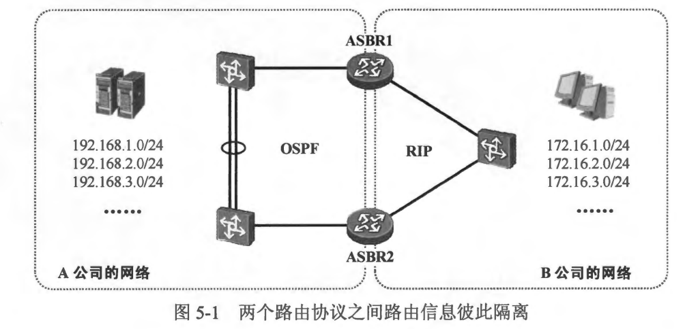
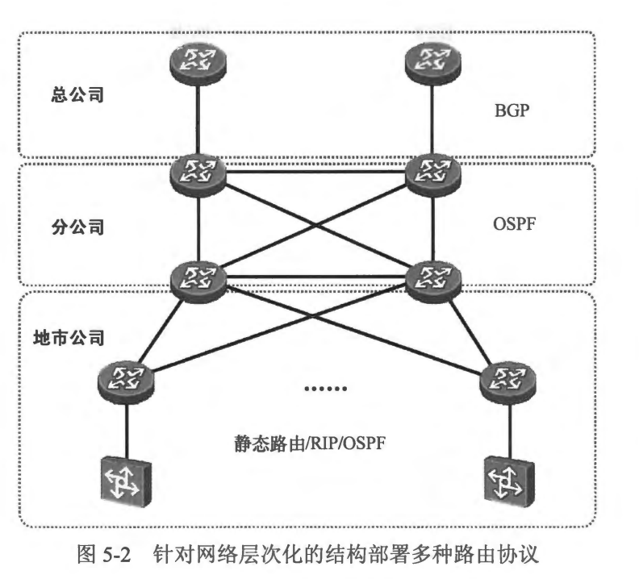
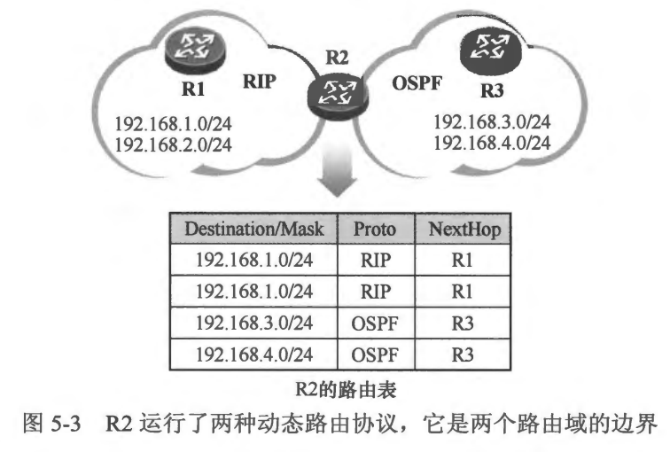
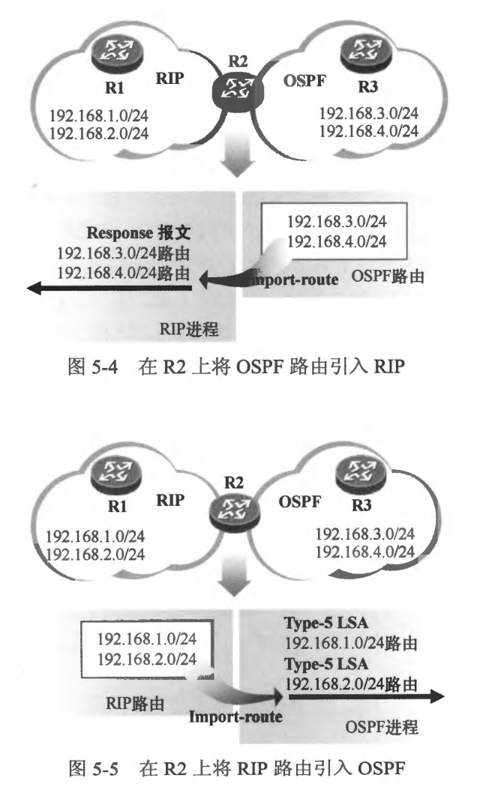

### 5.1.1路由重分发的概念
- 到目前为止，本书所讨论的多数网络环境都有一个共同的特点，那就是在网络中只用了一种路由协议，然而现实生活中的商用网络往往要更加复杂和多元化，在同一个网络中同时存在两种以上路由协议的情况是非常常见的。举个例子，假设 A 公司与 B 公司各有自己的网络，这两个网络被独立管理及运维，A 公司的网络使用的路由协议为 OSPF,而B 公司使用的路由协议为 RIP，现在这两家公司合并成一家公司，导致原有的两张网络不得不进行整合，如图 5-1 所示，为了使得合并后新公司的业务流量能够正常地在整合后的数据网络上交互，实现路由互通就是关键的问题之一。然而 RIP 和 OSPF 是两种不同的动态路由协议，路由信息肯定是无法在路由协议之问直接交互的，当然，可以进行全网路由协议的重新规划及整改，整改后网络中仅使用单个路由协议（如OSPF)。这当然是可行的，但是这样一来实施和变更的成本便是一个不得不考虑的问题。另一种方式是，保持这两张网络原有的路由规划，然后在 RIP 及 OSPF 路由域的边界设备上进行特定的操作，使得路由信息能够在这两个动态路由协议之间传递，从而实现路由的互通。

- 在同一个网络拓扑结构中，如果存在多种不同的路由协议，由于不同路由协议的机理各有不同，对路由的处理也不相同，这就在网络中造成了路由信息的隔离，在路由协议的边界设备上，将某种路由协议的路由信息引入另一种路由协议中，这个操作被称为路由引入(Route Importation）或者路由重分发 (Route Redistribution)。
- 当然在实际项目中，同一个网络中存在多种路由协议的情况不仅限于上文所介绍的网络合并的例子。在一个大型的企业中，由于网络规模十分庞大，选用单一的路由协议可能已经无法满足网络的需求，因此多种路由协议共存的情况颇为常见。再者出于业务逻辑的考虑，通过在不同的网络结构中设计、部署不同的路由协议，如 图5-2 所示，可以使路由的层次结构更加清晰和可控。另外，在执行路由重分发时，还可以部署路由策略，从而实现对业务流量的灵活把控，这也是路由重分发的魅力之一。

- 在图5-3所示的网络中，存在两个动态路由协议。R1 与 R2 之间运行 RIP 以便交互路由信息，R2 能够通过 RIP 学习到 R1 通告的 192.168.1.0/24 及 192.168.2.0/24 路由并将它们加载到路由表。同时 R2 与R3 又建立了 OSPF 邻接关系，R2 又通过 OSPF 学习到了路由 192.168.3.0/24 及 192.168.4.0/24。那么对于 R2 而言，它自己就分别通过这两种动态路由协议学习到了到达全网的路由，但是缺省时，它不会将其从 RIP 学习到的路由变成 OSPF 路由通告给 R3，也不会将其从 OSPF 学习到的路由变成 RIP 路由告诉给 R1。因此，R2 也就成了 RIP 及 OSPF 路由域的分界点。那么如何能够打通网络的路由呢？关键点在于 R2 上，通过在 R2 上部署路由重分发，可以实现路由信息在不同路由协议之间的传递。

- 首先将R2 路由表中的 OSPF 路由引入RIP，如 图5-4 所示，如此一来 R2 的 RIP 进程就获知了这些来自 OSPF 的外部路由，它将这些被引入的路由放置在 Response 报文中通告给 R1，而 R1 也就能够通过 RIP 学习到 192.168.3.0/24 及 192.168.4.0/24 路由了。这个过程就像是一个既懂汉语又懂英语的人将别人通过汉语讲述给自己的一个故事翻译成英语，并告诉给了另一个只懂得英语的朋友。
- 需要强调的是，路由重分发的操作是具有方向性的，例如刚才执行的动作是将 OSPF 路由引入 RIP，这个过程将使得 RIP 网络中的设备获知到达 OSPF 网络的路由，但是此时在 OSPF 网络中，依然不存在任何到达 RIP 域的路由，为了实现全网路由可达，还需要在 R2 上将 RIP 路由引入 OSPF，也就是执行双向的路由重分发。图5-5描述了 R2 将 RIP 路由引入 OSPF 的过程。当R2 将其路由表中的 RIP 路由引入 OSPF 后，对于整个 OSPF 网络而言，R2 将立即变成一台 ASBR，它将向OSPF 中注入 Type-5 LSA，用于描述这些被引入的外部路由。

- 路由重分发主要涉及如下几种场景:
  - 动态路由协议之间的路由重分发
  - 将直连路由引入动态路由协议
  - 将静态路由引入动态路由协议

 
 

### 5.1.2 RIP与OSPF重分发

 
 

### 5.1.3 EIGRP与OSPF重分发

 
 

### 5.1.4 路由重分发综合实验
