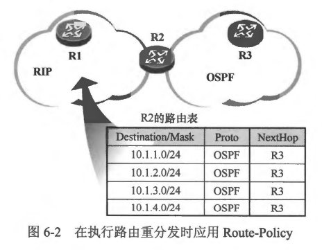

### 本章内容概述
- Route-map(路由映射图）是路由策略技术专题中的一个重要工具，它能在各种场合很好地完成路由策略的部署任务，而且功能非常强大，它既可以被用来执行路由过滤，又可以用于修改路由的属性。
- 在图6-2所示的网络中存在两个动态路由协议域 OSPF 及 RIP，而 R2 处于两个域的辺界。R2 同時込行着 RIP 及 OSPF，カ了止 R1 能学到 OSPF 域中的路由信息，我们需要在 R2 上部署路由重分发，将OSPF 路由引入 RIP。缺省情况下，R2 的路由表中所有的 OSPF 路由都会被引入 RIP，而且这些路由被引入后，它们的跳数都是统一的，是一个相同的值。如果希望 R2 只将特定的 OSPF 路由引入 RIP，而不是全部，并且对引入后的路由设置不同的跳数，该如何操作呢？此时就可以在路由重分发的过程中应用Route-map.

- 本章学习目标:
  - 了解 Route-Policy 的基本概念
  - 掌握 Route-Policy 的基础配
  - 掌握 Route-Policy 在各种场景下的应用

 
 

