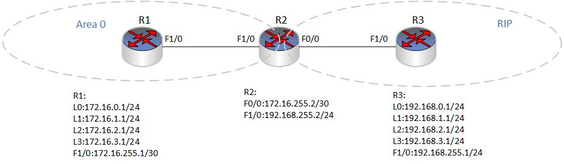

### 6.3.1 distribute-list(分发列表)
- 分发列表（Distribute List）是一种路由策略，用于在路由器之间控制路由信息的传递和过滤。Distribute List 可以控制路由器的路由表中，哪些路由信息被分发到其他路由器上，哪些被过滤掉。
- Distribute List 可以在路由器之间控制路由信息的传递，因为路由器之间通过路由协议交换路由信息，例如 OSPF，BGP 等。通过 Distribute List，我们可以筛选掉某些不必要的路由信息，或者只将特定的路由信息分发到某些路由器上，这有助于网络管理员优化网络的路由。
- 在使用 Distribute List 时，需要定义一个 ACL（Access Control List），用来匹配要分发或过滤的路由信息。ACL 可以根据路由器的接口、网络地址、协议等多个因素匹配路由信息。然后，在 Distribute List 中引用这个 ACL，指定要分发或过滤的路由信息，以及要将它们分发到哪些路由器上。
- Distribute List 是一种强大的路由策略，但也要谨慎使用。过滤掉太多的路由信息可能会导致网络中的某些主机或子网无法访问，而分发太多的路由信息可能会导致路由表的过度膨胀，从而影响路由器的性能。


### 6.3.2 distribute-list 基本配置命令:
- 创建 ACL（Access Control List):
```shell
access-list {number | name} {permit | deny} {source [source-wildcard] | any} [destination [destination-wildcard] | any] [protocol [protocol-number] | any]
```

- 配置 Distribute List，引用 ACL，选择路由协议，以及选择分发或过滤路由信息:
```shell
route-map map-tag [permit|deny] [sequence-number]

match ip address {number | name}
set [protocol {connected | static | ospf | isis | rip | eigrp | bgp} | interface interface-name | metric metric-value | tag tag-value | weight weight-value | next-hop ip-address | local-preference value | community value1 value2 [ additive ] | origin { igp | egp | incomplete } | as-path access-list | originator-id ip-address | cluster-list clist } 

distribute-list {acl-number | acl-name} [in | out] [interface-type interface-number] [level-1 | level-2 | level-1-2] [prefix prefix-list-name] [route-map map-tag] [vrf vrf-name]
```

- 其中，route-map 用于指定路由映射，match ip address 用于匹配 ACL，set 命令用于设置分发路由的条件，distribute-list 命令用于应用 ACL 和路由映射，实现分发或过滤路由信息。在 distribute-list 命令中，可以指定方向（in 或 out）、接口类型和接口号、区域类型、前缀列表名、VRF 名称等参数，以进一步限制分发或过滤的路由信息。


### 6.3.2 利用distribute-list过滤路由更新
- 配置要求
  - 在R1、R2上运行OSPF协议，R2、R3上运行RIP路由协议，在R2上配置路由重分发使其全网通现在要求做路由过滤R1不能学到R3的192.168.2.0和192.168.3.0网端，R3不能学到172.16.0.0和172.16.1.0网段。要求使用distribute-list列表。
  
