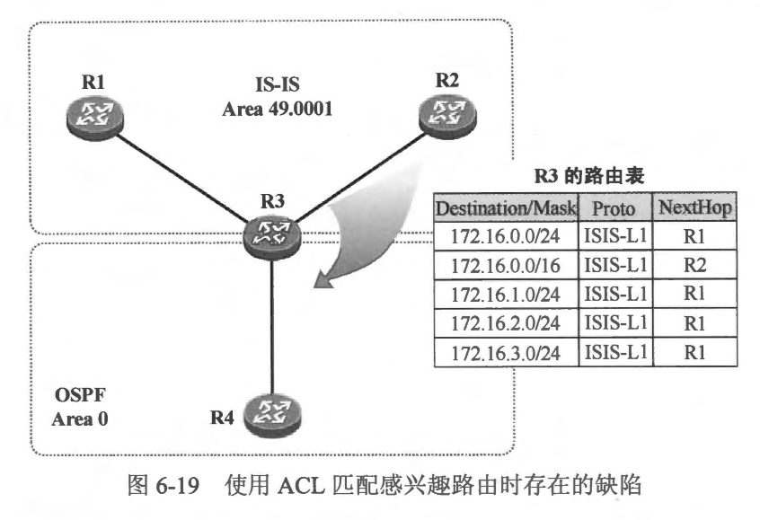
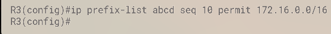
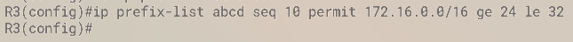

### 本节基本学习内容:
- route-map 能够在执行路由重分发时过滤路由信息，或者修改路由属性，而 distribute-list 也能够完成路由过滤的任务。当然无论是采用何种工具，在执行路由策略时，首先需要将“感兴趣” 的路由匹配出来，或者说区分出来，只有这样，才能够有针对性地进行路由属性修改或者路由过滤。ACL 确实能够在许多场合胜任这个工作，但也存在缺陷，它只能够匹配路由条目中的目的网络地址，而无法匹配路由的目的网络掩码。图 6-19 所示的案例可以很好地说明ACL 的这个缺陷。
- R3 与 R1 及 R2 建立 IS-IS 邻接关系，并通过 IS-IS 学习到数条路由，图6-19 展示了 R3 路由表中的 IS-IS 路由。现在为了让 OSPF 域内的路由器能够通过 OSPF 学习到这些路由，R3 将其路由表中的 IS-IS 路由引入OSPF。然而我们希望 R3 在路由引入的过程中，过滤掉 172.16.0.0/16 这条路由，您可能已经想到，使用 route-map 可以解决这个问题。
 
- R3上可能这样配置:

```shell
R3(config)#access-list 20 deny 172.16.0.0 0.0.0.0
R3(config)#route-map node permit 10
R3(config-route-map)#match ip address 20
R3(config-route-map)#exit
R3(config)#router ospf 1
R3(config-router)#redistribute isis route-map 20 
```

- 然而在完成上述配置后，IS-IS 路由 172.16.0.0/24 及 172.16.0.0/16 都没有被引入OSPF，也就是说，这两条路由都被 Route-map 过滤掉了。这显然与需求是不相符的。之所以出现这样的问题，是因为 ACL 只能用于匹配路由的目的网络地址，而对于目的网络掩码的匹配是无能为力的，因此目的网络地址为 172.16.0.0 的路由，无论目的网络掩码如何，都会被 ACL 规则 access-list 20 deny 172.16.0.0 0.0.0.0所匹配。
- 或者我们可能会采用下面的方式书写这个 ACL。

```shell
R3(config)#access-list 20 deny 172.16.0.0 0.0.0.255 
```

- 需要注意的是，这种写法其实是不严谨的，再次强调一下，ACL 只能匹配路由的目的网络地址，因此上述配置中，access-list 20 deny  172.16.0.0 0..0.255 这条规则实际上匹配的路由数量更多了，它不仅仅是将目的网络地址为 172.16.0.0 的路由匹配住了，实际上目的网络地址的前三个八位组为 172.16.0(最后一个八位组可以是任意值）的路由都会被该 ACL 匹配住。
- 无论如何，ACL 作为一个路由匹配工具，只能在一些较为简单的路由环境中使用，当面对更加复杂的路由匹配需求时，我们会考虑另一个工具，那就是 IP 前缀列表(Prefix List)。


- 本章学习目标:
  - 理解 IP 前缀列表的工作原理及使用场景
  - 掌握 IP 前缀列表的基础配置


<br>
<br>

### IP 前缀列表的基本概念
- 从名字上看，IP 前缀列表是一个列表形态的工具。它所匹配的对象是 IP 地址前缀，也就是路由条目。一个路由条目由目的网络地址（也被称为 IP 前缀）及掩码长度（也被称为前缀长度）共同标识。使用 ACL 从一批路由中筛选出感兴趣的路由时，是无法指定被匹配对象的目的网络掩码长度的，但是 IP 前级列表却可以做到，它除了能够指定被匹配对象的目的网络地址，还能指定目的网络掩码长度，从而实现对路由的精确匹配。
- 图6-20 展示了一个简单的 IP 前缀列表的示例。IP 前缀列表可以包含一条或多条语句，每条语句都使用一个十进制的序号（seq）进行标识。在本例中，这个名称为 abcd 的 IP 前缀列表中只有一条语向，这条语句的序号为 10，正如前面所说，您可以为一个 IP 前缀列表创建多条语句，每条语句使用不同的序号，所有的语句按照序从小到大依序序排列，这与 ACL 非常类似。



- 在本例中，这条 IP 前级列表的语句中指定了 IP 地址（172.16.0.0)以及掩码长度(16)，如此一来，该语句就精确地匹配了路由 172.16.0.0/16。IP 前缀列表除了能够精确匹配一条路由，还能够匹配一组有规律的路由。
- 图 6-21 展示了 IP 前级列表的另一个示例，该示例中增加了 ge（大于或等于）及 le（小于或等于）这两个关键字及参数，从而指定了掩码长度的范围。这条命令要求路由的目的网络地址的前 16 个比特位与 172.16.0.0 的前 16 个比特位相同。另外路由的目的网络掩码长度需大于或等于 24，同时小于或等于 32。只有满足上述条件的路由才会被该语句匹配。
- 如果一条语句中只是指定了 ge 关键字（且没有指定 le 关键字），则掩码长度的范围是大于或等于 ge 关键字所指定的值，同时小于或等于 32。而如果只是指定了 le 关键字（且没有指定 ge 关键字），则掩码长度的范围是大于或等于命令中指定的掩码长度，同时小于或等于 le 关键字指定的值。
- 当一个 IP 前级列表开始进行路由匹配时，将从序号最小的语句开始依序匹配，如果路由不满足该语句中的条件，则继续匹配下一个语句。只要满足当前语向，便不再继续匹配后续的语句，被当前语向匹配住的路由，将根据该语句所定义的匹配模式 (Permit 或 Deny）判断是否被允许通过，Permit 为允许，Deny 为拒绝。另外，在 IP 前缀列表的末尾隐含着一条拒绝所有的语句，因此一个对象若不满足任何一个语向，则该对象被视为不被该 IP 前缀列表允许通过。



- IP 前缀列表是一个重要的路由策略工具，能够作为路由过滤器被应用于各种场景，例如可以被 Route-map 调用，或者 distribute-list 调用等等，另外，也在BGP 路由协议中被直接用于路由过滤。
- **说明: 在创建 IP 前缀列表的一条语句时，可以手工指定该语句的序号，例如 ip prefix-list abcd seq 10 permit 172.16.0.0/16 ，也可以不指定，例如ip prefix-list abcd permit 172.16.0.0/16，如果不指定序号，则命令在输入后，系统会自动为该语句添加一个序号，如果该语句是本 IP 前缀列表的第一条语句，则缺省分配到的序号是10，此后若再向该 IP 前缀列表中添加新的语句并且不指定序号，则新的语句缺省以 10 为步长进行序号的递增，也就是说第二条语句的序号为20，第三条为30，以此类推。**
- 下面通过几个例子来加深大家对 IP 前缀列表的理解。假设有四条路由：172.16.0.0/16、 172.16.0.0/24、172.16.0.0/30 及 172.16.1.1/32，它们都是用于测试的被匹配对象。通过不同的 IP 前缀列表可以达到不同的结果:
 
- `ip prefix-list aa seq 10 permit 172.16.0.0/24`
    - 上述语句要求路由的目的网络地址的 前 24 个比特位需与 172.16.0.0 的前 24 个比特位相同，并且路由的目的网络掩码长度必须为 24。因此 aa 这个 IP 前缀 列表只允许了四条路由中的 172.16.0.0/24。

<br>

  - `ip prefix-list bb seq 10 permit 172.16.0.0/16 le 24`
    - 上述语句要求路由的目的网络地址的前 16 个比特位需与 172.16.0.0 的前 16 个比特位相同，并且路由的目的网络掩码长度须大于或等于 16，且小于或等于 24。因此比b这个 IP 前级列表允许了四条路由中的 172.16.0.0/16 及 172.16.0.0/24。

<br>

  - `ip prefix-list cc seq 10 permit 172.16.0.0/16 ge 24`
    - 上述语句要求路由的目的网络地址的前 16 个比特位需与 172.16.0.0 的前 16 个比特位相同，并且路由的目的网络掩码长度须大于或等于 24（且小于或等于 32，系统会自动在该命令后添加 le 32）。因此 cc 这个 IP 前缀列表允许了四条路由中的 172.16.0.0/24、172.16.0.0/30 以及 172.16.1.1/32。

<br>

  - `ip prefix-list dd seq 10 permit 172.16.0.0/16 ge 24 le 30`
    - 上达语句要求路由的目的网络地址的前 16 个比特位须与 172.16.0.0 的前 16 个比特位相同，并且路由的目的网络掩码长度须大于或等于 24，且小于或等于 30。因此 dd 这个 IP 前缀列表允许了四条路由中的 172.16.0.0/24 和 172.16.0.0/30。

<br>

  - `ip prefix-list ee seq 10 deny 172.16.0.0/30`
  - `ip prefix-list ee seq 20 permit 172.16.0.0/24`
    - 上述 IP 前缀列表的名称为 ee，它拥有两条语句。序号为 10 的语句要求路由的目的网络地址的前 30 个比特位须与 172.16.0.0 的前 30 个比特位相同，并且路由的目的网络掩码长度必须为 30，而由于该语句的匹配模式为 deny，因此四条路由中的 172.16.0.0/30 被该语句匹配住而且被拒绝。另外，序号为 20 的语句匹配路由 172.16.0.0/24。由于卫前缀列表末尾隐含拒绝所有，因此最终四条路由中只有 172.16.0.0/24被该 IP 前缀列表所允许。

<br>

  - `ip prefix-list ff seq 10 permit 0.0.0.0/0  le 32`
    - 上述语向中，IP 地址为 0.0.0.0，这种形式的 IP 地址被称为通配地址，也即该地址能匹配任意的目的网络地址。因此该语句并不关心被匹配路由的目的网络地址，但是要求路由的目的网络掩码长度须大于或等于 0，且小于或等于 32，实际上所有的路由都满足上述要求，因此，该条语向相当于 “允许所有”。因此四条路由都将被允许。
 
<br>

- `ip prefix-list gg seq 10 deny 172.16.0.0/30`
  - `ip prefix-list gg seq 20 permit 0.0.0.0/0 le 32`
    - 上述 IP 前级列表的名称为 gg，它拥有两条语句。序号为 10 的语句拒绝了路由 172.16.0.0/30，而序号为 20 的语句则为允许所有，因此四条路由中，除了 172.16.0.0/30 之外，其他所有路由都被允许。

<br>

  - `ip prefix-list hh seq 10 permit 0.0.0.0/0 ge 32 le 32`
    - 上述I前级列表将匹配网络掩码长度为32的任意路由，也就是匹配所有主机路由，因此四条路由中，只有 172.16.1.1/32 被允许。

<br>

  - `ip prefix-list ii seq 10 permit 0.0.0.0/0`
    - 这是一个非常特殊的语句，该语句允许的是默认路由 0.0.0.0/0。

<br>
<br>

### 案例1: 在Route-map中调用IP前缀列表

<br>
<br>

