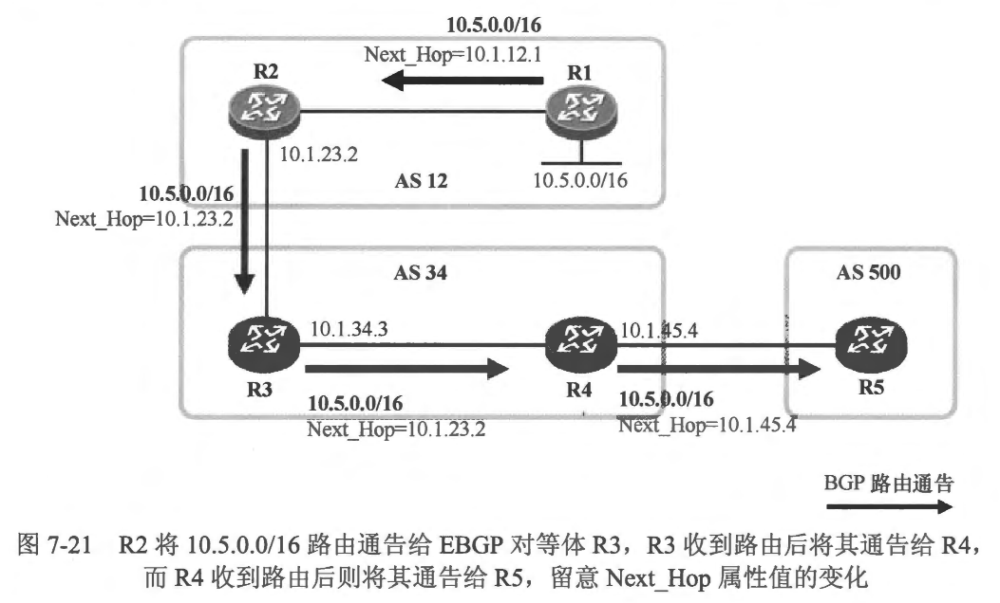

### 路径属性
- 任何一条 BGP 路由都拥有名个路径属性（Path Attributes)，当路由器将 BGP 路由通告给它的对等体时，一并被通告的还有路由所携带的各个路径属性，如 图7-14 所示。以现实生活中的房子为例，每套房子都有各种属性，例如房子的总面积、房间数量、装修的家华程度、楼层高度、房子的朝向以及周边配套设施等。在购买一套房子的时候，每个人心中自然是有自己的想法和需求，当然，房子的各项属性都有可能会影响购房者的购买决策。对于 BGP 而言，BGP 路径属性描述了该条路由的各项特征，同时，路由所携带的路径属性也将在某些场景下影响 BGP 路由优选的决策。
 
- BGP 设计了丰富的路径属性，每条 BGP 路由都携带着多个路径属性，这些路径属性都有各自的定义及功能。当 BGP 发现了多条到达同一个目的网段的路由（或者说路径）时，每条 BGP 路由的路径属性值将会作为该路由是合被优选的依据，BGP 將按照一定的规则进行决策，最終在这些路由中选择一条最优的路由。当然我们可以根据实际业务需要，对BGP 路由的路径属性进行修改，从而影响 BGP 路由优选的决策。BGP 提供了丰富了路由策略工具，使得我们针对路由的路径属性的操控更加地灵活和便捷。
- RFC 4271 将 BGP 路径属性分为两大类: 
  - 公认（Well-known）
  - 可选 (Optional)
  - 其中公认属性是所有 BGP 路由器必须都能够识别的路径属性，而可选属性则不要求所有的 BGP 路由器都必须能够识别。
- 公认属性里分了两个子类: 
  - 强制（Mandatory）
  - 自由决定 (Discretionary）
  - 其中强制属性指的是当 BGP 路由器使用 Update 报文通告路由更新时必须携带的路径属性，而自由决定属性则不要求 Update 报文中必须携带。
- 可选属性里也分了两个子类: 
  - 传递（Transitive）
  - 非可传递 (Non-transitive）
  - 其中对于传递属性，如果 BGP 路由器不能够识别该路径属性，那么也应该接受携带该路径属性的 BGP 路由更新，并且当路由器将该路由通告给其他对等体时必须携带该路径属性，而对于非可传递属性，如果 BGP 路由器不能够识别该属性，那么该路由器将会忽略携带该路径属性的 BGP 路由更新且不将该路由通告其他 BGP 对等体。综上，BGP 路径属性可分为 4 种类型，每种类型中包含的路径属性如下:

  - 公认强制(Well-known Mandatory)
    - Origin
    - AS Path
    - Next Hop

  - 公认自由决定 (Well-known Discretionary)
    - Local Preference
    - Atomic_Aggregate

  - 可选传递(Optional Transitive)
    - Community
    - Aggregator

  - 可选非传递 (Optional Non-transitive)
    - MED
    - Originator_ID
    - Cluster List

- 本章学习目标:
  - 理解 Weight 属性
  - 理解 Local Preference 属性
  - 理解 AS_ Path 属性
  - 理解 Origin 属性
  - 理解 MED 属性
  - 理解 Next Hop 属性
  - 理解 Atomic Aggregat

<br>
<br>

### 7.2.1 Weight

<br>
<br>

### 7.2.2 Local_Preference
- Local Preference（本地优先级）属性是一个公认自由决定属性，该路径属性只能在 IBGP 对等体之间传递，当路由被通告给 EBGP 对等体时，是禁止携带该属性的。因此 Local Preference 属性只能够在一个 AS 内部传递，这就是“本地”的含义。
- 如果一个 AS 拥有多个 BGP 出口，而且同一个 AS 内的 BGP 路由器通过这些出口均可到达同一个目的地，那么 Local Preference 属性可被该 AS 用于告知本 AS 内的 BGP 路由器哪一个出口更优。Local Preference 属性的取值范围是 0~4294967295，值越大则路由越有可能被优选。
- 在 图7-16 所示的网络中，R1 将 AS 100 内的 10.2.0.0/16 路由通过 BGP 通告给 EBGP 对等体 R2 及 R3。注意，这条 EBGP 路由在被通告给 R2 及 R3 时是不能携带 Local Preference 属性的。当 R2 及 R3 从 EBGP 对等体学习到这条路由时，它们会为这条 EBGP 路由在本地关联一个 Local Preference 属性值（这个值缺省为 100，以在 BGP 配置视图下使用 `bgp default local-preference` 命令修改该缺省值)，而当它们将路中通告给 IBGP 对等体 R4 时，路由将携带该 Local Preference 属性值。此时 R4 会分别从 R2 及 R3 学习到去往 10.2.0.0/16 的 BGP 路由，但是这两条路由的 Local Preference 均为 100，因此 R4 无法根据该属性做出路由优选的决策。现在如果期望 R4 使用 R2 这条路径到达 10.2.0.0/16，那么就可以在 R2 上部署 BGP 路由策略，将其通告给 R4 的该路由的 Local Preference 设置为 200（比 R3 所通告路由的 Local Preference 属性值更大），在其他条件相同的情况下，R4 将优选 Local Preference 值更大的路径到达目标网段。
 

<br>
<br>

### 7.2.3 AS_Path
- AS_Path 是公认强制属性，它描述了一条 BGP 路由在传递过程中所经过的 AS 的号码。一台路由器在将 BGP 路由通告给自己的 EBGP 对等体时，会将本地的 AS 号插入到该路由原有 AS_Path 之前。AS Path 实际上是一个有长度的 AS 号码列表。从上面的描述也可以看出，BGP 路由的 AS_Path 只在 EBGP 对等体之问发生改变，当 BGP 路由在一个AS 内传递时(路由被通告给自己的IBGP 对等体），该路由所携带的 AS Path 是不会发生改变的。
- AS_Path 有两个非常重要的作用，
  - 一是可以实现 EBGP 路由的环路避免，如果路由器收到一条 BGP 路由并且发现该路由携带的 AS_ Path 中出现了自己所在 AS 的 AS 号，它意识到从本地 AS 通告出去的 BGP 路由又被通告回了该 AS，如果它接收这条路由，那么就有可能引发路由环路，因此针对这种情况，BGP 将忽略关于该条路由的更新。
  - AS_Path 的另一个功能是用于 BGP 路由选的决策。我们知道 AS_Path 实际上是一个列表，AS_Path 的属性值呈现出来就是 0 个、1 个或多个 AS 号，那么既然是列表它就有长度，当 BGP 使用 AS_Path 作为路由优选的依据时，AS_Path 越短则该路由被视为越优，因为这条路径距离目的地所要经过的 AS 个数更少。
- 在图7-17中，R2 将路由 10.3.0.0/16 发布到BGP 并通告给自己的 IBGP 对等体 R1,值得注意的是，此时该BGP 路由所携带的 AS Path 属性值为空，而且路由在 AS 12 内传递的过程中，其 AS Path 不发生改变。接着R1将10.3.0.0/16路由通告给自己的 EBGP 对等体R3 及R4。 由于此时这条 BGP 路由要被传出本地 AS，因此 R1 在路由原有的 AS_Path 的基础上插入本地的 AS 号 12，如此一来这条 EBGP 路由的 AS_Path 就只包含了一个 AS 号。R3接收这条 EBGP 路由后，会将这条路由通告给自己的 EBGP 对等体 R4，它将本地 AS 号300 插入到路由原有的 AS_Path 之前，那该路由的 AS_Path属性值变成了 300 12。这样 R4 将从 R1 及 R3 各学习到一条到达 10.3.0.0/16 的 EBGP 路由，它将在这两条路由中选择一条最优的路由。
 
- R1 通告过来的 10.3.0.0/16 路由的 AS_Path 属性值为 12，而 R3 通告过来的路由 AS_Path 属性值为 300 12，R4 认为从 R1 到达目标网段所要经过的 AS 个数比从 R3 到达目标网段所需经过的 AS 个数更少，因此在其他条件相同的情况下，从 R1 到达该网段的路径要更优。
- 再考虑另一种情况，如果R2 与R4之间增加一条互联链路并且两者基于该链路建立 EBGP 对等体关系，那么 R4 从 R1 学习到的 10.3.0.0/16 路由是否又会被其通告给 R2,从而导致这条路由被发回 AS 12 呢？我们已经知道，当路由器收到一条 BGP 路由并且在该路由携带的 AS_ Path 中发现了自己所处 AS 的号码时，它将忽略这条路由，因此不用抇心 10.3.0.0/16 路由在这个场景中发生环路。
- 一条 BGP 路由被始发路由器发布到 BGP 时，该路由的 AS_Path 属性值缺省为空，当该路由被始发路由器通告给 IBGP 对等体时，AS_Path 属性必领被携带（虽然此时属性值为空），当然，当该路由被传出始发 AS 时，该 AS 的号码将被附加到路由原有的 AS_Path 属性值之前。一条 BGP 路由的 AS_Path 属性值（如果为非空）是由一种或者多种 AS_Path 片段 （AS Path Segment ） 组成的，AS 号码被填写在相应类型的 AS Path 片段中。BGP 设计了4种 AS Path 片段类型，其中两种是 AS Sequence 及 AS Set。 平时大家接触得比较多的应该是 AS_ Sequence 这种类型的 AS Path 片段，该类型 AS Path 片段中存储的是有序的 AS 号，例如本节中所描述的场景，R3 通告给 R4 的 10.3.0.0/16路由的 AS_Path 属性值为 300 12，R4 收到该路由后便知道，要从 R3 到达 10.3.0.0/16，需依次经过 AS 300 及 AS 12。

<br>
<br>

### 7.2.4 Origin
- Origin 属性用于描述 BGP 路由的来源。当一条路由被发布到 BGP 后，Origin 属性便被发布该路由的路由器附加到这条路由上，并且在路由的传递过程中，缺省时 Origin 属性值不会发生改变。
- Origin 是一个公认强制属性，这意味着每条 BGP 路由都必须携带这个属性值，并且 BGP 将路由通告给其他对等体时，必须携带 Origin 属性。
- Origin 属性的值有 3 种类型:
  - IGP：如果路由是由始发的 BGP 路由器使用 `network` 命令发布到BGP 的，那么该BGP 路由的 Origin 属性为 IGP。
  - EGP：如果路由是通过 EGP 学习到的，那么该BGP 路由的Origin 属性为 EGP。
  - **注意:此处 EGP 指的是一个具体的路由协议，其名称为 EGP。这个路由协议现在已经不再被使用。**
  - Incomplete：如果路由是通过其他方式学习到的，则 Origin 属性为 Incomplete（不完整的）。例如通过 `redistribute` 命令引入到 BGP 的路由。当到达同一个目的网段存在多条 BGP 路由时，在其他条件相同的情况下，Origin 属性为 IGP 的路由最优，其次是 EGP，最后是 Incomplete。

<br>
<br>

### 7.2.5 MED
- MED (Multi-Exit Discriminator）属性是一个可选非传递属性，是一种度量值。当到达同一个目的网段存在多条 BGP 路由时，在其他条件相同的情况下，MED 属性值最小的 BGP 路由将被优选。
- 当一个 AS (AS1）拥有多条路径（多个出口）可以到达同一个相邻 AS （AS 2）时，一个常见的做法是从 AS 2 向 AS 1 执行路由策略，通过操控 MED 属性，从而告知后者从哪一个出口（Exit）到达 AS 2 更优。
- 假设一台路由器将一条设置了MED 属性值的BGP路由通告给了一个 EBGP 对等体，后者在其所处的 AS 内通告该 BGP 路由时，缺省会携带该 MED 属性值，但是当该路由被传出该 AS 时，该MED 属性不会被携带。
- 图7-18 展示了 MED 属性的一个应用示例。为了让其他 AS 的用户能够访问 AS 12 中的 10.4.0.0/16 网段，R1 及 R2 将到达该网段的路由通过 BGP 发布了出去。对于 AS 300 中的 R3 而言，它将从 EBGP 对等体 R1 及 R2 分别学习到 10.4.0.0/16 路由，换句话说，R3 拥有两条路径可以进入 AS 12 从而访问目标网段。
 
- 现在，我们期望 AS 300 中的用户访问 10.4.0.0/16 时，流量始终往 R1 走，当 R1 发 BGP 路由通告生故障时再自动切换到R2，那么就可以通过 MED 属性来影响路由的优选，从而影响数据流的走向。可以在R1 上部署路由策略，将其通告给 R3 的10.4.0.0/16 路由的 MED 属性值设置为 10，同理在 R2 上部署路由策略，将其通告给 R3 的 10.4.0.0/16 路由的 MED 属性值设置为 20，如此一来，当 R3 对这两条路由做决策时，在其他条件相同的情况下，它会优选 MED 属性值更小的路由，因此 RI 所通告的路由被优选。此时在 R3 的 BGP 路由表中，到达 10.4.0.0/16 是存在两条路径的，但是最优的路径只有一条(从R1到达），R3只将自己认为最优的路由通告给其他对等体。当 R3 将该路由通告给自己的 IBGP 对等体（若有）时，路由会携带 MED 属性〔此时值为 10），但是当 R3 将这条路由通告给 EBGP 对等体 R4 时，路由缺省不会携带 MED 属性，正如前面所说: 一个 AS 从其他 AS 接收的 MED 属性值只能够在本 AS 中传递，不会传出该 AS。
- 缺省情况下，只有当路由来自同一个相邻的 AS 时，BGP 才会进行 MED 属性的比较。在本例中，R3 分别从 R1 及 R2 这两个 EBGP 对等体学习到去往同一个目的网段的路由，这两条路由都是传递自 AS 12，因此是从同一个相邻 AS 收到的，在其他条件相同时，R3 会进行两条路由的 MED 属性值的比较。但是如果将拓扑修改一下，将 R1 置于 AS 100，而 R2 置于 AS 200，并且它们都向 R3 通告到达同一个目的网段的路由，则此时 R3 不再比较这两条路由的 MED 属性值，因为它们来自不同的相邻 AS。当，BGP 设计了一个“开关”，我们可以通过一条简单的命令（在BGP 配置视图下执行 `bgp always-compare-med` 命令），使得 BGP 在这种情况下依然进行 MED 属性值的比较。
当我们在一台路由器上使用 `network` 或 `redistribute` 命令将该路由器的路由表中的直连路由、静态路由或通过 IGP 路由协议学习到的路由发布到 BGP 后，缺省时，路由的 MED 属性将继承其 IGP 度量值。

<br>
<br>

### 7.2.6 Next_Hop
- Next Hop 是一个公认强制属性，所有的 BGP 路由都必须携带该属性。这个属性描述了到达目的网段的下一跳地址。BGP 路由所携带的 Next Hop 属性值将在路由器计算路由时用于确认到达该路由的目的网段的实际下一跳I 地址和出接口。
- Next Hop 属性的缺省操作
  - 接下来，將通过一个示例，来讲解 Next Hop 属性的缺省操作。在图7-19中，AS 12 及 AS 34 内的路由器建立了 IBGP 对等体关系，另外，R2 及 R3、R4 及R5建立了EBGP 对等体关系。
 
  - 当路由器将本地路由表中的直连路由、静态路由或通过 IGP 协议学习到的动态路由使用 `network` 或 `redistribute`  命令发布到 BGP 时，在该路由器的 BGP 路由表中，这些路由的 Next Hop 属性显示0.0.0.0(该路由器是这些路由的始发者）。
  - 当BGP 路由器使用 aggregate 命令通告一条 BGP 汇总路由时，在该路由器的 BGP路由表中，该汇总路由的 Next Hop 属性显示 127.0.0.1。
  - 当路由器将本地始发的 BGP 路由通告给自己的 IBGP 对等体时，路由的 Next Hop 属性值将被设置为这台路由器的 BGP 更新源I 地址 (Update Source IP Address )；而当路由器将非本地始发的 IBGP 路由通告给自己的 IBGP 对等体时 (这种情况在部署了路由反射器的场景中能够见到)，缺省情况下该路由原有的 Next Hop 属性不会被改变。
  - 当路由器将一条 EBGP 路由通告给自己的 IBGP 对等体时，缺省情况下，该路由器不会改变该路由原有的 Next Hop 属性值。
  - 当路由器将一条 BGP 路由通告给自己的 EBGP 对等体时，无论这条路由是否为该路由器始发，路由的 Next Hop 属性值都被设置为这台路由器的更新源 IP 地址。
  - **说明: BGP 的更新源 IP 地址也即设备发送 BGP 协议报文时所使用的源 IP 地址，该地址可以是设备直连接口的 IP 地址，也可以是设备的 Loopback 接口 IP 地址。**
  - 在本例中，R1 及 R2 通过直连接口建立了 IBGP 对等体关系，当 R1 将直连路由 10.5.0.0/16 发布到 BGP 后，在 R1 自己的 BGP 路由表中，该路由的 Next Hop 属性显示为 0.0.0.0，当其将这条路由通告给 IBGP 对等体 R2 时，路由的 Next Hop 属性值被设置为 R1 的更新源 IP 地址，也就是 10.1.12.1，如图7-20 所示。
 
  - 在本例中，R2 及 R3 基于直连接口建立了 EBGP 对等体关系，当 R2 将10.5.0.0/16 路由通告给 R3 时，该路由的 Next Hop 属性值被设置为 10.1.23.2，也就是 R2 的更新源 IP 地址，如图7-21 所示。
当 R3 将这条学习自 EBGP 对等体的路由通告给自己的 IBGP 对等体 R4 时，路由的 Next Hop 属性值将保持不变，依然为 10.1.23.2。当 R4 在计算到达 10.5.0.0/16 的 BGP 路由时，会将该路由所携带的 Next Hop 属性值 10.1.23.2 视为到达这个目的网段的下一跳，若这条 BGP 路由最终被优选并且加载到路由表，则在 R4 的路由表中，10.5.0.0/16 路由的下一跳为 10.1.23.2。您可能己经发现，10.1.23.2 这个 IP 地址对于 R4 而言并非直连可达，因此实际上 R4 需要对该下一跳地址进行递归查询，才能确定实际用于转发报文的下一跳地址和出接口，R4 在路由表中查询到达 10.1.23.2 的路由，并找到去往这个地址的下一跳（从图 7-21 中能够看出，下一跳应该为 R3）和出接口。
 
  - **注意: 如果 R4 未能在自己的路由表中查询到去往 10.1.23.2 (BGP 路由 10.5.0.0/16 的 Next_ Hop）的路由（必须是具体路由，默认路由则不行)，那么该条 BGP 路由将被视为不可用。**
  - 另外，R4 也会將这条 IBGP 路由通告给自己的 EBGP 对等体 R5，此时该路由的 Next Hop 属性值被修改为 R4 的更新源 IP 地址，如图7-21 所示。
- 使用next-hop-local 命令修改 Next Hop 属性值
  - 在图7-21 所示的场景中，当R3 将通告自 EBGP 对等体 R2 的 10.5.0.0/16 路由通告给自己的 IBGP 对等体 R4 时，路由的 Next Hop 属性值缺省是不会做修改的。当R4学习到这条 BGP 路由时，首先它要确保该 BGP 路由的 Next Hop 是可达的，如果该 Next Hop 不可达，则这条 BGP 路由是不可用的，也是无论如何都不会被优选的。R4 通过在自己的路由表中查询到达该 Next Hop 的路由来判断其是否可达。
- 通常情况下，在一个 AS 内部可能运行着一个 IGP 协议（例如 OSPF），该 IGP 协议将用于实现 AS 内的路由互通。而 R2 及 R3 之间互联的链路，对于 AS 34 而言是外部链路，该链路使用的网段信息往往不会通过 AS 内的 IGP 进行扩散，换句话说，R4 也许并不能通过 IGP 协议学习到去往 10.1.23.2 的路由，如此一来，即使 R4 能够通过 BGP 学习到 10.5.0.0/16 路由，这条路由也无法被选，更无法被 R4 使用。
- 解决这个问题的方法，一是可以在IGP 协议中发布 R2 及R3之间互联网段的路由，二是使用 BGP 的 next-hop-self 特性。可以在 R3 上执行 `next-hop-self` 命令，如图 7-22 所示，该条命令应该被设置为对 R4 生效（具体命令是 `neighbor 10.1.34.4 next-hop-self`， 在R3 的BGP 配置视图下执行），如此一来，当 R3 将 EBGP 路由通告给 R4 时，这些路由的 Next Hop 属性值将被修改为 R3 的 BGP 更新源 IP 地址，也就是 10.1.34.3，而对于 R4 而言，这个地址是可以通过直连路由到达的，因此 BGP 路由的计算可以顺利进行。
 

<br>
<br>

### 7.2.7 Atomic_Aggregate I Aggregator
- 路由汇总是一个非常基础的路由协议特性，几乎所有的动态路由协议都支持路由汇总，BGP 也不例外。在一个BGP 网络中部署路由汇总，能够有效地减少 BGP 路由器通告的路由条目数量，减小设备的路由表规模，并将拓扑变化产生的影响限制在一个相对更小的范围内。路由汇总的优势是非常明显的，然而执行路由汇总也有可能带来新的问题。在BGP 中部署路由汇总后，原来被 BGP 通告出去的明细路由将被汇总路由取代，而汇总路由可能己经丢失了明细路由所携带的路径信息，这对于网络而言是存在问题的，因为路径信息(尤其是 AS_ Path 属性）的丢失有可能会带来包括路由环路在内的各种隐患。
- 在 图7-23 所示的网络中，R1 在BGP 中发布 172.16.1.0/24 路由，R2 在BGP 中发布 172.16.2.0/24 路由，则R3 能够通过 BGP 学习到这两条路由，并且将路由通告给 R4。现在为了优化网络中的路由，我们在 R3 部署 BGP 手工路由汇总，将 172.16.1.0/24 及 172.16.2.0/24 这两条明细路由汇总为 172.16.0.0/16。值得注意的是，一旦 R3 执行了路由汇总并且屏蔽了明细路由，它將在本地产生一条 172.16.0.0/16 汇总路由。172.16.0.0/16 是一条新的 BGP 路由，如果它丢失了这两条明细路由的路径属性，那么R3 不仅会将该路由通告给 R4，还会将其通告给 R1 及R2，并被它们接受，这将带来路由环路隐患。对于网络中的其他路由器来说，此时它们并不知道 172.16.0.0/16 是一条汇总路由且该路由存在路径属性的丢失。
- BGP 在手工路由汇总的命令中，设计了 as-set  关键字，若R3 执行路由汇总时使用了该关键字，则其产生的汇总路由将继承明细路由的路径属性，如此一来明细路由的 AS Path 等属性将不会被丢失。这样汇总路由便不会再被传递回 AS 100 及 AS 200，因为该路由的 AS Path 属性中包 100 及 200 这两个 AS号。

- 此时 R4 的BGP 路由表如下:
```shell
R4#show ip bgp
BGP table version is 4, local router ID is 10.1.34.2
Status codes: s suppressed, d damped, h history, * valid, > best, i - internal, 
              r RIB-failure, S Stale, m multipath, b backup-path, f RT-Filter, 
              x best-external, a additional-path, c RIB-compressed, 
              t secondary path, 
Origin codes: i - IGP, e - EGP, ? - incomplete
RPKI validation codes: V valid, I invalid, N Not found

     Network          Next Hop            Metric LocPrf Weight Path
 *>   172.16.0.0       10.1.34.3                0             0 300 {100,200} i
```
- 留意到在 R4 的 BGP 路由表中，汇总路由的 AS Path 为 300 {100 200}，实际上该 AS Path 由两个片段(Segment）组成，其一是“300”，其二是“ {100 200},”，这说明汇总路由被 R3 产生时，已经继承了明细路由 172.16.1.0/24 及 172.16.2.0/24 的 AS_ Path 属性值（100 及200）。需注意的是，这两条明细路由的 AS Path 属性分别含有两个不同的 AS 号，那么当汇总路由继承这两条明细路由的 AS Path 属性时，该如何安排这两个 AS号的顺序？实际上，这两个 AS 号在该汇总路由的 AS_Path 中的顺序并不重要，因为继承这两个 AS 号的目的是为了路由防环。R3 首先将明细路由的 AS Path 属性值都放置在一个特殊的 AS Path 片段中(该片段的类型为 AS Set, As Set 中存储的 AS 号码是无序的），当 R3 将汇总路由通告给 EBGP 对等体 R4 时，它为路由的 AS Path 属性新增一个 AS Sequence 类型的片段，并在其中写入本地 AS 号 300。在华为数通产品上，为了将 ASSequence 及 As Set 类型的片段区分开来，设备使用一对大括号囊括 AS Set 类型的片段。
- As-set 关键字的设计的确在很大程度上规避了汇总路由的环路隐患，但是我们依然需要考志汇总路由可能丢失明细路由的 AS_Path 属性时的情况，例如有些网络可能在部署手工路由汇总时没有关联as-set 关键字等。在这些情况下便需要一种“预警机制”，将路由汇总的发生以及路径属性的缺失告知给其他 BGP 路由器。
- Atomic_Aggregate 是一个公认自由决定属性，它只相当于一种预警标记，而并不承载任何信息。当路由器收到一条 BGP 路由更新且发现该条路由携带 Atomic_ Aggregate 属性时，它便知道该条路由可能出现了路径属性的丢失，此时该路由器把这条路由再通告给其他对等体时，需保留路由的 Atomie_Aggregate 属性。另外，收到该路由更新的路由器不能将这条路由再度明细化。
- 在本例中，若我们在 R3 上执行手工路由汇总使得它发布汇总路由 172.16.0.0/16 且屏蔽明细路由 172.16.1.0/24 及 172.16.2.0/24，那么它在生成汇总路由 172.16.0.0/16时，会为该路由添加 Atomic_Aggregate 属性，并将该属性随着路由通告给其他对等体，如图7-24 所示。

- 另一个重要的属性是 Aggregator， 这是一个可选传递属性，当路由汇总被执行时，执行路由汇总操作的路由器可以为该汇总路由添加 Aggregator 属性，并在该属性中记录本地 AS 号及自己的 Router-ID，因此 Aggregator 属性用于标记路由汇总行为发生在哪个 AS 及哪合 BGP 路由器上，如图 7-24 所示。在 R4 上使用 show ip bgp  172.16.0.0 命令可以查看汇总路由 172.16.0.0/16 的完整信息：

```shell
R4#show ip bgp 172.16.0.0
BGP routing table entry for 172.16.0.0/16, version 4
Paths: (1 available, best #1, table default)
  Not advertised to any peer
  Refresh Epoch 1
  300 {100,200}, (aggregated by 300 10.2.2.2)
    10.1.34.3 from 10.1.34.3 (10.2.2.2)
      Origin IGP, metric 0, localpref 100, valid, external, best
      rx pathid: 0, tx pathid: 0x0
```
<br>
<br>

### 7.2.8 Community
- 如图 7-25 所示，AS 600 内有大量的路由被发布到了 BGP，这些路由所指向的目的网段分别用于办公及生产两种业务。AS 600 的边界路由器将这些BGP路由通告给 AS 23，现在 AS 23 内的路由器基于某种需求，需要分别对到达生产及办公网段的路由执行不同的路由策略，那么该如何匹配感兴趣路由呢？使用 ACL 或者 IP 前级列表一条一条地匹配路由么？那样的话效率就太低了，因为路由的数量相当多，而且 AS 23 可能未必知道 AS 600 中究竟具体哪些网段用于生产业务，哪些用于办公业务。Community 属性能够很好地解决这个问题。

- Community 属性是一个可选传递属性，它类似于路由的 “标记”，我们可以针对特定的路由设置特定的 Community 属性值，而下游路由器在执行路由策略时，可以通过 Community 属性值来匹配目标路由。因此在图7-25 中，网络管理员可以在 AS 600 将这些路由发布到 BGP 时，为它们设置不同的 Community 属性值以作标记，例如将所有到达生产网段的路由附加 Community 属性值 600:11，将所有到达办公网段的路由附加Community 属性值 600:22，这些 Community 属性值将随着路由一起被通告到 AS 23，而 AS 23 内的路由器需要分别针对到达生产及办公网段的路由执行策略时，只需根据相应的 Community 属性值来区分这些路由即可,例如匹配 Community 属性值为 600:11 的 BGP 路由时，也就匹配了所有到达生产网段的路由。
- Community 属性的长度是可变的，网络管理员可以根据需要为一条BGP 路由添加一个或多个 Community 属性值，例如某条路由的 Community 属性可以包含 64512:177 和
64512:300 这两个值甚至更多其他的值，每个 Community 属性值的长度为 4byte，通常采用类似“64512:177” 的格式呈现，其中“：〞 前后的字段各占据 2byte，它们的取值范围都是 0~65535。 Community 属性值的前面 2byte 用于表示 AS 号，而后面2byte 则可由网络设计者自定义。
- RFC1997 (BGP Communities Attribute）定义了几个公认的 Community 属性值：
  - 0x00000000（或0），又被称为 “Internet”。
  - 所有 BGP 路由缺省都属于名称为 “Internet” 的 Community。如果我们使用路由过滤器匹配 Community 属性值为“Internet” 的 BGP 路由，则任意的 BGP 路由都会被匹配。
  - OxFFFFFF02（或 4294967042），又被称为 “No-Advertise”如果路由器从 BGP 对等体学习到一条携带了 Community 属性的 BGP 路由，并且 Community 属性中包含“No-Advertise”，则这条 BGP 路由仅能供该由器自己使用，该路由器不能将该 BGP 路由通告给任何 BGP 对等体。
  - OxFFFFFFO1(或 4294967041），又被称为 “No-Export” 如果路由器从 BGP 对等体学习到一条携带了 Community 属性的 BGP 路由，并且 Community 属性中包含 “No-Export”，则这条 BGP 路由将不允许被传递到该路由器所处的AS之外，也就是不能通告给 EBGP 对等体（但是可以通告给联邦的 EBGP 对等体）,换句话说，这条 BGP 路由只能在本地 AS 内传播。
  - 如图7-26所示，R1将一条 BGP 路由通告给 R2，同时为该路由附加了值为 “No-Export”的 Community 属性值，则该路由进入 AS 234 后，只能在该 AS 内传播。R4 收到该路由后，如果路由原有的 Community 属性未丢失，那么它不能将这条路由通告给 EBGP 对等体R5。

  - 0xFFFFFF03 （或 4294967043)，又被称力 “No-Export-Subconfed”
  - 如果路由器从 BGP 对等体学习到一条携带了 Community 属性的 BGP 路由，并且 Community 属性中包含 “No-Export-Subconfed”，则这条 BGP 路由将不允许被传递到该路由器所处的 AS 之外，如果该路由器位于联邦成员 AS 中，则这条路由不允许被传递到该联邦成员 AS 之外，也就是说，该条路由禁止传递给任何 EBGP 对等体（其中包括联邦 EBGP 对等体）。
  - 如图7-27所示，R1 将一条BGP路由通告给R2，同时为该路由附加了值为“No-Export-Subconfed” 的 Community 属性。由于 R2 处于联邦成员 AS 64512 中，因此该路由只能在该 AS 内传播，R3 收到该路由后，不能将其通告给任何 EBGP 对等体（包括联邦 EBGP 对等体 R4)。

