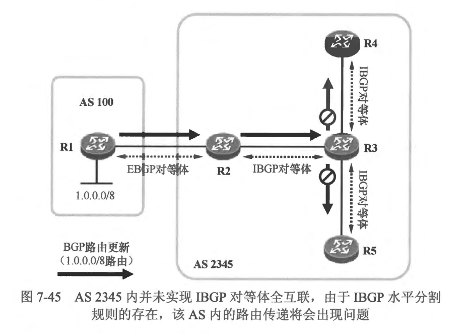
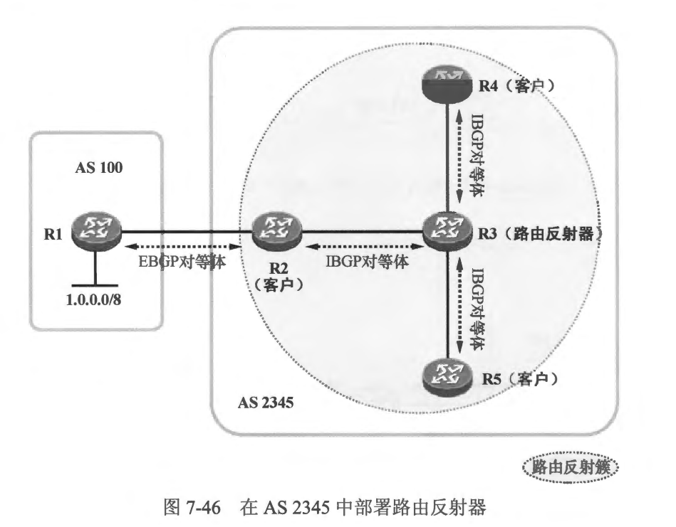
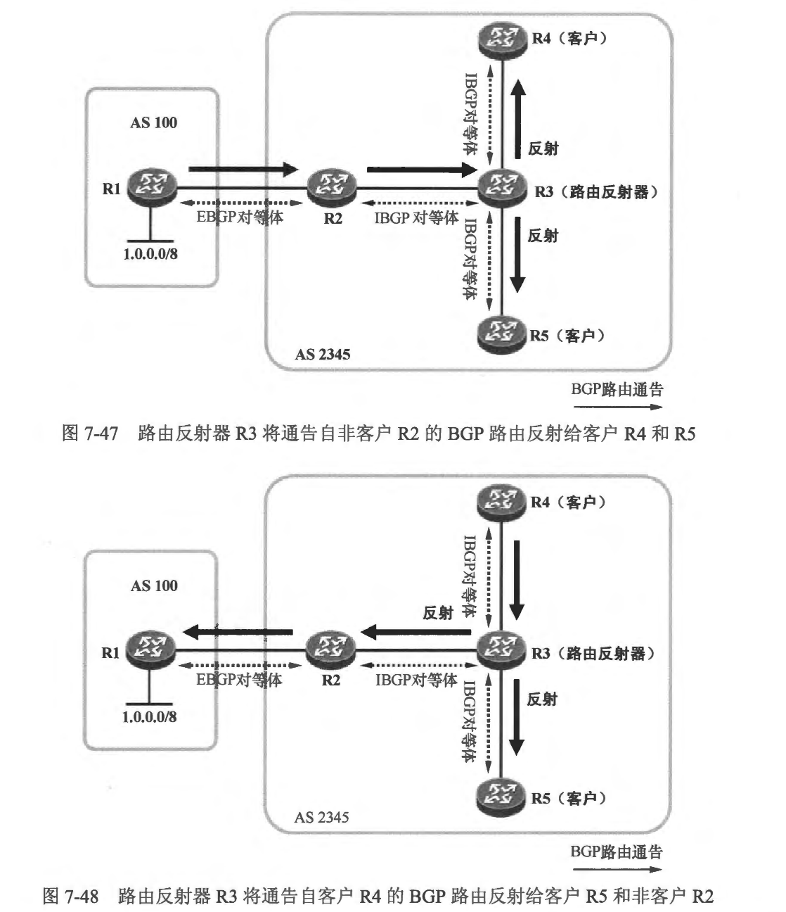
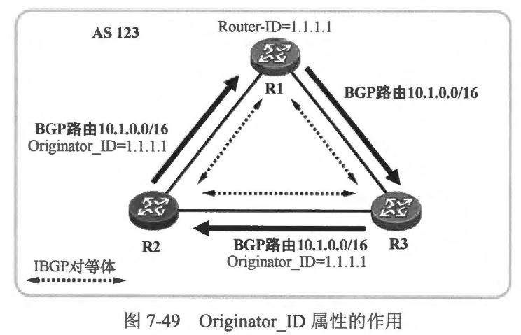
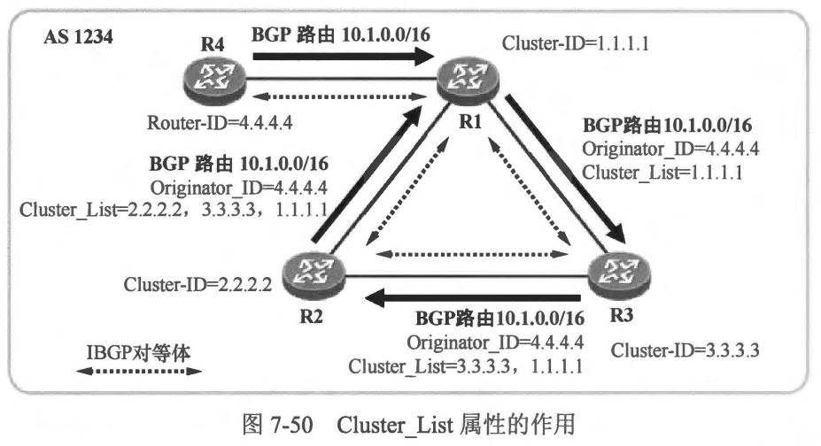

### 路由反射器
- 关于 BGP 的 AS Path 属性大家已经非常熟悉了，这个公认强制属性的重要性是不言而喻的，BGP 在 AS 之间的路由防环正是依赖于 AS Path 属性。当路由器收到一条 BGP 路由并且在该路由的 AS_ Path 属性值中发现了自己所处 AS 的AS 号时，它意识到从本 AS 传出的路由现在又被传递回了该AS，它将忽略这条路由，这可以在极大程度上避免环路的发生。然而 AS Path 属性只在 AS 之间发生改变，当路由在 IBGP 对等体之间传递时，AS Path 缺省是不会发生改变的，这意味着在 AS 的内部，AS Path 属性对于 BGP 路由的防环就无能为力了。
- BGP 定义了 IBGP 水平分割规则，来防止 BGP 路由在 AS 内部产生环路。这个规则在很大程度上杜绝了 IBGP 路由产生环路的可能性，但是却也带来了新的问题 ---- BGP 路由在 AS 内部只能传递一跳，这就可能造成 IBGP 路由无法被正确传递的问题。
- 在 图7-45 所示的网络中，R1 向 BGP 发布了 1.0.0.0/8 路由，R2 会从 R1 学习到该路由并且将其通告给 R3，但是 R3 从 R1 学习到的这条 IBGP 路由由于水平分割规则的存在故而不能够再被通告给 R4 及 R5，这就导致它们无法学习到 1.0.0.0/8 路由，从而无法访问这个目的网段。另外，R3 收到了 R4 发布的 BGP 路由后，也不能将其通告给 R2 或 R5，同理，R3 收到了 R5 发布的 BGP 路由后，也不能将其通告给 R2 或R4，当然，R1 也无法学习到 R4 及 R5 发布的路由。
- 解决这个问题的一个简单的方法是在 AS 2345 内实现 IBGP 对等体关系的全互联。本例中，需在 R2 及 R4、R2 及 R5 之间增加 IBGP 对等体关系，如此一来路由的传递问题即可解决。
- IBGP 对等体关系的全互联模型在某些场景下确实可行，但是当 AS 内 BGP 路由器数量较多时，若每台路由器需要与 AS 内的其他所有 BGP 路由器建立 IBGP 对等体关系，那么必然会加重设备的负担，同时降低了网络的可扩展性。值得庆幸的是，BGP 有两个解决方案能够应对这个问题，它们是路由反射器以及联邦。
 

- 本章学习要点
  - 理解路由反射器的概念及应用场景
  - 理解路由反射的规则及工作机制
  - 理解路由反射器的防环机制
  - 掌握路由反射器的基本配置

   
   

  ### 7.4.1 路由反射器的基本概念
- 路由反射器(Route Reflector， RR）是一种用于解决 AS 内部 BGP 路由传递问题的技术，在一些大型的 BGP 组网中常被应用。在本节开始时引入的案例中，如果 AS 2345
内不部署全互联的 IBGP 对等体关系，但是又要求路由传递不能出现问题，那么可使用路由反射器这个解决方案。如 图7-46 所示，R3 被指定为路由反射器，而 R2、R4 及R5 被指定为它的客户（Client），如此一来，R3 便会将自己学习到的 IGP 路由在遵循一定规则的情况下进行 “反射”。
- 以R1 发布的 BGP 路由为例,R2 收到该路由之后自然是可以直接将其通告给 R3 的，R3 收到客户 R2 发送过来的路由后，将其反射给 R4 及 R5，您可以将 R3 想象成一面镜子，现在有一束光从 R2 照射了过来，这束光被 R3 反射给了 R4 及 R5，这就是路由反射技术。R4 及 R5 发布的 BGP 路由被通告给 R3 后，后者也会将这些路由进行反射。因此在 AS 2345 内部署了路由反射器后，该AS 内的IBGP 路由传递问题将迎刃而解，而且 AS 内的路由器并未实现 IBGP 对等体的全互联，设备的处理资源得到了节约，如果 As 内需新增 BGP 路由器，那么该网络的配置也仅需做一点简单的变更，因此网络的可扩展性变得非常高。
- BGP 路由反射器技术在 RFC4456 (BGP Route Reflection: An Alternative to Full MeshInternal BGP）中定义。我们将路由反射器以及它的客户所构成的系统称为路由反射筷（Cluster），在 图7-46 所示的网络中，路由反射器 R3 与其客户 R2、R4 及 R5 就构成了一个路由反射筷。路由反射器与所有的客户建立 IBGP 对等体关系，而客户之间则无需建立 IBGP 对等体关系，这优化了网络中的 IBGP 对等体关系数量。实际上，路由反射器的配置是在充当反射器的 BGP 路由器上完成的，而路由反射器的客户设备并不需要做任何额外的配置，它甚至并不知道自己成为了某个路由反射器的客户(客户设备也无需支持路由反射器功能）。因此，路由反射器的配置是非常简单的，这一解决方案的引入，使得一个 AS 内 BGP 网络的部署变得更加简单，而且层次化路由反射筷的设计思维使得更大规模的 AS 内部 BGP 组网成为可能。
 
- 值得注意的是，路由反射器并不是在任何场景下都会将 BGP 路由进行反射的，否则 IBGP 路由的传递将变得泥乱不堪。路由反射器只在以下几种场景下才会反射 BGP 路由。
  - 如果路由反射器从自己的非客户对等体学习到一条 IBGP 路由，则它会将该路由反射给所有客户
  - 如 图7-47 所示，我们将 R3 配置为路由反射器，而且将 R4 及 R5 指定为其客户 (R2 并不是它的客户)。现在当 R3 从 IBGP 对等体 R2（非客户）收到一条 BGP 路由时，它将会把这条 IBGP 路由反射给客户 R4 及 R5。当然，如果此时 R3 还有一个非客户 IBGP 对等体 R6（在图中并未画出），那么这条路由是绝对不会被反射给 R6 的。
  - 如果路由反射器从自己的客户学习到一条 IBGP 路由，则它会将该路由反射给所有非客户，以及除了该客户之外的其他所有客户
  - 如 图7-48 所示，路由反射器 R3 从客户 R4 学习到了一条 IBGP 路由，则它会将这条路由反射给客户 R5，以及非客户 R2。Cisco 路由器支持关闭路由在客户之间的反射行为，如果在 R3 上将这个行为关闭（在BGP 配置视图下执行 no neighbor <邻居IP地址> route-reflector-client 命令），那么当它从客户学习到 IBGP 路由时，它只会把路由反射给非客户，而不会反射给其他客户。

  - 当路由反射器执行路由反射时，它只将自己使用的、最优的 BGP 路由进行反射 

 
 

### 7.4.2  路由反射器环境下的路由防环
- 7.4.1 节中已经介绍过了路由反射器的几种行为，实际上路由反射器对 IBGP 路由的操作是突破了水平分割规则的，而 IBGP 路由又依赖水平分割规则来实现无环化，那么这里就存在一个问题，即如何在部署了路由反射器的场景下杜绝 IBGP 路由环路呢？BGP 设计了两个路径属性，它们是 Originator_ ID 和 Cluster_ List，这两个属性只在部署了路由反射器的环境中被使用，都是可选非传递属性，借助它们，BGP 能够在路由反射器的环境中实现路由防环。

- Originator_ID 属性
  - Originator_ID 是一个可选非传递属性，该属性的长度为 32bit，其格式与 IPv4 地址的格式相同。当一条 BGP 路由被路由反射器反射给其他路由器时，如果该条路由已经携带了 Originator_ID 属性，则保留该属性，否则路由反射器为这条路由添加 Originator_ID 属性，并将属性值设置为该路由在本地 AS 内的始发路由器的 Router-ID。当路由器从
BGP 对等体收到一条IBGP 路由，并且该路由所携带的 Originator_ID 属性值与自己的 BGP Router-ID 相同时，它意识到从自己这里始发的路由又被通告回来了，它将忽略这条路由的更新。
  - 如图7-49 所示，R3 被配置为路由反射器，R1 是它的客户。另外，R2 也被配置为路由反射器，而 R3 是它的客户，也就是说，在 AS 123 中存在两个路由反射筷，它们之间存在一种类似嵌套的关系。现在一条 BGP 路由 10.1.0.0/16 从 R1 始发，被通告给了 R3。R3 将这条来自客户的 BGP 路由反射给非客户 R2。由于该路由此前并不携带Originator_ID属性，因此 R3 将路由反射的同时为其添加该属性，并将属性值设置为 R1 的 Router-ID 1.1.1.1（实际上 R3 还为路由创建了 Cluster_List 属性)。当 R2 从自己的客户 R3 收到 BGP 路由 10.1.0.0/16 后，将路由反射给非客户 R1，在反射路由时保持该路由中的 Originator_ID 属性。而当R1 从 R2 收到关于 10.1.0.0/16 路由的通告时，发现该条路由携带了 Originator_ID 属性，并且属性值与自己的 Router-ID 相同，它将忽略这个路由更新。如此一来，路由环路隐惠即可被规避。
 
- Cluster_List 属性
  - Cluster_List 是一个可选非传递属性，该属性的值是可变长的，它可以包含一个或者多个 Cluster-ID(路由反射筷标识符)。大家已经知道，路由反射器与其客户在一起构成了一个路由反射筷，在一个 AS 内是可以存在多个路由反射筷的，每个筷都拥有自己的 Cluster-ID。所谓的 Cluster-ID 是一个可配置的、32bit 的数值，缺省时为路由反射器的
BGP Router-ID。当一条BGP 路由被路由反射器执行反射时，如果该条路由己经存在 Cluster_List 属性，那么路由反射器将本地的 Cluster-ID 附加到路由的 Cluster_ List属性值之前，而如果该条路由并不存在 Cluster_List 属性，那么路由反射器为它创建 Cluster_List 属性并将本地的 Cluster-ID 插入 Cluster_List 属性值中。当一合路由反射器收到一条 BGP路由后，若发现该条路由携带 Cluster_List 属性，并且 Cluster_List 属性值中包含着自己的 Cluster-ID 时，它意识到被自己反射出去的 BGP 路由又被通告回来了，此时它将忽略关于这条路由的更新。
  - 在 图7-50 所示的场景中，我们配置了三台路由反射器，它们分别是 R1、R3 及 R2,其中 R4 是 R1 的客户，R1 是 R3 的客户，而 R3 是 R2 的客户。现在 R4 将 BGP 路由
10.1.0.0/16 通告给 R1，R1 则将这条来自容户的路由反射给非客户 R3，同时为被反射的路由创建 Originator_ID 属性，其值为R4 的Router-ID 4.4.4.4，另外也创建Cluster_List 属性，其值为 1.1.1.1。当 R3 收到这条路由时，它会把路由反射给 R2，同时在路由的 Cluster List 属性值的前面插入自己的 Cluster-ID 3.3.3.3。 当 R2 收到这条路由时，它将路由反射给 R1，同时在路由的 Cluster_ List 属性值的前面插入自己的 Cluster-ID 2.2.2.2。因此最终R1 将从 R2 收到关于 10.1.0.0/16 路由的通告，而且该路由携带的 Cluster_List 属性值为“2.2.2.2，3.3.3.3， 1.1.1.1”，R1 在其中看到了自己的 Cluster-ID，它将忽略这条路由，如此就可以规避路由环路。
 
- 值得强调的是，当路由反射器将一条从自己的 EBGP 对等体学习到的 BGP 路由通告给客户路由器时，它是不会为路由创建 Originator_ID 或 Cluster_List 属性的，因为这本质上并不是一个路由反射的行为，而是一个正常的路由通告行为。另外，当一条携带着 Originator_ID 及 Cluster_List 属性的BGP 路由被通告给路由器的 EBGP 对等体时，这条路由的 Originator_ID 及 Cluster List 属性会被该路由器移除。当路由反射器执行路由反射时，除了可能会为路由附加 Originator_ID 及 Cluster_List属性，或修改Cluster_ List 属性之外，对于其他路径属性缺省不做修改，例如 Local Preference、AS_Path、 MED、 Next Hop等。

### 7.4.3 路由反射器基础配置