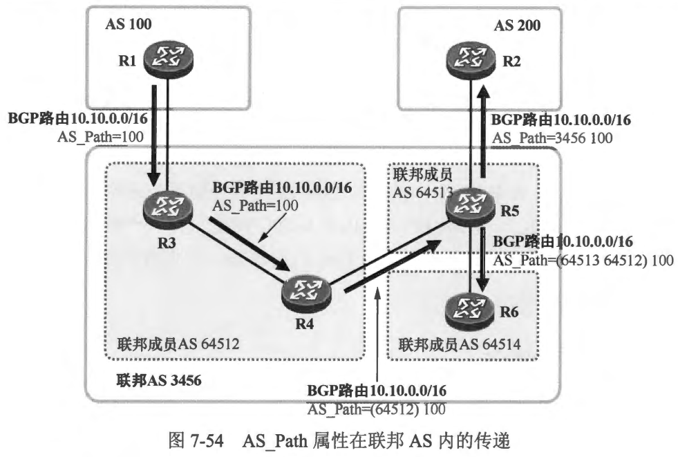

### 7.5 联邦
- 在一个AS 内部署全互联的 IBGP 对等体关系确实可以很好地解决 IBGP 路由传递的问题，但这是一个低扩展性的做法，在大型的网络中会给设备带来沉重的负担。在前面的章节中大家已经掌握了使用路由反射器解决这个问题的方法，接下来我们将为大家讲解另一个解决方案，它就是联邦。联邦 (Confederation）也被称为联盟，大致的思想是在一个大的 AS 内创建若千个小的 AS（类似子 AS 的概念），使得 AS 内部出现一种特殊的 EBGP 对等体关系，从而解决 IBGP 路由在 AS 内的传递问题。BGP 联邦在 RFC5065 (Autonomous System Confederations for BGP)中定义。

- 本章学习目标:
  - 理解联邦的基本概念
  - 理解联邦的环境下 BGP 路由传播的过程中 AS_Path 属性的变化
  - 掌握联邦的基础配置

 
 

### 7.5.1 联邦的基本概念
- 在图7-52 中，AS 3456 内并没有实现 IBGP 对等体全互联，这将导致该AS 内的路由传递出现问题，这里可以随便举几个例子：
  - R3 会将自己从 R1 学习到的 BGP 路由通告给 R4，但是后者不能将该路由通告给 R5，因此 R2、R5 及 R6 都无法学习到该路由。
  - R3 发布的 BGP 路由会被其通告给 R1 及 R4，但是 R4 不能将该路由通告给 R5,因此 R2、R5 及 R6 都无法学习到该路由。
  - R4发布的BGP 路由会被其通告给R3及R5，但是R5 不能将该路由通告给 R6,因此 R6 无法学习到该路由。
  - ...
  - 利用 BGP 联邦即可解决上述问题。如图7-53 所示，我们在 AS 3456 内创建了两个“小 AS ”---- AS 64512 及 AS 64513，这就有点像一个大的城市被划分成了两个行政区。此时 AS 3456 被称为联邦 AS (Confederation AS)，3456是该联邦的AS 号，而 AS 64512及 AS 64513 被称为成员 AS (Member AS)。如此一来，R3 与 R4 之间、R5 与 R6 之间依然保持 IBGP 对等体关系，而 R4 与 R5 之间的关系则变成联邦 EBGP 对等体关系。联邦 EBGP 对等体关系与传统的 EBGP 对等体关系有许多相似的地方，例如 IBGP 水平分割规则在这里不再起作用。当 R4 从 IBGP 对等体 R3 学习到 BGP 路由时，它可以将路由通告给其联邦 EBGP 对等体 R5 ----与传统的 EBGP 路由通告相似，而 R5 从 R4 学习到的 BGP 路由，当然也就能被通告给 EBGP 对等体 R2 以及 BBGP 对等体 R6。因此，通过在 AS 3456 内部署联邦，即可在该 AS 内没有实现 IBGP 对等体全互联的情况下，解决路由传递的问题。
   
  - 值得注意的是，若在 AS 3456 内部署联邦，R3、R4、R5及R6 创建 BGP 进程时所使用的 AS 号是其所属的成员 AS 号，而R3 及R5作为联邦 AS 的边界路由器，需与联邦 AS 之外的其他 AS 建立 EBGP 对等体关系，它们需使用联邦 AS 号与 EBGP 对等体 R1 及 R2 对接。而对于联邦 AS 外部的网络而言，例如 AS 100 及 AS 200，它们并不知晓成员 AS 64512 及 AS 64513 的存在，也就是说联邦 AS 内部的成员 AS 对于联邦外部并不可见。

 
 

###  7.5.2 AS Path 属性在联邦 AS 中的处理
- 值得注意的是，当BGP路由在联邦内传递时，联邦成员 AS 号才会出现在 AS_ Path属性中，当路由传出联邦 AS 时，成员 AS 号将被移除。因此联邦 AS 的外部是不知道联邦内成员 AS 的存在的。我们已经知道，一条 BGP 路由的 AS Path 属性值（如果为非空）是由一种或者多种 AS Path 片段组成的，一条路由的 AS Path 属性中可能只存在一种 AS Path片段，也可能同时存在多种。BGP 设计了4种AS_ Path 片段类型，它们分别是:
  - AS_Sequence
  - AS_Set
  - AS_Confed_Sequence
  - AS_Confed_Set
- 关于 AS_Sequence 及 AS_Set 我们在前面的章节中已经介绍过了。联邦使用了后面两种 AS_Path 片段类型，也就是 AS_Confed_Sequence 及 AS Confed_Set， 这两种片段类型分别与前面两种类似，只不过它们只被用于联邦。当路由在联邦 EBGP 对等体之间传递时，成员 AS 号被写入这些特殊类型的 AS_Path 片段中。而当路由被传出联邦时，成员 AS 号应该被移除，此时这两种片段类型将被设备从 AS_Path 属性中移除。
- 在图7-54中，R1 向 BGP 发布了10.10.0.0/16 路由，它将路由通告给了 EBGP 对等体 R3，此时路由的 AS_Path 属性值为 100（该AS_Path 属性只包含一个 AS_Path片段，其类型为 AS_Sequence，该片段中只包含 100 这个 AS 号)。接下来R3将这条 BGP 路由通告给 IBGP 对等体 R4，此时路由的 AS_Path 属性值当然是不会发生改变的。而当 R4 将这条路由通告给联邦 EBGP 对等体 R5 时，它将在路由原有 AS_Path 属性的基础上，增加一个 AS_Confed_Sequence 类型的片段，专门用于存储联邦成员 AS 号，R4 将自己所处的成员 AS 号 64512 写入其中，并将路由通告给 R5，此时该条路由的AS_Path 属性值为 “（64512） 100”，该 AS Path 属性包含两种类型的 AS_Path 片段。当R5将该路由通告给R6时，它在 AS_Confed_Sequence 类型的片段中附加本地 AS 号 64513，R6 收到该路由时，路由的AS_Path 为“ 64513 64512）100”。而当R5将这条 BGP 路由通告给 EBGP 对等体R2 时，它将路由的 AS_Path 属性中专门用于联邦的 AS_Confed_Sequence 片段移除，并在剩下的 AS_Sequence 片段中附加联邦 AS 号 3456。
 

 
 

### 7.5.3 案例：联邦的基础配置
- 在 图7-55中，AS 3456 内已经运行了 OSPF，该 AS 内的路由器都配置了 Loopback0 接口并为其分配 x.x.x.x/32 的IP地址（其中× 为设备编号），它们都将自己 Loopback0 接口的路由发布到了 OSPF 中。我们将 AS 3456 规划为联邦 AS 并在其中创建两个联邦成员 AS， 分别是 AS 64512及 AS 64513。联邦 AS 3456 内的 BGP 对等体关系都基于 Loopback0 接口建立。R1 及 R3、R2 及R5 的 EBGP 对等体关系基于直连接口建立。
 