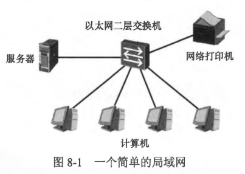
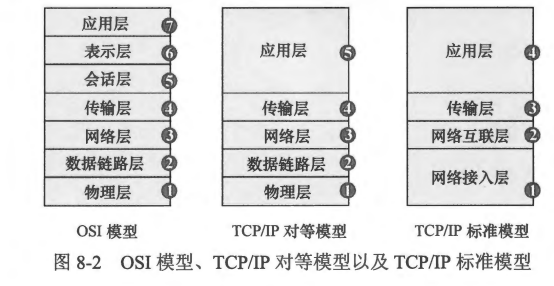
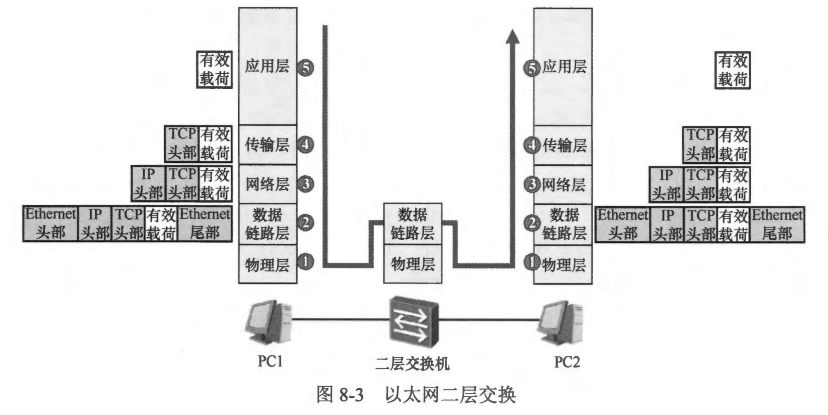

### 8.1.1  本章内容概述和教学目标
- 简单地说，局域网 (Local Area Network， LAN）指的是在一个局部的地理范围内，将个人计算机、服务器、网络打印机等各种电子设备连接起来的通信网络。从其名称就可以看出，局域网的地理覆盖范围通常不会太大。在现实生活中，局域网可以说是随处可见，例如一个公司的内部网络、一家网吧的网络、一个家庭网络等。自从 20 世纪 70年代局域网技术提出后，出现了各种实现局域网的技术，而随着行业的发展及技木演进，以太网（Ethernet）逐渐占据了局域网技术的主导地位，现如今我们在生活中所见的局域网几乎均采用以太网技术实现。
- 在使用以太网技术实现的局域网中，以太以太网二层交换机网二层交换机是非常重要及基础的网络设备，服务器网络打印机使用一台以太网交换机即可将网络中的个人计算机、服务器以及网络打印机等电子设备连接起来并且实现相互通信，如 图8-1 所示。在本书后续的内容中，如无特别说明，交换机都指以太网交换机。
 
- 交换机通常以两种形态呈现：
  - 二层交换机: 二层交换机指的是只具备二层交换 (Layer 2 Switching） 功能的交换设备。
  - 三层交换机: 三层交换机除了具备二层交换机的功能，还具备三层路由和三层数据转发功能。所谓二层交换，指的是根据数据链路层信息对数据进行转发的行为，此处的数据链路层指的是TCP/IP 对等模型中的第二层。
- 在网络通信领域中，OSI 模型 (Open System Interconnection Reference Model，开放系统互联参考模型）及 TCP/IP 模型都被大家所熟知，这些参考模型的出现，极大地推动了网络技术的发展。TCP/IP 模型存在两个不同的版本，它们分别是 TCPIP 标准模型及 TCP/IP 对等模型。图 8-2 展示了 OSI 参考模型和 TCP/IP 对等模型、TCP/IP 标准模型的比较。现实中, TCP/IP 对等模型的使用最为广泛，因此在本书后续的内容中将使用 TCP/IP 等模型来帮助大家理解数据的处理过程。
 
- 在图 8-3 中，当 PC1 要发送一份数据给 PC2 时，PC1 的应用层协议会产生应用数据(即有效载荷)，而数据网络的基本功能就是要将这份数据传输到目的设备 PC2。当然这些数据不可能被直接扔到网络中进行传输，PC1 还需要对其进行层层封装，这就像邮寄一封信件时，你不可能直接将信件交付给邮局，而要先将其放入一个信封，在信封上填写相应的信息，例如寄件人、收件人及地址信息等，再将封装好的信件交给邮局，邮局则根据信封上的收件人及地址来进行信件的传递。以 HTTP 会话为例，数据发送方 PC1 的 HTTP 会产生应用数据载荷，在传输层(Transport Laver）这些数据载荷会被封装一个 TCP 的头部，接着在网络层（Network Layer）再被封装一个 IP 的包头，随后在数据链路层（Data Link Layer）则再被封装一个数据帧头部，在以太网中，该头部便是以太网帧头(由于数据链路层位于 TCP/IP 对等模型的第二层，因此数据链路层的头部也被称为二层头部），最后，完成封装的数据以电信号的方式通过网线传输到链路对端。由于 PC1 连接着一台交换机，当交换机从接口上接收到这些电信号时，首先会将它们还原成数据帧，然后会检查数据帧的完整性，并根据帧头中的目的MAC 地址 (Media Access ControlAddress）来转发该数据帧。每台二层交换机都维护着一个MAC 地址表 (MAC Address Table），交换机在转发数据帧时，会在 MAC 地址表中查询该数据帧的目的 MAC 地址，以便决定将其从哪一个接口发送出去。由于此时交换机是根据数据的二层头部中的信息来进行转发操作的，因此这种行为又被称为二层交换。在本例中，交换机在其 MAC 地址表中查询到匹配数据帧目的 MAC 地址的表项后，将数据帧转发给 PC2，后者收到数据帧后，将其进行层层解封装 sc，最终得到 HTTP 载荷。
 

- 本章学习目标:
  - 理解 MAC 地址的基本概念及用途
  - 熟悉以太网数据帧结构
  - 学会查看MAC 地址表
  - 理解二层交换的基本工作原理

 
 

### 8.1.1 MAC地址
