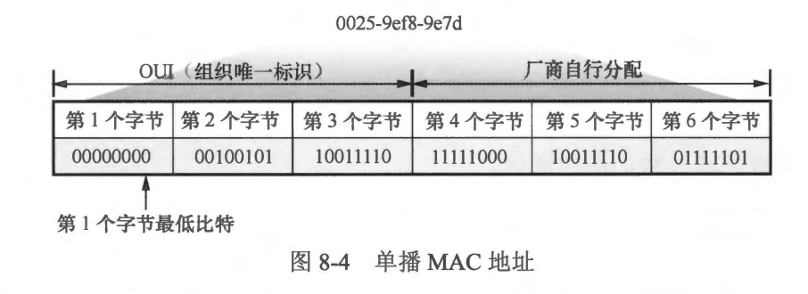
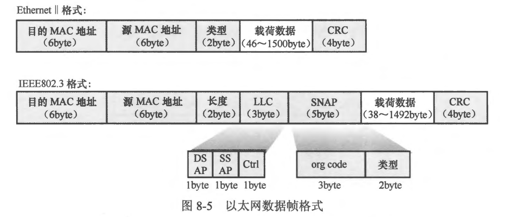
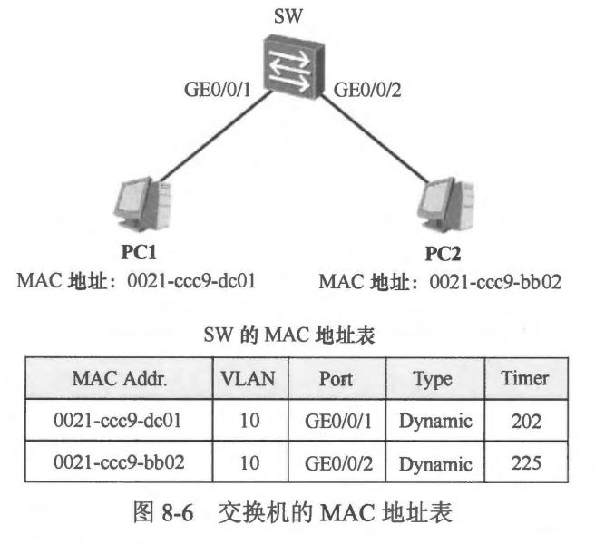
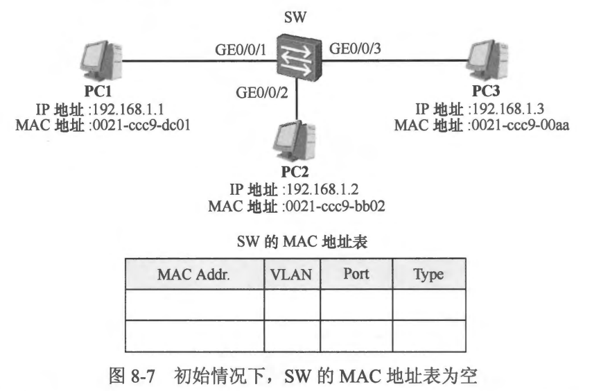
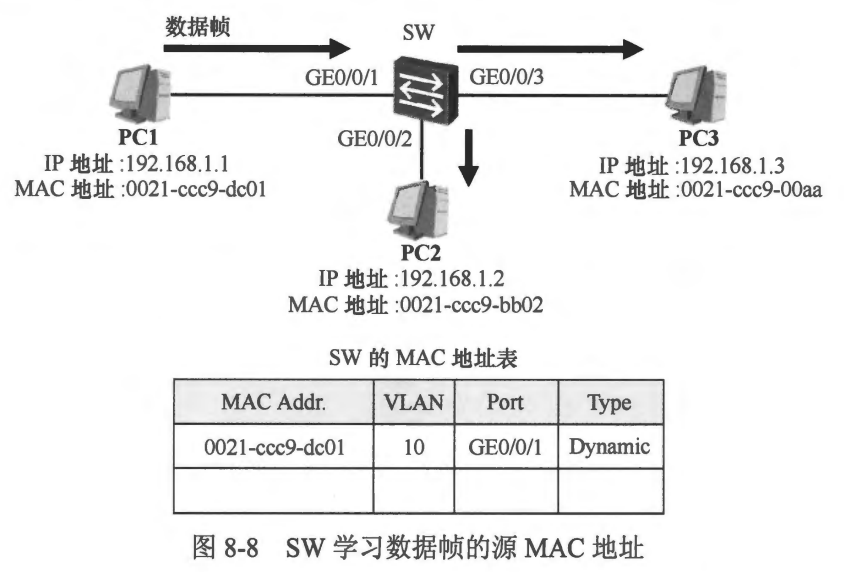
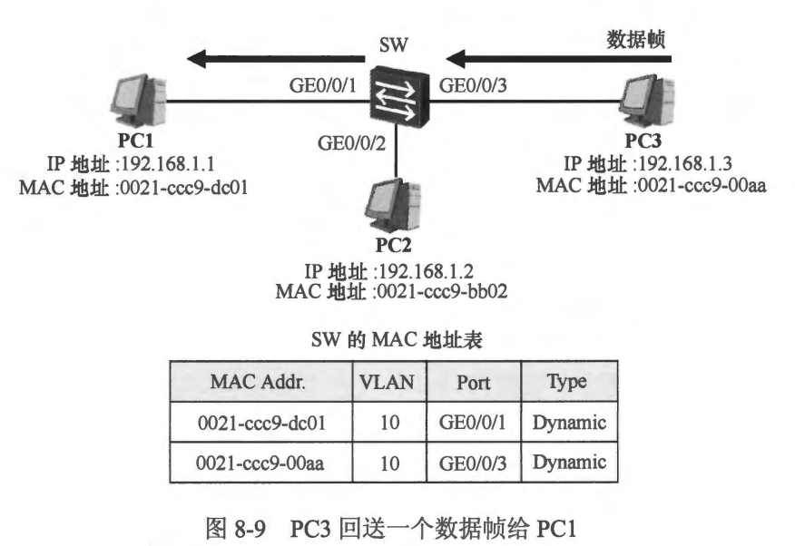

### 本章内容概述和教学目标
- 简单地说，局域网 (Local Area Network， LAN）指的是在一个局部的地理范围内，将个人计算机、服务器、网络打印机等各种电子设备连接起来的通信网络。从其名称就可以看出，局域网的地理覆盖范围通常不会太大。在现实生活中，局域网可以说是随处可见，例如一个公司的内部网络、一家网吧的网络、一个家庭网络等。自从 20 世纪 70年代局域网技术提出后，出现了各种实现局域网的技术，而随着行业的发展及技木演进，以太网（Ethernet）逐渐占据了局域网技术的主导地位，现如今我们在生活中所见的局域网几乎均采用以太网技术实现。
- 在使用以太网技术实现的局域网中，以太以太网二层交换机网二层交换机是非常重要及基础的网络设备，服务器网络打印机使用一台以太网交换机即可将网络中的个人计算机、服务器以及网络打印机等电子设备连接起来并且实现相互通信，如 图8-1 所示。在本书后续的内容中，如无特别说明，交换机都指以太网交换机。
 
- 交换机通常以两种形态呈现：
  - 二层交换机: 二层交换机指的是只具备二层交换 (Layer 2 Switching） 功能的交换设备。
  - 三层交换机: 三层交换机除了具备二层交换机的功能，还具备三层路由和三层数据转发功能。所谓二层交换，指的是根据数据链路层信息对数据进行转发的行为，此处的数据链路层指的是TCP/IP 对等模型中的第二层。
- 在网络通信领域中，OSI 模型 (Open System Interconnection Reference Model，开放系统互联参考模型）及 TCP/IP 模型都被大家所熟知，这些参考模型的出现，极大地推动了网络技术的发展。TCP/IP 模型存在两个不同的版本，它们分别是 TCPIP 标准模型及 TCP/IP 对等模型。图 8-2 展示了 OSI 参考模型和 TCP/IP 对等模型、TCP/IP 标准模型的比较。现实中, TCP/IP 对等模型的使用最为广泛，因此在本书后续的内容中将使用 TCP/IP 等模型来帮助大家理解数据的处理过程。
 
- 在图 8-3 中，当 PC1 要发送一份数据给 PC2 时，PC1 的应用层协议会产生应用数据(即有效载荷)，而数据网络的基本功能就是要将这份数据传输到目的设备 PC2。当然这些数据不可能被直接扔到网络中进行传输，PC1 还需要对其进行层层封装，这就像邮寄一封信件时，你不可能直接将信件交付给邮局，而要先将其放入一个信封，在信封上填写相应的信息，例如寄件人、收件人及地址信息等，再将封装好的信件交给邮局，邮局则根据信封上的收件人及地址来进行信件的传递。以 HTTP 会话为例，数据发送方 PC1 的 HTTP 会产生应用数据载荷，在传输层(Transport Laver）这些数据载荷会被封装一个 TCP 的头部，接着在网络层（Network Layer）再被封装一个 IP 的包头，随后在数据链路层（Data Link Layer）则再被封装一个数据帧头部，在以太网中，该头部便是以太网帧头(由于数据链路层位于 TCP/IP 对等模型的第二层，因此数据链路层的头部也被称为二层头部），最后，完成封装的数据以电信号的方式通过网线传输到链路对端。由于 PC1 连接着一台交换机，当交换机从接口上接收到这些电信号时，首先会将它们还原成数据帧，然后会检查数据帧的完整性，并根据帧头中的目的MAC 地址 (Media Access ControlAddress）来转发该数据帧。每台二层交换机都维护着一个MAC 地址表 (MAC Address Table），交换机在转发数据帧时，会在 MAC 地址表中查询该数据帧的目的 MAC 地址，以便决定将其从哪一个接口发送出去。由于此时交换机是根据数据的二层头部中的信息来进行转发操作的，因此这种行为又被称为二层交换。在本例中，交换机在其 MAC 地址表中查询到匹配数据帧目的 MAC 地址的表项后，将数据帧转发给 PC2，后者收到数据帧后，将其进行层层解封装 sc，最终得到 HTTP 载荷。
 

- 本章学习目标:
  - 理解 MAC 地址的基本概念及用途
  - 熟悉以太网数据帧结构
  - 学会查看MAC 地址表
  - 理解二层交换的基本工作原理

 
 

### 8.1.1 MAC地址
- 众所周知，网络层是 ICP/IP 对等模型的第三层，它最基本的功能是将数据包从源转发到目的地，为了实现数据包的转发，以及在数据网络中定位设备，网络层定义了逻辑地址，对于 IP 协议来说，这个地址就是 IP 地址。源设备在其发送的数据包的卫头部中写入源、目的 IP 地址，这样一来这个数据包被送入网络后，就能够被正确地转发到目的 IP 地址所定位的设备。当然，实际上这个数据包从源被转发到目的地的过程中，可能穿越了多段链路，为了保证数据能够从链路的一端传递到另一端，还需要额外的信息。
- 数据链路层是 TCP/P 对等模型中的第二层，位于网络层和物理层之间，它最基本的功能是将源设备的网络层下发的数据传输到链路上的目的相邻设备。当然，为了保证数据能够准确地送达目的相邻设备，还需要借助一个第二层的地址。以太网是最常见的数据链路层技术之一，在以太网中，MAC 地址用于定位设备，也被用于第二层的数据寻址。MAC 址是在 IEEE 802 标准中定义的，符合 IEEE 802 标准的接口必须拥有 MAC地址。以太网标准是 IEEE 802 的一个子集，因此每一个以太网接口都必领拥有 MAC 地址，例如电脑的以太网接口，或者路由器的以太网接口等，这里所说的 MAC 地址指的是单播 MAC 地址。实际上，MAC 地址与卫地址类似，也有单播、组播及广播类型之分。MAC 地址的长度为 48bit， 通常采用十六进制的格式来呈现，例如 0025-9e18-9e7d（也可表示成 00-25-9e-18-9e-7d）。
- 正如上文所说，MAC 地址分为三种，分别是单播 MAC 地址、组播MAC 地址以及广播 MAC 地址: 
  - 单播 MAC 地址用于唯一地标识一台设备的某个接口，这种 MAC 地址第1个字节的最低比特位为 0，如图8-4 所示。单播 MAC 地址通常也被称为硬件地址，因为它往往是被烧录在以太网网卡上的。每一个单播 MAC 地址都具有全球唯一性，厂商在生产以太网接口卡（网卡）之前，必须先得到 24bit 的组织唯一标识 (Organizationally Unique Identifier, OUI), if OUI Finit M IEEE (Institute of Electrical and Electronics Engineers,电气和电子工程师学会）注册得到的。厂商在生产网卡时，将 OUI 作为 MAC 地址的前面 24bit，而 MAC 地址的后 24bit 则由厂商自己指定。当主机（注：此处所说的主机，是指终端 PC 或路由器等，但不包括二层交换机） 的网卡接口收到一个数据帧时，若该数据帧的目的 MAC 地址为单播 MAC 地址，并且这个 MAC 地址与该网卡接口本身的 MAC 地址不相同时，网卡会丢弃这个数据帧。
 
  - 组播 MAC 地址标识了一组设备，这种MAC 地址第1个字节的最低比特位为 1，例如 0100-5e-00ab。一个组播 MAC 地址所标识的一组设备有着共同的特点，那就是它们都加入了相同的组播组，这些设备将会侦听目的 MAC 地址为该组播MAC 地址的数据帧。本书将在“组播” 一章中详细介绍这种类型的 MAC 地址。只有单播 MAC 地址才能够被分配给一个以太网接口，组播或广播 MAC 地址是不能被分配给任何一个以太网接口的，换句话说，这两种类型的 MAC 地址不能作为数据帧的源 MAC 地址，而只能作为目的MAC 地址。
  - 广播 MAC 地址的所有比特位全都是 1（因此广播 MAC 地址就是ffff-ffff-ffff)，这种 MAC 地址标识了所有的以太网接口。因此当一个数据帧的目的 MAC 地址为 ffff-ffff-ffff，那么这就是一个广播数据帧，所有收到该数据帧的网卡都要处理它。

 
 

### 8.1.2 以太网数据帧
- 一个 IP 数据包要想在以太网链路上传输，就需要增加以太网的封装，从而形成一个以太网帧（Ethernet Framne）。以太网帧的格式有两种标淮，一个是IEEE 802.3 格式。另一个是Ethernet II格式，如图8-5所示。

- 目前的网络设备及网卡兼容 IEEE 802.3 及 Ethernet II 两种格式的以太网帧，但是在现实网络中，大多数的以太网帧使用 Ethernet II格式，因此本节主要探讨 Ethernet II 格式的以太网帧。Ethernet II 格式的以太网帧中各个字段的描述如下：
  - 目的MAC 地址 (Destination MAC Address): 标识了该数据帧的接收者。目的 MAC 地址可以是单播 MAC 地址、组播 MAC 地址或者广播 MAC 地址
  - 源MAC 地址 (Source MAC Address): 标识了该数据帧的发送者。源 MAC 地址只能是单播 MAC 地址
  - 类型 (Type): 用来标识该数据帧头部后所封装的上层协议类型（载荷数据的类型)。该数据帧的接收方通过这个字段得知载荷数据是什么类型的数据。例如，如果类型宇段值为 0x0800，则表示载荷数据是IPv4 报文；如果类型字段值为 0x86dd，则表示载荷数据是 IPV6 报文
  - 载荷数据 (Payload)：载荷数据，其长度为 46~1500byte。
  - CRC (Cyclic Redundancy Check): 循环冗余校验字段，用于检测数据帧在传输过程中是否发生损坏。

 
 

### 8.1.3 MAC地址表
- MAC 地址表是交换机能够正常工作的重要依据，它相当于交换机保存的一张“地图”。MAC 地址表中的每一个表项都包含着 MAC 地址、VLAN-ID 以及交换机接口等信息。在 图8-5 所示的网络中，交换机 SW 连接着两合 PC。初始情况下，SW 的MAC 地址表是空的，当它的某个接口收到一份数据帧时，它会将该数据帧的源 MAC 地址学习到 MAC 地址表中，并且与收到该顾的接口以及该接口所加入的 VLAN 进行关联，从而形成一个表项。通过查看交换机的 MAC 地址表，能非常直观地看出哪一合设备连接在交换机的哪个接口。

- 当 PC1 及 PC2 开始在网络中发送数据时，SW 便能够学到两者的MAC 地址并且在MAC 地址表中形成相应的表项。交换机在接收数据帧时，通过检查数据帧从而自动学习到的 MAC 地址表项是动态表项，在 MAC 地址表中，这些表项的类型为 Dynamic（动态)。动态的 MAC 地址表项是存在老化时间的。在初始情况下，当 PC1 发送的数据帧到达 SW 的 GE0/0/1 接口时，SW 学习 PC1 的 MAC 地址并且与 GE0/0/1 接口进行关联，从而形成一个 MAC 地址表项，与此同时，SW 为这个表项启动一个计时器，这个计时器从缺省 300s 开始倒计时，当 PC1 的下一个数据帧到达 SW 的 GE0/0/1 接口时，该 MAC 地址表项被刷新，计时器复位并重新开始倒计时。如果 SW 一直没有收到 PC1 发送的新数据，并且该计时器计数到 0 时，这个 MAC 地址表项将被删除。这个机制使得交换机的 MAC 地址表不至于被大量陈旧的、无用的表项填充，竟该数据表的存储空间是有限的。除了动态的 MAC 地址表项之外，我们还能为交换机添加静态的表项，静态表项不会被老化。
- MAC 地址表最重要的作用是作为交换机进行数据帧转发的依据。

 
 

### 8.1.4 二层交换的工作原理
- 当交换机在某个接口上收到一个单播数据帧时，它将首先读取数据帧的目的 MAC 地址，并且在自己的 MAC 地址表中查询该地址，如果查询不到匹配的表项，则将该数据帧进行泛洪(Flooding)，所谓的泛洪是指将当交换机收到一个未知单播帧时，除接收到该数据帧VLAN下的接口外，交换机会向VLAN内的其他所有UP的成员接口进行泛洪(向所有节点转发该数据帧)。如若有目标节点响应后，交换机会刷新MAC地址表映射它们间的关系，从而该未知单播帧变为已知单播帧，当交换机再次收到该帧直接匹配MAC地址表进行转发；如若没有目标节点响应，交换机则丢弃该数据帧。
- **原书对于泛洪的解释: 所谓的泛洪是指将数据帧从除了收到该帧的接口之外的所有接口都发送一份拷贝。如果能够在 MAC 地址表中找到匹配的表项，并且收到该帧的接口与该表项中对应的接口不同时，则将数据帧从该表项中对应的接口转发出去；如果收到该帧的接口与该表项中对应的接口相同时，则丢弃该数据帧。**
- 此外，当交换机收到一个数据帧时，它还会读取数据帧的源 MAC 地址，如果该地址在 MAC 地址表中并不存在相关表项，则交换机将创建一个 MAC 地址表项，并将该MAC地址及收到该数据帧的接口记录在该表项中，这就是交换机的MAC 地址学习功能。
- 以 图8-7 为例，初始情况下，交换机的 MAC 地址表为空，现在来看看当 PC1 发送一个数据帧给 PC3 时，交换机的帧转发行为。

  - PC1 构造 IP 数据包，IP 头部里的源 IP 地址为本地 IP 地址 192.168.1.1，目的 IP 地址为 192.168.1.3。上述 IP 数据包要在以太网环境中传输，还需要封装一个以太网的帧头。在帧头中源 MAC 地址为 0021-ccc9-dc01，目的 MAC 地址为 0021-ccc9-00aa（这里姑且忽略 ARP 解析过程，假设 PC1 已经知晓了PC3 的MAC 地址）。PCI 将该数据帧发出。
  - 交换机 SW 收到这个数据帧后，首先借助数据帧尾部的 CRC 字段进行差错校验，确保该数据帧在传输过程中没有被损坏。接下来交换机读取数据帧的目的 MAC 地址，并且在其 MAC 地址表中查询该地址，结果发现并不存在匹配的表项，于是它将这个数据帧进行泛洪，如图 8-8 所示。泛洪的直接结果是，除了 GE0/0/1 接口外，交换机其他的所有接口（相同 VLAN 内的接口）所连接的设备都将会收到该数据帧的拷贝。然后SW 还会进行源 MAC 地址的学习，它发现数据帧源 MAC 地址在 MAC 地址表中并不存在，因此 SW 为该MAC 地址创建一个新的 MAC 地址表项，由于这个数据帧是在接口 GE0/0/1 上接收，因此 MAC 地址 0021-ccc9-dc01 与接口 GE0/0/1 形成关联。
  
  - PC2 收到交换机转发的数据帧后，发现该帧的目的 MAC 地址与自己的网卡接口 MAC 地址并不相同，因此它丢弃这个数据帧。而 PC3 则会接收这个数据帧，并且对数据帧进行解封装。
  - 现在，PC3 要回复一份数据给 PC1，它将数据封装成帧后，从网卡接口发出。该帧的源 MAC 地址为 0021-ccc9-00aa，目的 MAC 地址为 0021-ccc9-dc01， SW 在其 GE0/0/3 接口上收到这个帧。首先它读取数据帧的目的 MAC 地址，并且在其 MAC 地址表中查询该地址，它将在表中查询到一个匹配的表项，而且该表项的出接口为 GE0/0/1,于是它将这个数据帧从 GE0/0/1 接口转发出去。然后 SW 将数据帧的源 MAC 地址学习到MAC 地址表中，如图8-9 所示。
  
- 上述就是典型的二层交换机制。实际上对于二层交换的过程来说，数据帧从进入交换机，到其被交换机从某个接口转发出去，通常是没有任何改变的（插入 802.1Q Tag 的情况除外），因此我们通常将二层交换机的帧交换操作称为“透传”。
- **说明: 初始时如果 PC1 并不知道 PC3 IP 地址对应的 MAC 地址，那么它将向网络中发送一个广播的 ARP Request 数据帧，用于请求对方的 MAC 地址。这个广播帧将会被 SW 进行泛洪。PC2 收到该帧后需首先将数据帧解封装，然后将里面的 ARP 載荷上交 ARP 协议模块去处理，当该协议模块发现该 ARP 请求并非发给自己时，PC2 将忽略该 ARP 请求。而PC3 收到该 ARP Request 数据帧后，会使用一个单播的 ARP Reply 数据帧进行回应，如此一来，PC1 便获知了PC3 的卫地址对应的MAC 地址。**
- 当交换机收到一个广播数据帧（目的 MAC 地址为 ffff-ffff-ffff）时，交换机不会进行目的 MAC 地址查询，而是直接将其进行泛洪。
- 当交换机收到一个组播数据帧时 （组播数据帧指的是目的 MAC 地址为组播 MAC 地址的数据帧），缺省情况下，交换机会对其进行泛洪处理，但是如果交换机部署了诸如 IGMP Snooping 这样的二层组播技术，那么组播数据帧将只会被交换机从特定的一些接口转发出去。
