### 8.2.1 VLAN的概念及意义
- 对于一台交换机而言，缺省情况下它的所有接口都属于同一个广播域 (Broadcast Domain），所谓广播域指的是一个广播数据所能到达的范围。当多台主机连接到同一合交换机时，它们可以直接进行通信（只需配置相同网段的 IP 地址），而且无需借助路由设备，这种通信行为被称为二层通信。由于这些主机都属于同一个广播域，因此当其中一台主机发出一份广播数据时，连接在交换机上的其他所有主机都会收到这份数据的拷贝，当然，如果交换机在某个接口上收到目的 MAC 地址未知的单播数据帧时，会将这个数据帧进行泛洪，如图8-10所示。然而并非所有的主机都需要这些数据帧，此时对于它们而言，这些广播帧或者目的 MAC 地址未知的单播帧实际上是增加了 设备性能损耗，而且对网络带宽而言也是一种浪费。设想一下，如果存在一个由许多二层交换机构成的大型二层网络，那么在这个大规模的广播域中，一旦出现广播帧或目的 MAC 地址未知的单播帧便将引发大量的泛洪现象，从而给网络带来沉重的负担，如图8-11 所示。
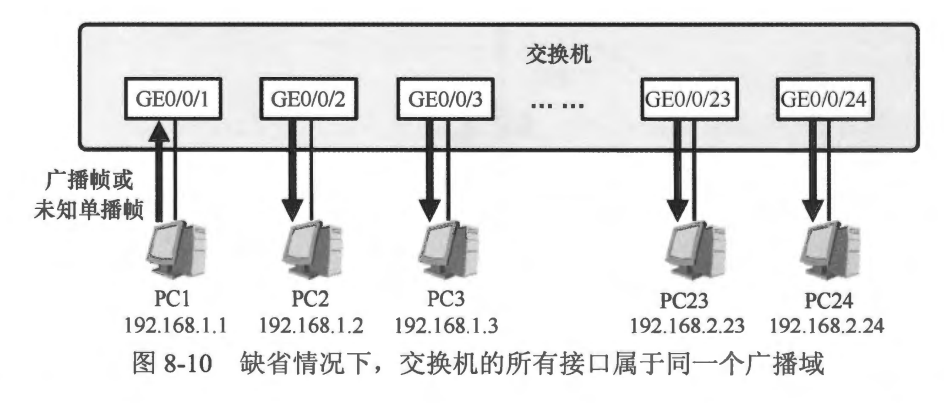
- 另外，实际的网络中经常存在这样的需求: 连接在同一个交换机上的主机有可能属于不同的业务部门，用户希望对它们进行隔离或者以独立的网络单元、独立的广播域进行管理，那么网络中就迫切地需要一种技术，一种能够在交换机上实现二层隔离的技术，否则网络管理员就不得不为不同的业务部门分配不同的交换机，并且搭配其他设备从而实现二层隔离。
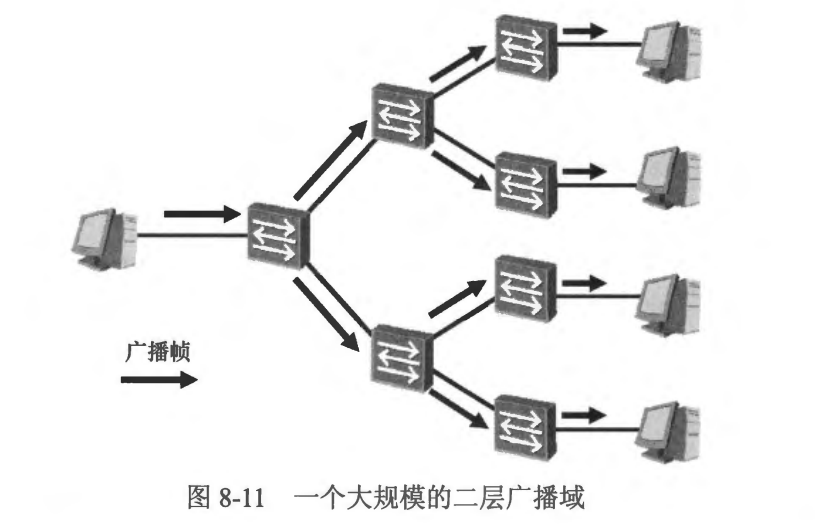
- 综上，当我们规划一个网络时，应该始终关注网络中广播域的大小，采用适当的技术將一个大的广播域切割成更小的单元。当然，您可能已经想到，可以使用路由器来实现这个目的，如图 8-12 所示。路由器的每个三层接口连接着一个独立的广播域。因此在网络中部署路由器确实可以起到隔绝广播的作用，毕竟一个广播数据缺省时会被终结在路由器的三层接口上，不会被透传。然而路由器接口资源相比于交换机更为有限，再者，为什么不能直接在交换机上实现广播域的隔离或划分呢？
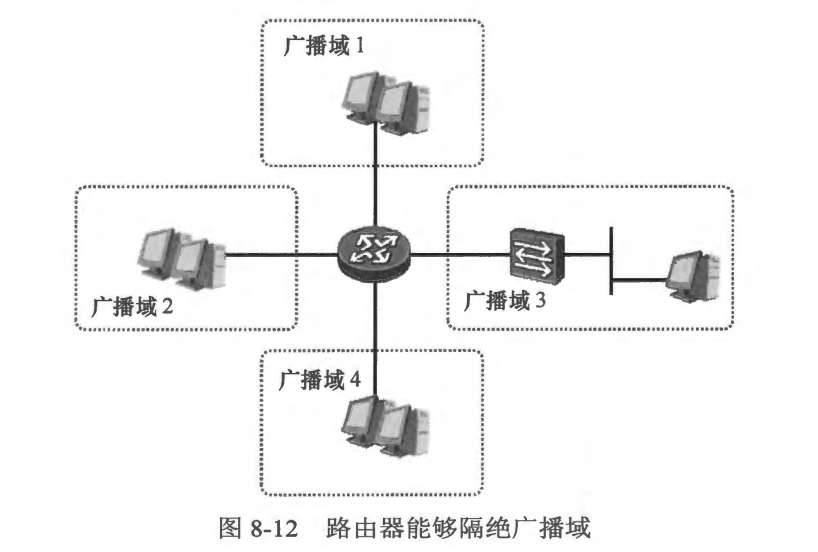
- VLAN (Virtual Local Area Network，虚拟局域网）就是这样一个技术，它能够将一个物理的 LAN 在逻辑上划分成多个广播域。如图 8-13 所示，交换机创建了两个 VLAN,这两个 VLAN 各有一个 ID（标识符），它们分别是 10 和 20。现在我们将交换机的 GE0/0/1、GE0/0/2 以及 GE 0/0/3 接口加入 VLAN10，而 GE0/0/23 及GE0/0/24接口加入 VLAN20。如此一来，网络中原先存在的一个广播域被切割成两个小的并且独立的广播域。关于在交换机上将接口加入特定的 VLAN 这一操作，也被称为基于接口的 VLAN 划分，所谓 VLAN 划分其实就是将用户（或用户发出的数据）与特定的 VLAN 进行关联的操作。VLAN 划分的方式有多种，上面所举的例子是基于交换机的接口来划分 VLAN 的，这是一种比较常用的方式，除此之外还有基于 MAC 地址、IP 网段、协议类型及策略等方式。若在交换机上基于 MAC 地址来划分 VLAN，那么可以指定 MAC 地址与 VLAN 的对应关系，例如将 MAC-1 映射到 VLAN30，则当拥有 MAC-1 这个地址的 PC 接入交换机时，它所发送的数据会被自动关联到 VLAN30，不管这合 PC 是从交换机的哪一个接口接入。
- 一个 VLAN 就是一个广播域，同属一个 VLAN 的设备之问依然是能够直接进行二层通信的，数据的泛洪也被限制在 VLAN 内，因此在 图8-13 中，PC1、PC2 以及 PC3 可以进行二层通信，并且其中一台 PC 发送出来的广播数据，会被泛洪给其他两台 PC,当然，如果交换机收到某台 PC 发送出来的单播数据帧并且并不知晓目的 MAC 地址时，它会在所有属于该 VLAN 的接口上泛洪这个数据帧。需要特别强调的是，不同的 VLAN之间无法进行二层通信。
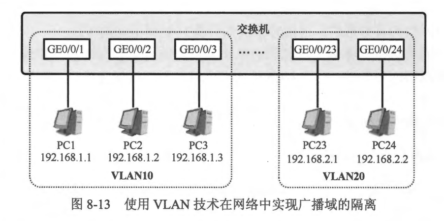
- PC1 从网卡发出一个广播数据帧，如 图8-14 所示。这个数据帧到达交换机后，交换机发现这是一个来自 VLAN10（该帧在 GE0/0/1 接口上收到，而该接口加入了 VLAN10)的广播数据帧，因此它将该数据帧从所有加入 VLAN10 的接口泛洪出去，最后 PC2 及 PC3 都会收到这份数据，然而处于 VLAN20 的 PC23 及 PC24 是不会收到这个广播帧的。
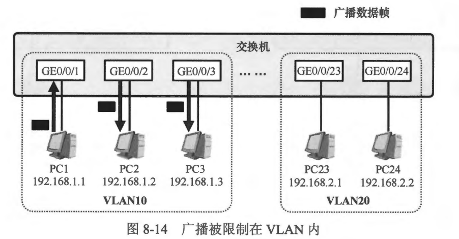
- 再看另一个例子，假设 PC23 发送一个单播数据帧给 PC24（假设此时 PC23 已经知道PC24 的 MAC 地址），交换机收到这个数据帧并且发现这是一个单播数据帧，因此它在 MAC 地址表中查询数据顿的目的 MAC 地址，而且它只会查询那些与 VLAN20 关联的表项（MAC 地址表中的每个表项将 MAC 地址、VLAN-ID、接口等信息进行鄉定），如果交换机查询不到与目的 MAC 地址匹配的表项，它会把这个数据帧从所有加入VLAN20 的接口泛洪出去，因此PC24 会收到这个帧，而处于 VLAN10 的PC1、PC2 及 PC3 则不会受到影响。
- VLAN 技术是二层交换领域中非常重要也是非常基础的技术，它能给网络带来诸多利好，例如:
  - 隔绝广播: 当交换机部署 VLAN 后，广播数据的泛洪被限制在 VLAN 内。利用 VLAN 技术可以将网络从原来的一个大的广播域切割成多个较小的广播域，从而减少了泛洪带来的带宽资源及设备性能的损耗。
  - 提高网络组建的灵活度: VLAN 技术使得网络设计和部署更加灵活。同一个工作组的用户不再需要局限在同一个地理位置。
  - 提高网络的可管理性: 通过将不同的业务规划到不同的 VLAN，并且分配不同的 IP 网段，从而将每个业务划分成独立的单元，极大地方便了网络管理和维护。
  - 提高网络的安全性: 利用 VLAN 技术可以将不同的业务进行二层隔离。由于不同 VLAN之 间相互隔离，因此当一个 VLAN 发生故障，例如某个 VLAN 内发生 ARP 欺骗行为，不会影响到其他 VLAN。

 
 

### 8.2.2 VLAN的跨交换机实现
- 在图8-15 中，某公司的两台交换机，它们分别是sW1 及sw2，现在我们在 SW1上创建两个 VLAN: 10 及 20（分别将这两个 VLAN 分配给技术部与会计部），然后将GE0/0/1 和 GE0/0/2 接口加入 VLAN10，如此一来，这两个接口所连接的 PC(PC1 及 PC2)也就加入了 VLAN10,现在它们属于同一个广播域，而 PC3 则属于另一个广播域(GE0/0/3接口加入 VLAN20）。网络另一边的 SW2 上也有技术部与会计部的员工需要接入，因此我们在 SW2 上也创建了 VLAN10 及 VLAN20 并且将接口添加到相应的 VLAN 中。
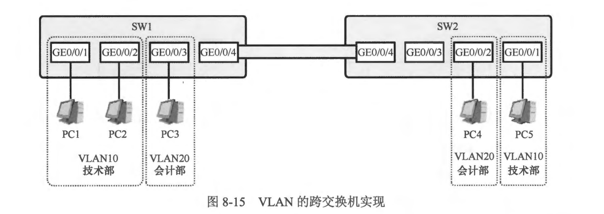
- 现在面临一个问题，SW1 及 SW2 都连接着技术部与会计部的员工电脑，这两台交换机可能分布在公司的不同楼层，该公司希望 SW1 所连接的技术部的员工可以与 SW2 所连接的技木部的员工进行二层通信，它们应该属于同一个广播域并且使用同一个 IP 网段，当然会计部也是同理，不过公司依然希望 SW1 所连接的技术部的员工与 SW2 所连接的会计部是互相隔离的。这样就涉及 VLAN跨交换机实现的问题。
- 现在 PC1 给 PC5 发送了一个数据帧(姑且假设它已经获知了对方的 MAC 地址），交换机接收数据帧后，将其从 GE0/0/4 接口转发出去(此处姑且忽略交换机的 MAC 寻址过程），如果交换机直接将这个数据帧从 GE0/0/4 接口发出，链路对端的 SW2 收到这个数据帧时，它会如何判断该帧究竟是来自 VLAN10 还是 VLAN20，它究竟应把该数据帧放入本地的 VLAN10 还是 VLAN20 中，SW2 显然是无从判断的，因为数据帧本身没有任何信息能标识它的来源，这是一个传统的以太网数据帧。
- SW1 及SW2之间的互联链路是非常关键的，因为它需要承载多个 VLAN 的数据流量，VLAN10 及 VLAN20 的流量都可能会在上面传输，这条链路被称为干道链路。由于多个 VLAN 的数据都需要在该链路上传输，因此链路两端的接口需要识别对端发送过来的数据帧究竟是属于哪一个 VLAN 的。我们需要一种“标记” 手段，在SW1 将属于个 VLAN 的数据帧从 GE0/0/4 接口发送出去时，对数据帧进行特定的标记，而 SW2 的 GE0/0/4 接口在收到该数据帧时，又能借助这个标记来识别数据帧所属的 VLAN。
- IEEE 802.1Q 标准也即虛拟桥接局域网 (Virtual Bridged Local Area Networks）标准，该标准定义了实现上述“标记” 的方法，使得 VLAN 能够跨交换机实现。IEEE 802.1Q 标准也常被称为 Dot1Q 标准，它对传统的以太网数据帧进行了修改，在数据帧头部中的源 MAC 地址和类型字段之间插入 4 byte 的 802.1Q Tag （标记），如图 8-16 所示。
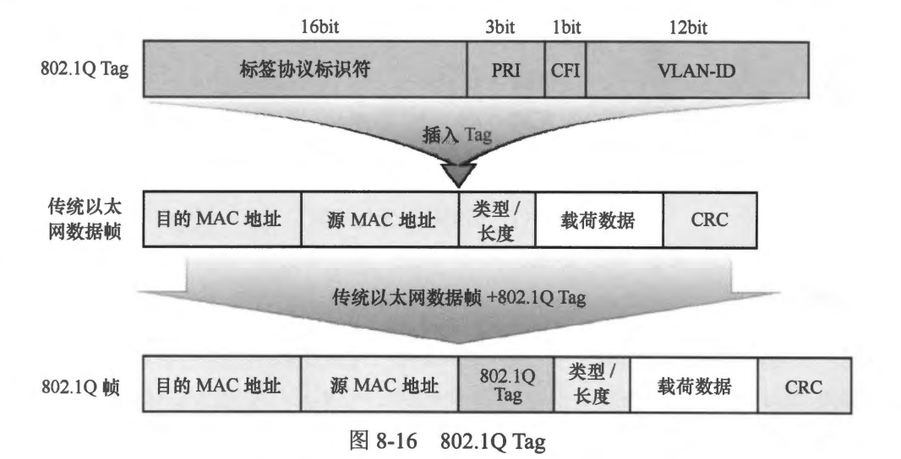
- 802.1Q Tag 共计 4 byte，包含多个字段，每个字段的描述如下: 
  - 标签协议标识符 (Tag Protocol Identifier, TPD): 表示数据帧的类型，如果该字段值为 0x8100，则表示该数据帧是 802.1Q帧。
  - 优先级 (Priority， PRI): 表示帧的优先级。该字段主要用于 Qos (Quality ofService，服务质量）。
  - 标准格式指示符 (Canonical Format Indicator, CFT): 在以太网环境中，这个字段始终为 0。
  - VLAN ID: 该数据帧所属的 VLAN-ID。
- 802.1Q 标准的提出使得 VLAN 跨交换机得以实现。如 图8-17 所示，PC1 发送了一份数据帧给 PC5，该数据帧被 PC1 发出时，是传统的以太网数据帧，也被称为无标记帧(Untagged Frame)，主机的网卡通常只能发送和接收无标记帧。当这个数据帧到达 SW1后，由于 SW1 的 GE0/0/1 接口已经加入 VLAN10，因此它知道该数据帧归属 VLAN10,于是它将在数据帧头部内插入 Tag(此处 Tag 指的是 802.1Tag，下文不再特别强调），在该 Tag 的 VLAN-ID 字段中填写数据帧的起源 VLAN 的ID: 10，如此一来这个数据帧就变成了一个标记帧(Tagged Frame)。实际上，在交换机内部，为了区分不同 VLAN 的数据帧，数据帧都是以标记帧的形式存在，至于该帧被交换机从某个接口发出去后是否携带 Tag， 则要视具体的情况而定。接下来，交换机在其 MAC 地址表中查询数据帧的目的MAC 地址（只查询与 VLAN10 关联的表项），最终它发现该数据帧要从 GE0/0/4 接口送出，而这个接口连接着千道链路，因此，它将数据帧以标记帧的形式发送出去。SW2 的 GE0/0/4 接口收到这个标记帧后，通过读取 Tag 中相应的字段，也就知道了这个数据帧所属的 VLAN，因此在 MAC 地址表中查询该帧的目的 MAC 地址时，只在与 VLAN10关联的表项中查询。最后，sW2 将数据帧中的 Tag 移除，将数据帧还原成无标记帧发送给 PC5。
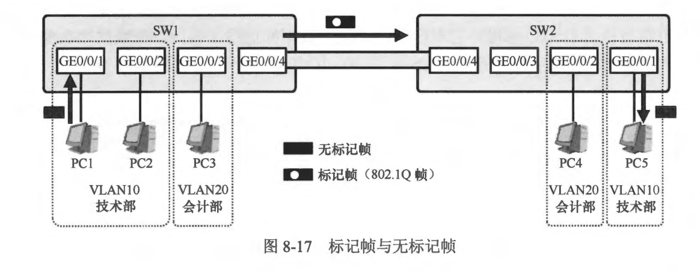

 
 

### 8.2.3 接口类型
- 通常，二层交换机的接口均为二层口 (Layer 2 Interface）。在之前的内容当中，我们己经详细地探讨了二层交换的工作原理以及相应的技术细节。在 VLAN 技术被引入交换体系后，数据帧在交换机上的转发都与 VLAN 息息相关。交换机的二层接口存在多种类型，在 Cisco 的交换机上也被称为链路类型（switchport mode），不同类型的二层接口对数据帧的处理方式是不同的。
- 值得一提的是，所有的二层接口无论其类型如何，都有一个缺省 VLAN-ID，默认Cisco交换机的缺省VLAN-ID为 1。另外，出于提高数据帧处理效率的考虑，在交换机内部，数据帧一律携带 Tag。
- Access 类型: 
  - Access 类型的二层接口通常用于连接终端设备，例如 PC、服务器等，这些终端设备的网卡通常只收发无标记帧。如图 8-18 中的 Port1、Port2、Port3、Port4 和 Ports 都可以配置为 Access 接口。当交换机的接口用于连接路由器时，如果路由器的接口工作在三层模式，而且没有部署子接口（Sub-Interface），则通常情况下交换机侧的接口也会被配置为 Access 类型，例如图中的 Port8。
  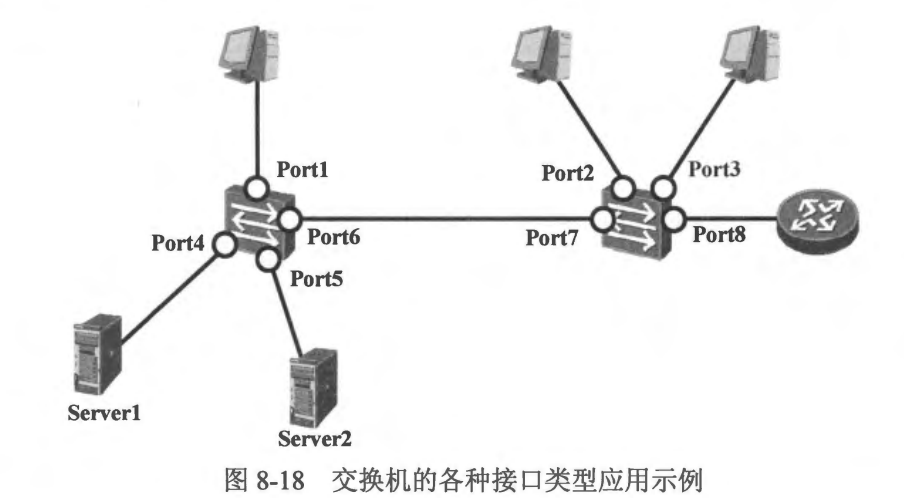
  - 如果采用基于接口划分 VLAN 的方式，那么交换机的一个 Access 接口只能加入一个 VLAN，一旦接口加入了特定的 VLAN，则该接口所连接的设备也就被视为属于该VLAN。
  - **Access 接口接收数据帧:**
    - **说明: 接口接收数据帧，指的是一个来自交换机外部的数据帧，从交换机的某个接口到达并进入交换机内部的过程。**
  - 当 Access 接口收到一个无标记帧时，交换机会接收这个数据帧，并将数据帧打上接口缺省 VLAN 的 Tag。如图8-19（左）所示，假设 GE0/0/1 接口被配置为 Access 接口，而且加入了 VLAN8，若 GEO/O/1 收到一个无标记帧，则该帧在进入交换机内部时交换机会为其打上 VLAN8 的 Tag。
  
  - 当 Access 接口收到一个标记帧时，如果该帧所携带的 VLAN-ID 与该接口的缺省 VLAN-ID 相同，那么交换机将接收这个数据帧，如图8-19（右边图)所示；如果该帧所携带的 VLAN-ID 与该接口的缺省 VLAN-ID 不相同，那么交换机将丢弃这个数据帧。
  - **Access 接口发送数据帧:**
    - **接口发送数据帧，指的是一个处于交换机内部的数据帧，被交换机从某个接口发送出去的过程。**
  - 当 Access 接口发送数据帧时，交换机会将数据帧中的Tag 剥除，然后再将数据帧从该接口发送出去，也就是说 Access 接口发送出去的数据帧一定是无标记帧。如图 8-20 所示，数据帧在交换机内部是携带 Tag 的，在该数据帧被发出 GE0/0/1 接口时，Tag 被剥除。值得注意的是，如果交换机内部存在一个标记帧，而且该帧携带的 VLAN-ID 不是 8，那么它是不能从 GE0/0/1 接口发出的。
  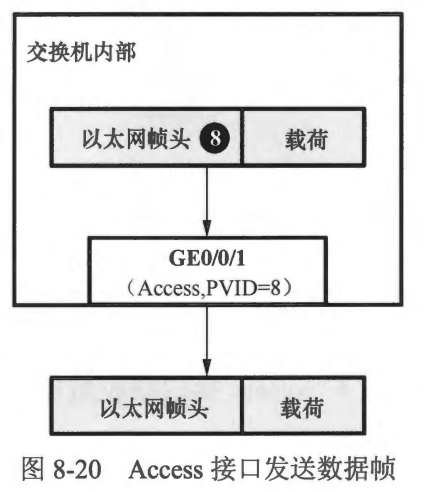
- Trunk 类型
  - Trunk 类型的接口是可以接收或者发送多个 VLAN 的数据帧的接口。图 8-18 中的 Port6 及 Port7 如需承载多VLAN 的数据帧，那么就可以配置为 Trunk 类型。因此Trunk 类型的接口多见于交换机之间互联的接口，当然，两台交换机之间的互联接口未必就一定得是 Trunk 类型。
  - 另外，图8-18中，如果路由器使用子接口的方式与 图8-20 Access 接口发送数据帧交换机的 Port8 对接，那么Port8 也可以配置为 Trunk 接口，此时一般不能配置为 Access 接口，因为该接口需要向对端发送标记帧。
  - **说明: 随着虛拟化技术的盛行，在如今的网络中，在主机上部署虛拟化技术的场景几乎随处可见。通过虛拟化技术，我们可以在一台主机上虛拟出多台逻辑主机，从而使得单一的物理主机可以用于多种业务。这些逻辑主机被称为VM (Virtual Machine， 虛拟机），从用户的角度来看，这些VM 与真实的物理机没什么两样，都拥有自己的CPU、内存、磁盘空间、网卡以及操作系统等，VM 之问相互独立、互不干扰，同时又都依赖于物理主机而存在。网络管理员可以为一台物理主机上的每个VM分配单独的网卡，这些网卡被称为虛拟网卡，所有的虛拟网卡都共享物理主机的物理网卡。不同的 VM 可能有不同的业务用途，为了区分不同的业务流量，网络管理员可能会让虛拟网卡以标记帧的方式处理数据，从而将不同的业务流量对应到不同的 VLAN。此时与该物理主机相连的交换机的接口將会收到来多个 VLAN 的标记帧，那么在这种场景下，通常交换机侧的接口需配置为 Trunk 类型或者Hybrid 类型。**
  - **Trunk 接口接收数据帧:**
    - 当 Trunk 接口收到一个无标记帧时，交换机会将数据帧打上缺省 VLAN 的 Tag， 并检查该 VLAN-ID 是否在接口允许通过的 VLAN-ID 列表中，如果允许，则将标记帧接收，反之则丢弃该帧。而如果 Trunk 接口收到标记帧，交换机将判断该帧所携带的 VLAN-ID 是否在接口允许通过的 VLAN-ID 列表中，如果允许，则接收这个标记帧，反之则丢弃该帧。
    - 如图 8-21（左），接口 GE0/0/24 被配置为 Trunk 类型，并且接口的 Native VLAN-ID为 1（Cisco 以太网交换机缺省时 Trunk 类型接口的 Native VLAN-ID为1，而且 VLAN1 缺省即被添加到了允许通过的 VLAN-ID 列表中），一个无标记帧在该接口到达，该帧被标记 VLAN1 的Tag,然后交换机在该接口允许通过的 VLAN-ID列表中查询是否有 VLAN1，如果有则接收该标记帧，反之则丢弃。
    - 如图 8-21（右)，接口 GE0/0/24 收到一个标记帧，交换机将在接口允许通过的 VLAN-ID 列表中查询该帧所携带的 VLAN-ID（也就是8），如果 VLAN8 在列表中，那么这个标记帧将被接收，反之则被丢。
    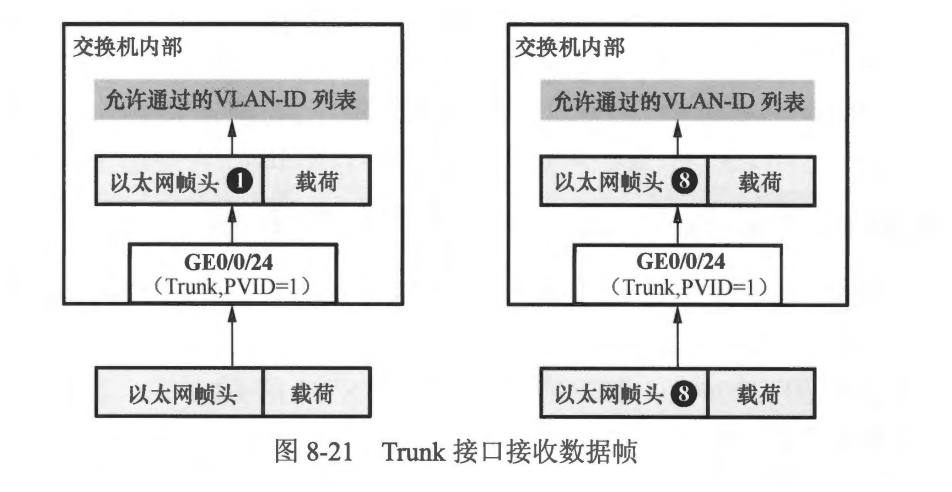
  - **Trunk 接口发送数据帧:**
    - 当 Trunk 接口在发送数据帧时，如果该标记帧所携带的 VLAN-ID 与发送接口的 Native VLAN-ID 相同，并且该 VLAN-ID 又在接口允许通过的 VLAN-ID 列表中，那么这个数据帧的 Tag 将被剥除，然后从接口发出;如果该标记帧所携带的 VIAN-ID 与发送接口的 Native VLAN-ID 不同，并且该 VLAN-ID 又在接口允许通过的 VLAN-ID 列表中，那么这个标记帧将保持原有的 Tag，直接从接口发送出去。
    - 如图 8-22（左），当 GE0/0/24 接口准备发送一个数据帧时，交换机发现数据帧所携带的 VLAN-ID 为 1，与发送接口 GE0/0/24 的 Native VLAN-ID 相同，而且 VLAN1 又在该接口允许通过的 VLAN-ID 列表中，因此交换机把数据帧的 Tag 剥除，然后将其从接口 GE0/0/24发出。当然，如果 VLAN1 不在接口允许通过的 VLAN-ID列表中，那么这个帧是不允许从 GE0/0/24 接口发出的。
    - 如图 8-22（右）中，交换机准备发送的数据帧的 VLAN-ID 与发送接口 GE0/0/24 的 Native VLAN-ID 不相同，并且 VLAN8 又在该接口允许通过的 VLAN-ID 列表中，因此这个数据帧保持原有的 Tag，从接口 GE0/0/24 发出。注意此时如果 VLAN8 不在该接口允许通过的 VLAN-ID列表中，则这个数据帧将不能从该接口发出。
    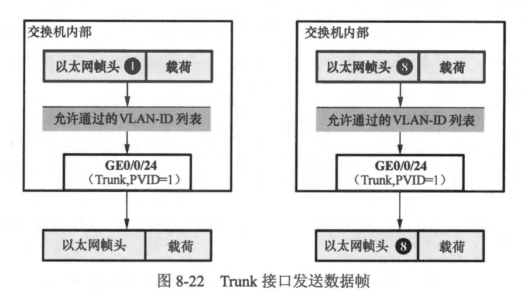
- Hybrid 类型
  - Hybrid 接口也能承载多个 VLAN 的数据，它与 Trunk 接口在数据帧的接收行为上大体相同，这里不再赘达。Trunk 接口在发送数据帧时，仅当待发送的数据帧的 VLAN-ID 与发送接口的 Native VLAN-ID 相同时，数据帧的 Tag 才会被移除，除此之外，该接口发送出去的其他 VLAN 的数据帧都是携带 Tag 的。而 Hybrid 接口发送数据帧的行为则与 Trunk 接口不同。我们可以通过命令指定 Hybrid 接口在发送某个，或者某些 VLAN 的数据帧时不携带 Tag。

 
 

### 8.2.4 基础Vlan实验
- 配置要求:
  -  PC1和PC2分别接入SW1交换机的Fa0/1和Fa0/2端口，配置交换机将F0/1口放入vlan10,F0/2口放入vlan20。
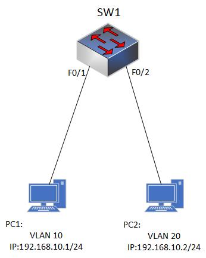

 
 

### 8.2.5 跨交换机的Vlan通信
- 配置要求
  -  在SW1和SW2交换机上船舰VLAN10和VLAN20，配置Trunk实现同一VLAN里的计算机能跨交换机进行相互通信进行相互通信。
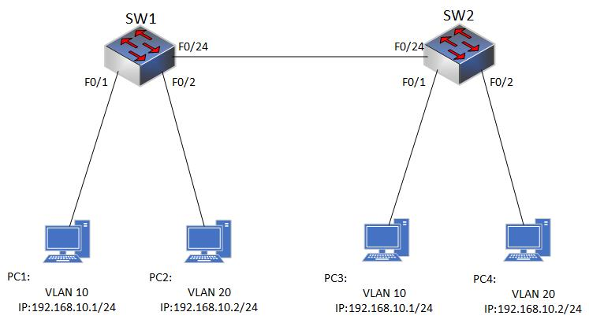

 
 

### 8.2.6 Hybrid接口的配置

 
 

