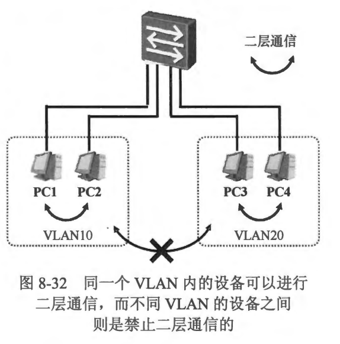
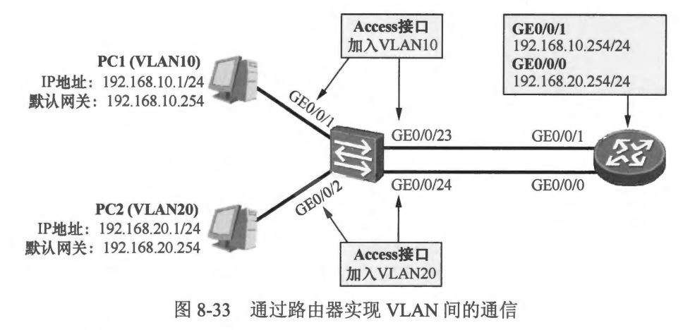
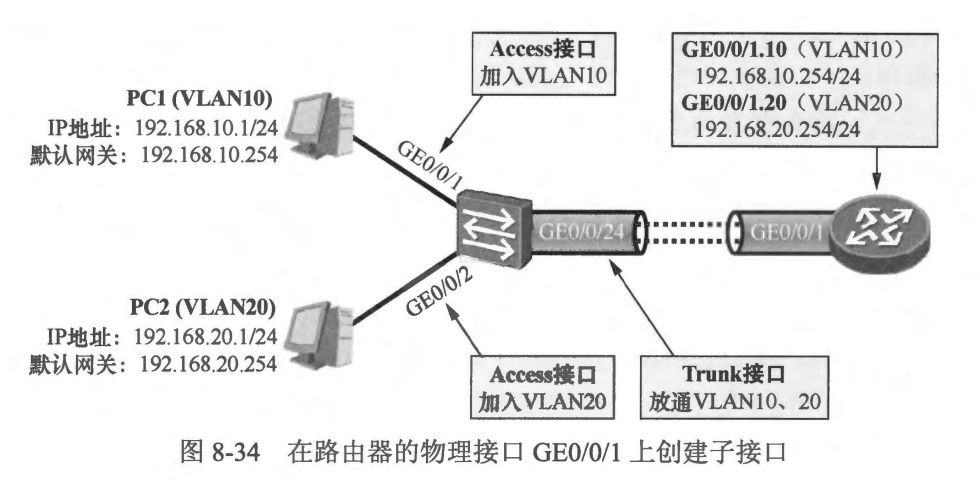
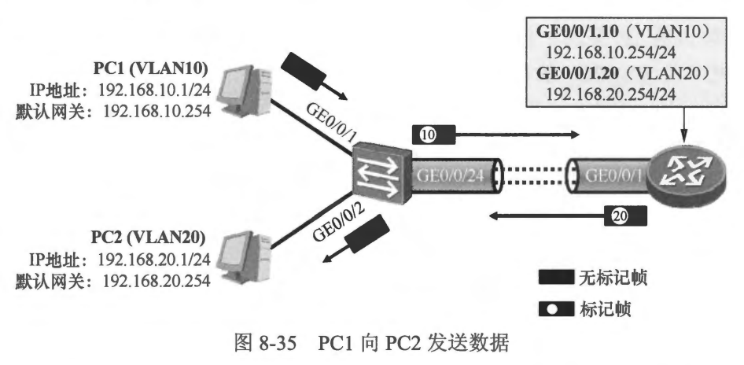
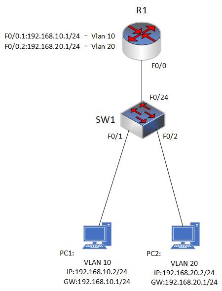
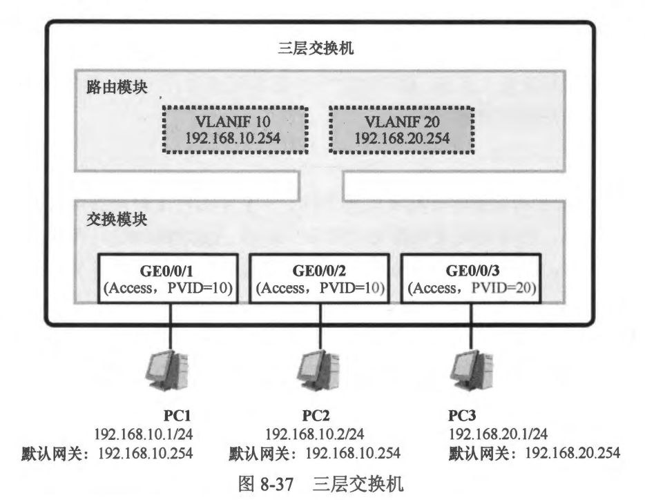
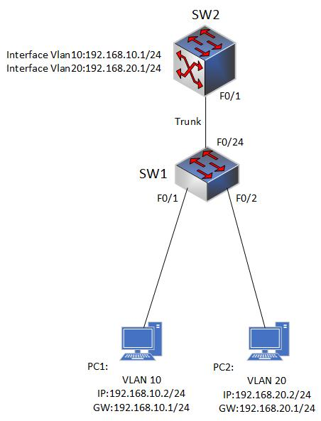

- VLAN 是交换领域非常基础的一项技术，它使得交换网络的部署更加灵活，也使得网络规划变得更加合理。在一个交换网络中部署 VLAN,能够将一个大的广播域切割成多个更小的广播域，一个 VLAN 就是一个独立的广播域，广播以及数据帧的泛洪被限制在 VLAN 内部，不同的 VLAN 之间二层隔离，这对于交换网络而言实在是一个令人欣喜的功能。
- 通常在一个园区网络中，我们会基于业务类型或者基于用户类型进行不同 VLAN 的规划，例如在部署一个企业的园区网络时，可能会将该企业不同的部门规划到不同的 VLAN,而且不同的 VLAN 会分配不同的 IP 网段，这样一来，每个部门在网络中就会成为单个逻辑单元，管理起来十分方便。由于每个部门被规划在了不同的 VLAN 内，因此二层通信被限制在部门内部。然而在实际的网络中时常需要在部门之问实现数据通信，那么这就涉及到 VLAN 之间的通信问题了。但是正如前面所说，不同的 VLAN 之间是无法进行二层通信的，如图 8-32 所示，因此要实现 VLAN 之间的通信，就需要通过三层设备（具备三层功能，也就是路由功能的设备）来实现了。

 
 

### 8.3.1  使用以太网子接口实现 VLAN 之间的通信

- 既然不同的 VLAN 是不同的广播域，通常也使用不同的 IP 网段，所以 VLAN 之间无法直接进行二层通信，那么要实现 VLAN 之间的互通，您可能已经想到了，可以在网络中增加路由器来实现，因为路由器是具备路由功能的，它能够连接不同的广播域，并且实现数据的三层转发。如图 8-33 所示，交换机创建了两个 VLAN: VLAN10 及 20 并将 GE0/0/1 接口加入 VLAN10，将GE0/0/2 接口加入 VLAN20，如此一来 PC1 及 PC2 就处于两个不同的 VLAN，它们互不影响，也无法进行二层通信。现在网络中增加了一台路由器，由于要连接两个广播域(VLAN)，因此路由器需要贡献两个物理接口与交换机对接，其中 GE0/0/1 接口配置与 PC1 相同网段的 IP 地址，而 GE0/0/0 接口则配置与 PC2 相同网段的 IP 地址。最后交换机将 GE0/0/23 接口配置为 Access 类型并且加入 VLAN10、将 GE0/0/24 接口配置为 Access 类型并且加入 VLAN20。由于 PC1 与路由器的 GE0/0/1 接口同属一个广播域，因此它们可以直接进行二层通信，PC2 与路由器的GEO/010 接口同理。PC1 将默认网关设置为路由器 GE0/0/1 接口的地址，而 PC2 则将默认网关设置为路由器 GE0/0/0 接口的地址。
  
- PC1 发送数据给 PC2 时，过程如下:
  - PC1 的上层协议产生的数据载荷到了网络层，数据载荷在网络层被封装一个 IP 头部，在 IP 头部中，源 IP 地址填写的是 192.168.10.1，而目的 IP 地址则填写的是 192.168.20.1。接下来，PC1 的网卡要将其封装成帧。PC1 发现数据包的目的 IP 地址与本地网卡的 IP 地址并不在同一网段，因此它判断需要将这个数据包先转发到默认网关，由默认网关将其转发到目的地。于是它通过网卡配置信息得到网关的 IP 地址 192.168.10.254，然后在 ARP 表中查询这个 IP 地址对应的MAC 地址。初始情况下，PC1 并没有相应的 ARP 表项，因此它以广播的方式发送一个 ARP Request 数据帧，该数据帧用于请求 192.168.10.254对应的MAC 地址。
  - PC1 发送的广播 ARP Request 数据帧到达了交换机，交换机读取数据帧目的 MAC 地址，发现这是一个广播数据帧，而接收这个数据帧的接口 GE0/0/1 又加入了 VLAN10,因此交换机在 VLAN10 内泛洪这个数据帧。GE0/0/23 接口也加入了 VLAN10，因此交换机也会从这个接口发送一份拷贝出去。当然 GE0/0/2 接口并未加入 VLAN10，交换机则不从该接口泛洪这个数据帧。另外，交换机还会学习数据帧的源 MAC 地址，并将该地址与 GE0/0/1 接口绑定。
  - 路由器的 GE0/0/1 接口收到了这个 ARP Request 数据帧，由于 ARP Request 中
    填充着发送者 PC1 的卫地址及 MAC 地址，因此路由器为 PC1 创建一个 ARP 表项，然后构造一个单播的 ARP Reply 数据帧回复给 PC1。
  - ARP Reply 数据帧到达交换机后，交换机在 MAC 地址表中查询这个数据帧的目的 MAC 地址，发现 MAC 地址表中已经有匹配的表项，且该表项的出接口为 GE0/0/1,因此它将该数据帧从 GE0/0/1 接口发送出去。另外，交换机还会学习数据帧的源 MAC 地址，并将该地址与 GE0/0/23 接口绑定。
  - PC1 收到了 ARP Reply 数据帧，根据报文中的内容形成 192.168.10.254 以及相应 MAC 地址的 ARP 表项，然后将待发送给 PC2 的数据包封装成数据帧，帧头中目的 MAC 地址为路由器 GE0/0/1 接口的 MAC 地址。数据帧从网卡发出。
  - 数据帧到达交换机后，交换机通过 MAC 地址表查询，发现该帧的目的 MAC地址在表中存在匹配的表项，而且出接口为 GE0/0/23，因此它将数据帧从该接口发出。
  - 路由器收到这个数据帧后，读取数据帧的目的 MAC 地址，发现目的 MAC 地址正是 GE0/0/1 接口的 MAC 地址，它意识到这个数据帧是发送给自己的，通过帧头里的“类型”宇段，路由器发现数据帧里封装的是一个 IP 报文，于是它将数据帧解除封装，然后将里面的报文交给 IP 协议模块去处理。上层卫协议模块检查报文的 IP 头部中的目的 IP 地址，发现目的 IP 地址为 192.168.20.1，并非本设备的 IP 地址，于是它在路由表中查询这个 IP 地址，发现该地址匹配本地直连路由 192.168.20.0/24，出接口为 GE0/0/0,它意识到这个数据包是要发往本地直连的一个网段。因此它重新将数据包封装成帧，帧头里源 MAC 地址填写的是路由器 GE0/0/0 接口的 MAC 地址(因为数据包将从这个接口发出），目的MAC 地址是 PC2 的网卡MAC 地址（初始时路由器可能并不知道 PC2 的 IP 地址对应的 MAC 地址，因此将触发 ARP 解析过程，此处不再赘述)。然后它将数据帧从 GE0/0/0 接口发出。
  - 交换机转发该数据帧的过程此处不再赘述。最后 PC2 收到了这个数据帧，它检查数据帧的目的 MAC 地址，发现填写的是本地网卡的 MAC 地址，于是将数据帧解除封装，将里面的载荷上交给 IP 协议模块，IP 协议模块检查数据包头部，发现目的 IP 地址填写的正是本地网卡的 IP 地址，因此确认该报文是发送给自己的，它通过 IP 包头的“协议” 字段判断 IP 头部里包裹的上层数据类型，再将其上交给对应的协议去处理。如此一来，PC1 发送给 PC2 的数据最终就完成了转发过程，到达了目的地。
  - 到目前为止，通过路由器实现 VLAN 间通信的方案的确是可行的，然而有一个问题却不得不被考虑:
    - 一个园区网内的 VLAN 数量往往不两个，规模大一点的网络中，数十上百个 VLAN 的场景是很常见的，如果一个 VLAN 就需要占用路由器的一个物理接口，那么十个 VLAN 的话，路由器岂不是要拿出十个物理接口。重要的是路由器的接口资源是非常宝贵的，这显然是不太合理的。
  - 但是，用以太网子接口（Sub-interface）可以解决这个问题。所谓的以太网子接口，指的是基于以太网物理接口所创建的逻辑接口。子接口是软件的、逻辑的接口，是物理上并不存在的，它的状态又依赖于对应的物理接口。您可以在一个物理接口上创建多个子接口，而每一个子接口即可与一个 VLAN 对接，从而缓解上面提到的问题。在物理接口上创建子接口，就像是在一个大管道里开设许多小管道，这些小管道都依赖于大管道，并且彼此之间互不干扰。
  - 以图8-34 所示的场景为例，路由器仅使用一条链路与交换机直连。现在我们在路由器的物理接口 GE0/0/1 上创建两个子接口: GE0/0/1.10 及 GE0/0/1.20，这两个子接口的状态与物理接口 GE0/0/1 息息相关，当 GE0/0/1 被关闭或者发生故障时，基于该物理接口所创建的所有子接口都将无法正常工作。请留意子接口的标识，以“GE0/0/1.10” 为例，GE0/0/1 指的是物理接口类型及编号，而小数点“.”后面的数字则是子接口的编号，这个编号是自定义的，没有特殊的含义。以Cisco 路由器为例，在一个千兆以太网接口上最多可以创建 4096个子接口。值得注意的是，子接口被创建后，需指定其对接的 VLAN-ID，当该子接口向外发送数据帧时，数据帧将会被打上相应 VLAN 的 Tag。为了能够与交换机顺利对接，路由器 GE0/0/1 对端的交换机接口必须配置为 Trunk 类型（或 Hybrid 类型），而且要放通相的 VLAN 并以标记帧的形式处理相关数据。路由器会把子接口当成是一个普通接口来对待。通过子接口的方式可以大大节省硬件成本。
    
- 在本例中，路由器的 GE0/0/1.10 子接口被指定了 VLAN-ID 10，而 GE0/0/1.20 则被指定了 VLAN-ID 20。接下来，我们看看在路由器部署了子接口之后，PC1 与 PC2 的数据通信过程，如图 8-35 所示，以 PC1 发往 PC2 的数据为例，重点关注数据帧在交换机与路由器之问交互时的细节。
  
- PC1 要发送数据给 PC2，它判断出 PC2 并不在本地网段，因此将数据发往网关 192.168.10.254。 PC1 发往 PC2 的数据帧（无标记帧）从 PC1 的网卡发出，其目的 IP 地址是 192.168.20.1，但是目的MAC 地址是路由器的接口MAC 地址（假设此时它己经知晓了网关的 MAC 地址）。
- 交换机收到了这个数据帧，由于该帧在 GE0/0/1 接口到达，而该接口加入了 VLAN10，因此它在 VLAN10 的 MAC 地址表项中查询这个数据帧的目的MAC 地址，假设交换机找到一个匹配的表项，并且该表项的出接口为 GE0/0/24。于是它将数据帧从这个接口发出，由于该接口为 Trunk 类型，并且放通了 VLAN10 的流量，因此数据帧以标记帧的形式发出。
- 路由器在 GE0/0/1 接口上收到这个标记帧，根据数据帧携带的 Tag，路由器判断出这个标记帧来源于 VLAN10，这意味着这个数据帧需要交给子接口 GE0/0/1.10 处理，路由器将数据帧 Tag 剥除，将帧头解封装，然后读取 IP 头部，发现目的 IP 地址并非本地所有，于是在路由表中查询目的 IP 地址。路由器发现目的 IP 地址匹配本地直连路由 192.168.20.0/24，而且该直连路由的出接口是 GE0/0/1.20，于是它重新将数据包封装成帧，此时帧头中的源 MAC 地址是路由器 GE0/0/1 接口的 MAC 地址，而目的 MAC地址则是 PC2 的 MAC 地址。由于数据将要从子接口 GE0/0/1.20 送出，而该子接口又指定了 VLAN-ID 20，因此路由器在数据帧中插入 Tag，其中 VLAN-ID 为 20，然后将这个标记帧发送出去。
- 交换机收到这个标记帧，从 Tag 中读取 VLAN-ID，发现该帧来源于 VLAN20,随后在 MAC 地址表中查询目的 MAC 地址，交换机只会在 VLAN20 中查询该 MAC 地址，最终，它查询到匹配的表项，并将数据帧的 Tag 剥除，然后将无标记帧从 GE0/0/2 接口转发出去。
- 数据帧到达 PC2。
- **说明: 在许多场合中，路由器在一个物理接口上部署子接口从而实现多个 VLAN 互通的场景，也被称为“单臂路由”，其中单臂指的是路由器的一个物理接口，或者一条物理链路。而当路由器使用多个物理接口，并且每个物理接口 单独与某个VLAN对接的场景，则被称为 “多臂路由”。**

 
 

### 8.3.2 路由器子接口实现Vlan间通信

- 配置要求
  - 在二层交换机SWA上创建VLAN10和VLAN20，在RTA上对物理口FA0/0划分子接口并封装802.1Q协议，使得每一个子接口分别充当VLAN10和VLAN20网段中主机的网关，实现VLAN10和VLAN20的相互通信。
    
    ` `
    ` `

### 8.3.3 使用 SVI 实现 VLAN 之间的通信

- 经过前面几个小节的介绍，相信大家已经掌握了使用路由器实现 VLAN 间通信的方法。当路由器使用多臂的方式实现 VLAN 问的通信时，路由器的接口资源将受到极大的挑战，当 VLAN 数量特别多时，这显然是不具备可行性的，而且这种方式的可扩展性并不高。而路由器采用单臂的方式实现 VLAN 间通信的解决方案在现网中是一种更佳的选择，因为后者的可扩展性更高、更经济。然而单臂的解决方案也存在一定的短板。一个直接的短板是，路由器与交换机之间的链路由于需承载所有 VLAN 间的通信数据，因此它的负载将变得非常高，尤其是当 VLAN 的数量特别多、VLAN 问通信的流量特别大时，这段链路将变得不堪重负。另外，单臂链路也不具备元余性，一旦链路发生故障，VLAN 之间的通信也就无法再正常进行。
- **说明: 有不少方法可以提高单臂路由的可靠性，一个常见的方法是在路由器与交换机之间采用多链路互联，然后将这些链路进行聚合 (Link Aggregation)，而路由器则在聚合接口上创建子接口。键路聚合一方面增加了路由器这条 “手臂”的带宽，另一方西也增加了它的可靠性**
- 接下来将为大家介绍一种在实际网络中用于实现 VLAN 间通信的更为常用的解决方案，那就是使用三层交换机 (Layer 3 Switch）。对于二层交换机的概念及功能，相信大家已经很清楚了，而所谓的三层交换机，简单地理解是同时具备二层功能及三层功能的交换机。
- 三层交换机除了能够实现二层交换机所有功能，还支持路由功能。三层交换机除了拥有二层接口外，还拥有三层接口。SVI (Switched Virtual Interface) 就是一种非常重要的三层接口，这是一种逻辑接口，物理上并不存在。当我们在一台三层交换机上创建了一个 VLAN 时，就可以将交换机的物理接口（例如 GE0/0/1）加入到该 VLAN中，此时这些物理接口都是二层接口（某些交换机支持配置物理接口的工作模式，接口可以在二层及三层模式之间切换，关于这点此处哲不涉及)。与此同时我们还能在交换机上配置这个 VLAN 对应的 SVI，也就是这个 VLAN 对应的三层接口，该接口能够与同处于这个 VLAN 内的设备进行二层通信。SVI 作为一个三层接口，可以进行 IP 地址配置，而通常情况下，这个 IP 地址会作为 VLAN 中设备的默认网关地址。
- 图8-37 展示了一台三层交换机的逻辑图。该交换拥有两个VLAN，分别是 VLAN10 及 VLAN20， 物理接口 GE0/0/1、GE0/0/2 及 GE0/0/3 都被配置为 Access 类型，其中 GE0/0/1 及 GE0/0/2 接口加入了 VLAN10，而 GE0/0/3 接口则加入了 VLAN20。另外，interface vlan 10 配置了 IP 地址 192.168.10.254， interface vlan 20 则配置了 IP 地址 192.168.20.254。 各 VLAN 内的 PC 都将其默认网关地址配置为相应 VLAN 的 SVI IP地址。
- 从图8-37中可以看到，三层交换机同时拥有交换模块以及路由模块。首先来看一下在三层交换机上，相同 VLAN 内PC的通信过程，以 PC1 发送一份数据给 PC2 为例，大致的过程如下:
  - PC1 的上层协议产生的数据载荷到了网络层，数据载荷被封装 IP 头部，在 IP 头部中，源 IP 地址是 192.168.10.1，而目的 IP 地址是 192.168.10.2。数据载荷被封装好 IP 头部后，下送到了 PC1 的网卡，现在网卡要为其进行数据链路层封装，将其封装成以太网数据帧，该数据帧的源 MAC 地址为 PC1 的网卡 MAC 地址，而目的MAC 地址为 192.168.10.2 这个IP地址对应的 MAC 地址。PC1 查询 ARP 表试图寻找相应的 ARP 表项，初始时 PC1 的 ARP 表中并没有相应的表项，因此 PC1 发送一个广播的 ARP Request 去请求 PC2 的 MAC 地址。
    
  - 这个广播的 ARP Request 到达了交换机的 GE0/0/1 接口，被打上 VLAN10 的 Tag。交换机通过读取数据帧头部，发现这是一个广播数据帧，因此一方面将其在所有加入 VLAN10 的接口上泛洪，另一方面将数据帧解封装后上送到自己的 ARP 协议模块（交换机通过数据帧头部的 “类型”字段发现该帧内封装着一个 ARP 报文)，而 ARP模块发现这个 ARP 报文请求的是 192.168.10.2 这个 IP 地址的 MAC 地址，该 IP 地址并非自己所有，因此它直接忽略这个数据帧。
  - 由于交换机在 VLAN10 内泛洪了 PC1 发送的 ARP Request， 因此 PC2 会收到这个数据帧，它将记录相应的 ARP 表项，并发送一个单播的 ARP Reply 帧进行回应。
  - 交换机收到这个数据帧，通过查询 MAC 地址表并找到目的 MAC 地址所关联的出接口，将数据帧从 GE0/0/1 接口发出。
  - PC1 收到了这个 ARP Reply，获知了 192.168.10.2 对应的 MAC 地址，因此继续封装数据帧，然后将数据帧从网卡发出。
  - 交换机收到这个数据帧，发现这是一个单播数据帧，于是在 MAC 地址表中查询目的MAC 地址，找到匹配的表项后，將该帧从 GE0/0/2 接口发出。
  - 最后，PC2 收到这个数据帧。
- 接着来看在三层交换机上，不同 VLAN 的PC 的通信过程，以PC1 发送一份数据给 PC3 为例，大致的过程如下:
  - PC1 的上层协议产生的数据载荷到了网络层，数据载荷被封装 IP 头部，然后下送到了 PC1 的网卡，现在网卡要将其封装成以太网数据帧，由于数据包的目的 IP 地址与本机不在相同网段，这意味着 PC1 需要先把报文发送到默认网关，因此数据帧的目的 MAC 地址需填写网关（192.168.10.254）的 MAC 地址。PC1 在 ARP 表中查询 192.168.10.254，发现并没有匹配的表项，因此它发送一个广播的 ARP Request 试图查询网关的 MAC 地址。
  - 这个广播的 ARP Request 到达了交换机的 GE0/0/1 接口，被打上 VLAN10 的 Tag。交换机通过读取数据帧头部，发现这是一个广播数据帧，因此一方面将其在加入 VLAN10 的接口上进行泛洪，另一方面将数据帧解封装后上送到自己的 ARP 协议模块，ARP 模块发现这个 ARP 报文请求的是 192.168.10.254 这个IP地址的 MAC 地址，而 interface vlan 10 的IP 地址就是 192.168.10.254，因此它直接发送一个 ARP Reply 给 PC1。
  - PC1 收到了这个 ARP Reply，获知了 192.168.10.254 对应的 MAC 地址，因此继续封装数据帧，然后将数据帧从网卡发出。
  - 交换机收到这个数据帧发现这是一个单播数据帧，而且该帧的目的 MAC 地址正是本机的 MAC 地址，因此交换机将数据帧解封装，并将里面的数据上送到 IP 模块进行处理。IP 模块读取数据包的目的 IP 地址后，发现目的 IP 地址并非本机的 IP 地址，于是它在路由表中查询这个地址，结果发现有一条本地直连路由匹配，而该直连路由的出接口是 interface vlan 20，因此交换机重新将这个数据包封装成帧，这个新的以太网帧头中，源MAC 地址填写的是交换机的 MAC 地址，而目的MAC 则需填写 192.168.20.1 的 MAC 地址，如果交换机的 ARP 表中没有相关的表项，那么它需要在 VLAN20 中发送广播 ARP Request 去请求 PC3 的MAC 地址，这个过程不再赘述。数据帧封装好后，交换机将其从 GE0/0/3 接口发出。
  - 最后，PC3 收到这个数据帧。

 
 

### 8.3.4 三层交换机实现Vlan间通信

- 配置说明
  - 在 SW1 和 SW2 交换机上创建 VLAN 10 和 VLAN 20，配置Trunk实现同一 VLAN 里的计算机能跨越交换机进行相互通信。并且在SW2三层交换机上配置SVI虚拟接口，利用三层交换机实现不同VLAN间的路由。
    
  -
