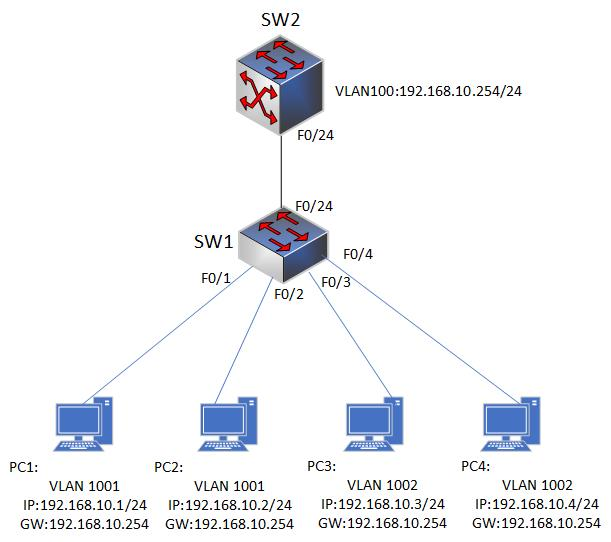

### 8.4.1 私有VLAN
- Private VLAN（PVLAN）是一种用于实现 VLAN 隔离和安全的技术，它可以将一个 VLAN 划分成多个子 VLAN，并通过不同的端口将这些子 VLAN 连接起来。PVLAN 技术最初由 Cisco Systems 提出，现在已经成为 IEEE 802.1Q 标准的一部分。

- PVLAN 将一个 VLAN 划分成三个类型的子 VLAN:

  - Isolated VLAN（隔离VLAN）:
    - Isolated VLAN 是 PVLAN 中最基本的子 VLAN 类型，它用于隔离单个端口，防止端口之间的数据流量相互影响。在 Isolated VLAN 中，每个端口只能与 Promiscuous VLAN 进行通信，而与同一 Isolated VLAN 中的其他端口无法直接通信。
  - Community VLAN（社区VLAN）:
    - Community VLAN 用于将多个端口组合起来形成一个小型网络。在 Community VLAN 中，同一 Community VLAN 中的端口之间可以相互通信，但不能与其他 Community VLAN 中的端口进行通信。与 Isolated VLAN 相比，Community VLAN 可以更灵活地组合端口，形成不同的小型网络。
  - Promiscuous VLAN（混杂VLAN）:
    - Promiscuous VLAN 用于连接到外部网络（比如路由器或防火墙）。在 Promiscuous VLAN 中，所有端口都可以直接通信，包括与 Isolated VLAN 和 Community VLAN 中的端口进行通信。通过将 Isolated VLAN 和 Community VLAN 组合起来，可以实现更细粒度的 VLAN 隔离和安全。例如，可以将服务器端口配置为 Community VLAN，将客户端口配置为 Isolated VLAN，从而实现服务器和客户端之间的隔离。

- 在配置 PVLAN 时，需要先创建一个普通 VLAN，并将其配置为 PVLAN。然后，可以将端口分配到不同的子 VLAN 中，从而实现 VLAN 隔离和安全。

### 8.4.2 在Cisco设备上配置Private VLAN需要完成以下步骤：
- 创建普通 VLAN:
  - 在配置 PVLAN 之前，需要先创建一个普通 VLAN，并将其配置为 PVLAN
  - 例如，创建一个 ID 为100的普通 VLAN，并将其配置为 PVLAN：
  ```shell
  switch(config)#vlan 100
  switch(config-vlan)#private-vlan primary
  ```
- 配置子 VLAN:
  - PVLAN 包括三种类型的子VLAN: Isolated VLAN、Community VLAN 和 Promiscuous VLAN。可以通过以下命令来配置子VLAN:
  ```shell
  switch(config)#vlan 101
  switch(config-vlan)#private-vlan isolated

  switch(config)#vlan 102
  switch(config-vlan)#private-vlan community
  switch(config-vlan)#private-vlan association 100
  ```
- 分配端口:
  - 最后，需要将端口分配到不同的子 VLAN 中。可以使用以下命令将端口分配到指定的子 VLAN 中:
  ```shell
  switch(config)#interface GigabitEthernet0/1
  switch(config-if)#switchport mode private-vlan host
  switch(config-if)#switchport private-vlan host-association 101 102  
  ```
  - 以上命令将 GigabitEthernet0/1 端口配置为主机端口，并将其关联到 Isolated VLAN 和 Community VLAN。

### 8.4.3 private vlan配置实例
- 配置要求:
  - 端口1 只能与其他主 VLAN 100 端口通信，而 端口2 和 3 只能与彼此通信，不能与其他任何端口通信。同样，端口 4 和 5 只能与彼此通信，不能与任何其他端口通信。通过私有 VLAN，我们限制了不同端口之间的通信，提高了网络的安全性。
- 具体配置:
```shell
#创建主VLAN
Switch(config)# vlan 100
Switch(config-vlan)# name main_vlan

#创建两个私有VLAN: VLAN 101 和 VLAN 102
Switch(config)# vlan 101
Switch(config-vlan)# private-vlan primary
Switch(config-vlan)# name pvlan_101

Switch(config)# vlan 102
Switch(config-vlan)# private-vlan primary
Switch(config-vlan)# name pvlan_102

#将端口分配到私有VLAN。将端口1分配给主VLAN 100，并将端口2和3分配给私有VLAN 101。将端口4和5分配给私有VLAN 102：
Switch(config)# interface fastethernet 0/1
Switch(config-if)# switchport mode access
Switch(config-if)# switchport access vlan 100

Switch(config)# interface fastethernet 0/2
Switch(config-if)# switchport mode private-vlan host
Switch(config-if)# switchport private-vlan host-association 101 102

Switch(config)# interface fastethernet 0/3
Switch(config-if)# switchport mode private-vlan host
Switch(config-if)# switchport private-vlan host-association 101 102

Switch(config)# interface fastethernet 0/4
Switch(config-if)# switchport mode private-vlan host
Switch(config-if)# switchport private-vlan host-association 102

Switch(config)# interface fastethernet 0/5
Switch(config-if)# switchport mode private-vlan host
Switch(config-if)# switchport private-vlan host-association 102

#配置VLAN 的联动口，这样私有VLAN之间就可以相互通信
Switch(config)# interface gigabitethernet 0/1
Switch(config-if)# switchport mode private-vlan promiscuous
Switch(config-if)# switchport private-vlan mapping 100 add 101-102
```

### 8.4.2 私有Vlan配置实例1
- 配置要求
  -   将SW1上的VLAN100配置为主VLAN，VLAN1001配置为公共VLAN将PC1和PC2加入VLAN1001，VLAN1002配置为隔离VLAN，将PC3和CP4加入VLAN1002。SW1和SW2的互联口放入VLAN100，作为四台PC的网关。
