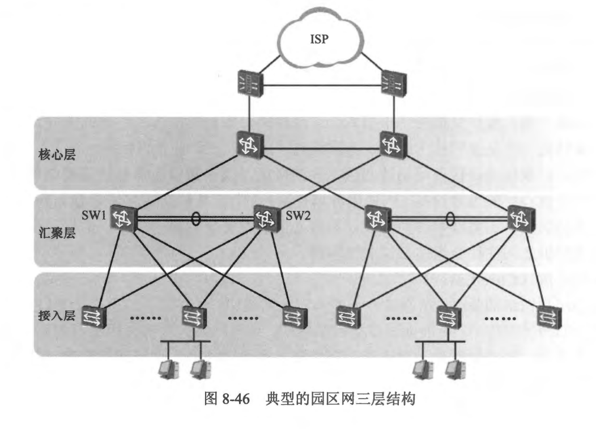

### 8.6.1 企业交换网络
- 以太网交换技术在企业园区网络中有着广泛的应用。传统的企业园区网络通常采用三层架构，如图8-46所示。

- 接入层 (Access Layer)
  - 接入层可被视为网络的边界，主要的功能是提供终端用户接入网络的入口，它负责将终端用户发往外部网络，或者发往其他 VLAN 的流量上交给汇聚层处理。一个典型园区网络的接入层往往连接着多种终端设备，例如 PC、服务器、网络打印机、无线 AP(Wireless Access Point， 无线接入点）等。
  - 工作在接入层的设备主要是接入层交换机，这些交换机通常仅具备二层功能。在接入层交换机上应用的技术主要有 VLAN、Trunk、生成树、Smart Link 等，另外可能也会应用一些安全技术，例如 ACL (Access Control List， 访问控制列表）、接口安全技术、NAC (Network Admission Control， 网络接入控制）等。由于大型网络中，终端设备的数量比较大，因此网络中的接入层交换机势必非常多，如何有效管理这些交换机便是网络设计者和管理者不得不考虑的问题，使用堆叠(Stacking）技术可以将多台物理交换机组合成一个整体，形成一台具体更高接口密度的“大交换机”，这不但简化了网络的管理方式，也使网络的逻辑拓扑更加简单。
- 汇聚层 (Aggregation Layer)
  - 汇聚层顾名思义是流量的汇聚地，通常是终端设备的默认网关所在。三层交换机通常被部署在汇聚层，而这些交换机将作为各个用户 VLAN 的终结点（来自终端设备的二层流量在这里终止）以及默认网关。
  - 内网中各个 VLAN 之间的数据互通是在汇聚层实现的。正如上文所说，汇聚层的交换机通常作为终端设备的默认网关，它们通过配置 SVI 提供服务。由于网关设备地位非常关键，因此其可靠性的保障是非常有必要的。一般而言，在典型的园区网络中，在汇聚层通常会采用多合汇聚层交换机实现冗余。在中小型组网中，采用两台交换机实现网关元余是较为常见的，例如图 8-46 中的 SW1 及 SW2，这两台交换机可以通过例如 VRRP (Virtual Router Redundanoy Protocol，虚拟路由器元余协议）这样的技术实现热备份。  
  - 大多数情况下，接入层交换机与汇聚层交换机构成一个园区网络中的二层交换网络。为了保证网络的高可靠性，接入层交换机与汇聚层交换机之间往往通过冗余的链路互联，如此一来，便在交换网络中引入了二层环路，如何解决二层环路问题并保证网络的高可靠性是一个重要的技术课题，另外，汇聚层也是接入层与核心层之间的桥梁，当终端设备需要访问网络外部，或者访问位于核心层的重要设备(例如服务器资源）时，汇聚层负责将流量路由到核心层，因此汇聚层的设备还需部署路由协议，与核心层的设备交互路由信息。汇聚层交换机与核心层交换机之间往往会组建三层交换网络。
- 核心层 (Core Layer)
  - 核心层是网络的骨干，在许多中小型的园区网络中，核心层与汇聚层常被合二为一，但在大型的园区 网络中，可能涉及多个网络区块，这些网络区块都使用各自的汇聚设备，在这种场景下，核心层就是必须的了，它负责将各个区块的汇聚层连接起来，实现区块之问的数据交互。核心层负责高速的数据转发，而且必须充分考虑高可靠性、高容错性等等方面的设计。
