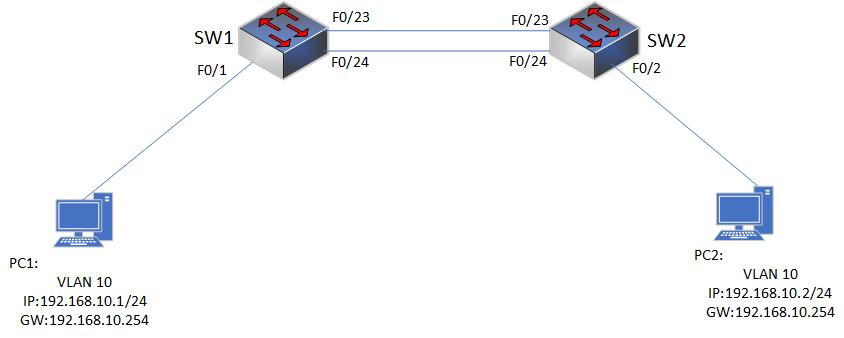

### 8.6 端口聚合
- 端口聚合概念
  - 端口聚合（Aggregate-port）又称链路聚合，是指两台交换机之间在物理上将多个端口连接起来，将多条链路聚合成一条逻辑链路。从而增大链路带宽，解决交换网络中因带宽引起的网络瓶颈问题。多条物理链路之间能够相互冗余备份，其中任意一条链路断开，不会影响其他链路的正常转发数据。

- 二层链路聚合的基本概念
  - 把多个二层物理链接捆绑在一起形成一个简单的逻辑链接，这个逻辑链接我们称之为链路聚合，这些二层物理端口捆绑在一起称为一个聚合口aggregate port（简称AP）。AP是链路带宽扩展的一个重要途径，符合IEEE 802.3ad标准。它可以把多个端口的带宽叠加起来使用，形成一个带宽更大的逻辑端口，同时当AP中的一条成员链路断开时，系统会将该链路的流量分配到AP中的其他有效链路上去，实现负载均衡和链路冗余。Aggregate port（AG）可以根据报文的源MAC地址、目的MAC地址或IP地址进行流量平衡，即把流量平均地分配到AG组成员链路中去。当接入层和汇聚之间创建了一条由三个百兆组成的AP链路时，在用户侧接入层交换机上，来自不同的用户主机数据，源MAC地址不同，因此二层AP基于源MAC地址进行多链路负载均衡方式。而在汇聚层交换机上发往用户数据帧的源MAC地址只有一个，就是本身的SVI接口MAC。因此二层AP基于目的MAC地址进行多链路负载均衡方式。

- 链路聚合的注意点:
  - 聚合端口的速度必须一致
  - 聚合端口必须属于同一个VLAN
  - 聚合端口使用的传输介质相同
  - 聚合端口必须属于同一层次，并与AP也要在同一层次
  - 所选择的端口必须工作在全双工模式，工作速率必须一致
  - 所有成员端口以及链路聚合组的模式必须保持一致，可以是access、trunk或hybrid。

- 链路端口聚合的分类和方式
- 静态聚合 
  - 双方系统间不使用聚合协议来协商链路信息

- 动态聚合 
  - 双方系统间使用聚合协议来协商链路信息
  - LACP（LinkAggregation Control Protocol，链路聚合控制协议）是一种基于IEEE802.3ad标准的、能够实现链路动态聚合的

- 协议链路聚合方式
  - LACP( Link Aggregation Control Protocol)
  - 标准：IEEE802.3ad
  - LACP通过协议将多个物理端口动态聚合到   Trunk组，形成一个逻辑端口。
  - LACP自动产生聚合、自动发现故障链路，在获得最大的带宽同时保证链路有效性。

- 聚合配置
```shell
#同时选中需要配置的端口，举例选择1口和2口
Switch(config)#interface range fastEthernet 0/1-2

#将端口加入端口聚合组1并开启功能        
Switch(config-if-range)#channel-group1 mode on

#按照目标主机IP地址数据分发来实现负载平衡
Switch(config)#port-channelload-balance dst-ip

#链路聚合配置说明:
Active模式：在Active模式下，设备主动地发送LACP协议数据单元（PDU）以尝试与对端设备建立聚合。如果对端设备支持LACP并配置为Active或Passive模式，则可以建立聚合；否则，链路将按独立链路进行操作。
Auto模式：在Auto模式下，设备仅在收到LACP PDU时才尝试与对端设备建立聚合。如果对端设备支持LACP并配置为Active或Passive模式，则可以建立聚合；否则，链路将按独立链路进行操作。
Desirable模式：在Desirable模式下，设备主动地发送LACP PDU以尝试与对端设备建立聚合，但是如果对端设备配置为Auto模式，则设备将继续发送LACP PDU以尝试建立聚合。
On模式：在On模式下，设备将直接建立聚合，而不使用任何协议。此模式需要手动配置对端设备以匹配。
Passive模式：在Passive模式下，设备不会主动发送LACP PDU，而是仅在收到LACP PDU时才响应。如果对端设备支持LACP并配置为Active或Desirable模式，则可以建立聚合；否则，链路将按独立链路进行操作。

#需要注意的是，为了成功建立链路聚合，对端设备的配置需要与本地设备相匹配。例如，如果本地设备配置为Active模式，则对端设备必须配置为Active或Passive模式。
```

- 配置需求
  -   将PC1放入SW1的VLAN10，PC2放入SW2的VLAN10。在SW1和SW2的互联口FA0/23和FA0/24开启二层端口聚合，用于提高链路冗余和增加带宽。
