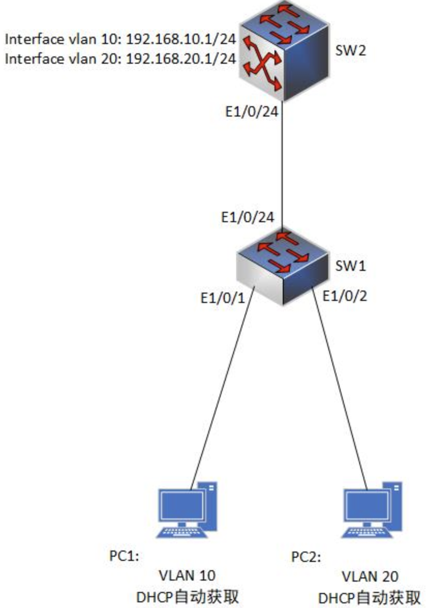
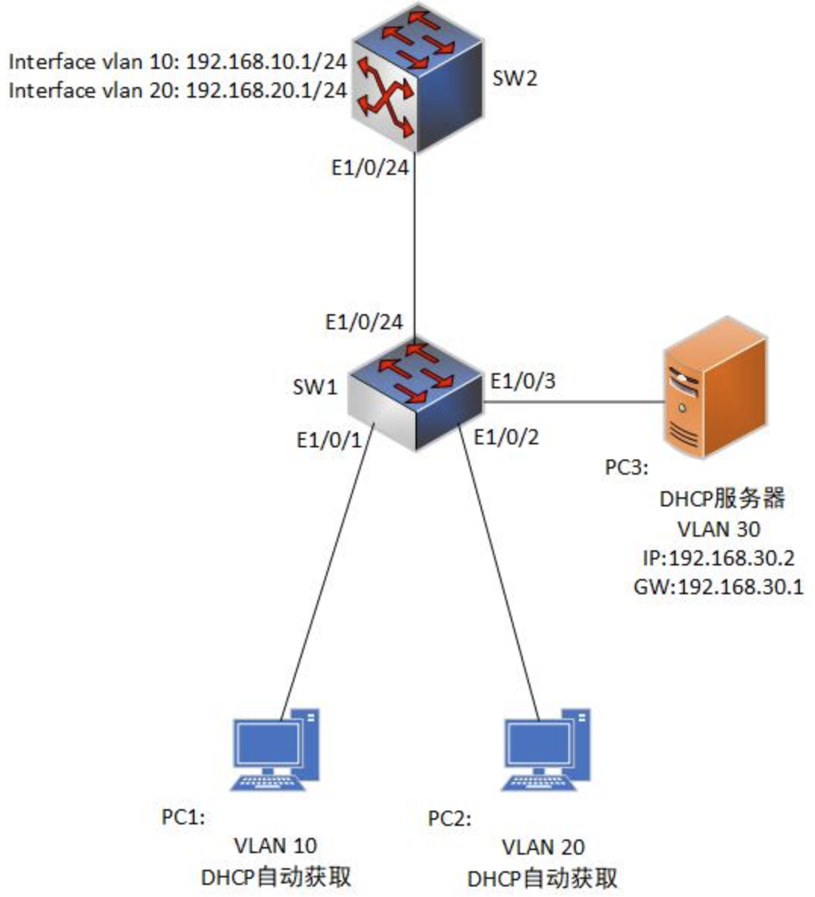

### 8.71 配置交换机作为DHCP服务器
- DHCP介绍
  - DHCP(Dynamic Host Configuration Protocol)是一种动态的向Internet终端提供配置参数的协议。在终端提出申请之后，DHCP可以向终端提供IP地址、网关、DNS服务器地址等参数。

- DHCP的必要性
  - 在大型网络中，确保所有主机都拥有正确的配置是一件的相当困难的管理任务，尤其对于含有漫游用户和笔记本电脑的动态网络更是如此。经常有计算机从一个子网移到另一个子网以及从网络中移出。手动配置或重新配置数量巨大的计算机可能要花很长时间，而IP主机配置过程中的错误可能导致该主机无法与网络中的其他主机通信。

- DHCP报文
  - DHCPDISCOVER —— 客户机广播发现可用的DHCP服务器
  - DHCPOFFER—— 服务器响应客户机的DHCPDISCOVER报文,并向客户机提供各种的配置参数
  - DHCPREQUEST:
    - 客户机向服务器申请地址及其他配置参数
    - 客户机重新启动后确认原来的地址及其他配置参数的正确性  
    - 客户机向服务器申请延长地址及其他配置参数的使用期限

  - DHCPACK —— 服务器向客户机发送所需分配的地址及其他配置参数

- DHCP流程
  - 客户机在本网段内广播DHCPDISCOVER报文已发现网络中的DHCP服务器,DHCPRelay可将此报文广播到其他的网段
  - 服务器向客户机回应请求,并给出一个可用的IP地址。此地址并非真的被分配。但在给出此地之前，应当用ICMP ECHO REQUEST报文进行检查
  - 如果收到多个DHCPOFFER报文,DHCP客户机会根据报文的内容从其中选择一个给与响应。如果客户机之前曾经获得过一个IP地址，她会将此地址写在DHCPREQUEST报文的OPTIONS域的“REQUESTD IP ADDRESS”中发给服务器
  - 当收到DHCPREQUEST报文后,服务器将客户机的网络的(网络地址,硬件地址)同分配的IP地址绑定,在将IP地址发送给客户机
  - 当收到DHCPREQUEST报文后,如果发现其申请的地址无法被分配,则用DHCPNAK报文回应
  - 客户机收到DHCPACK报文后,再对所有的参数进行一次最后的检查,如果发现由地址冲突存在,则使用DHCPDECLINE报文回复服务器
  - 如果客户机放弃现在使用的IP地址,则她使用DHCPRELEASE报文通知服务器,服务器将此地址回收以备下次使用
  - 当客户机的地址到达50%租用期（T1）时，客户机进入RENEW状态，使用DHCPREQUEST报文续约
  - 当客户机的地址到达87.5%租用期（T2）时，客户机进入REBINDING状态，使用DHCPREQUEST报文续约

- DHCP配置
```shell
#开启交换机的 dhcp服务
Switch(config)#service dhcp

#配置DHCP服务的地址池
Switch(config)#ip dhcp pool [dhcp-pool-name]  

#配置分配的网段地址
Switch(dhcp-[pool-name]-config)#network-address [network-address]  [network-masks]

#配置分配的网关地址
Switch(dhcp-[pool-name]-config)#default-router [ip-address]

#配置分配的DNS地址
Switch(dhcp-[pool-name]-config)#dns-server [ip-address]

#配置租期单位为天
Switch(dhcp-[pool-name]-config)#lease [days]

#排除不分配的地址
Switch(config)#ip dhcp excluded-address [low-ip-address] [high-ip-address]
```

- 实例配置
  - 配置要求
    - 将SW2设置为DHCP服务器为VLAN10和VLAN20的PC分配地址，分配地址范围为VLAN10:192.168.10.10-200,VLAN20:192.168.20.10-200,网关为VLAN0:192.168.10.1,VLAN20:192.168.20.1，DNS都分配为172.16.1.1，租期都为一个月（30天）。 
    


<br>
<br>

### 8.7.2 配置交换机作为DHCP中继
- DHCP中继的概念
  - DHCP中继代理是将一个局域网内的DHCP请求转发到其他局域网内的DHCP服务器上，实现一个DHCP服务器向多个局域网分配不同网段的IP。

- DHCP中继的应用
  - 在现实中，稍复杂一些的网络，服务器经常集中存放在服务器区，DHCP服务器和客户端不在同一个网段，DHCP的广播包被三层设备阻止，会导致DHCP获取地址失败。此时，可以在离客户端最近的三层设备接口上配置DHCP中继，让其进行辅助寻址，进行DHCP请求广播包的转发。

- DHCP中继配置
```shell
#开启交换机DHCP功能
Switch(config)#service dhcp

#开启UDP转发功能
Switch(config)#ip forward-protocol udp bootps

#配置DHCP中继，地址指向DHCP服务器
Switch(config)#interface vlan 10
Switch(config-if-vlan10)#ip helper-address [dhcp-server-ip-address]         
```

- 实例配置
  - 配置要求
    - PC3为安装了Centos系统，作为DHCP服务器为VLAN10和VLAN20分配地址，由于DHCP服务器和PC1、PC2不在一个网段，在SW2上配置DHCP中继代理，使 PC1 和 PC2 能获取地址。 
    