### 案例1: BGP基础实验
- 实验目的：
  - 掌握BGP的基本配置方法。
  - 掌握如何查看BGP的各种配置信息。
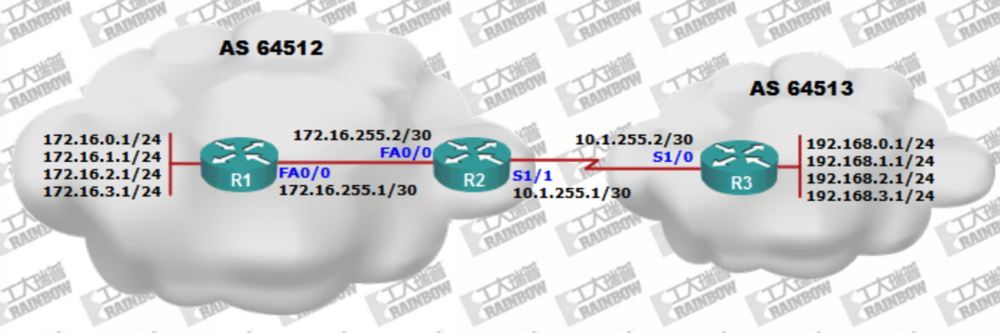

 
 

### 案例2: 指定 BGP 更新源 IP 地址
- 实验目的:
  - 掌握基于回环口的BGP的邻居关系建立的配置方法
  - 理解需要使用回环口为目的

 
 

### 案例3: BGP 同步规则
- 实验目的:
  - 深入理解BGP的同步规则
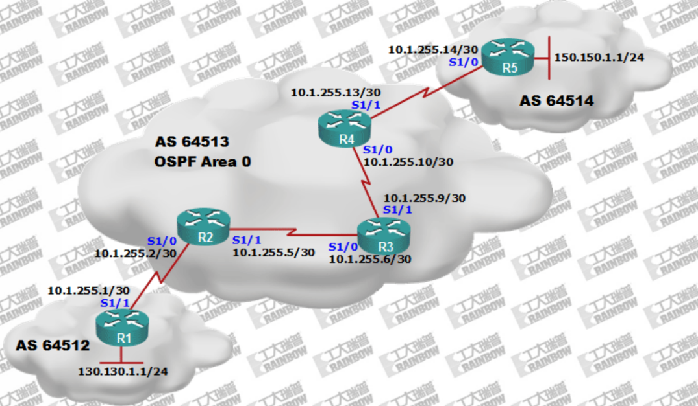

 
 

### 案例4: BGP路由自动汇总
- 实验目的:
  - 理解BGP的自动汇总特性
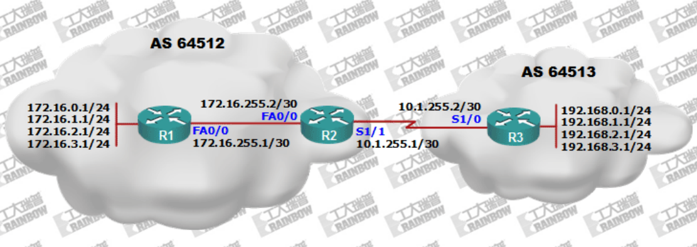

 
 

### 案例5: BGP手工路由汇总
- 实验目的:
  - 掌握使用指向NULL0接口的静态路由的汇总配置方法
  - 掌握使用聚合属性的路由汇总配置方法
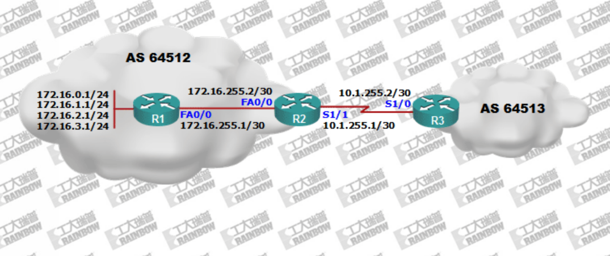

 
 

### 案例6: BGP路由认证
- 实验目的:
  - 掌握其于MD5的BGP对等体认证配置。
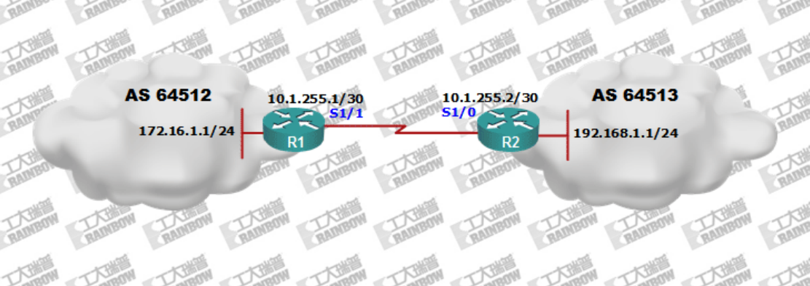

 
 

### 案例7: BGP的本地优选属性
- 实验目的:
  - 理解掌握BGP的本地优选属性概念和配置方法
  - 本地优选的属性默认值为100，较高值的路径会被优先选择
  - 本地优先属性，决定离开本自治系统最佳的路径
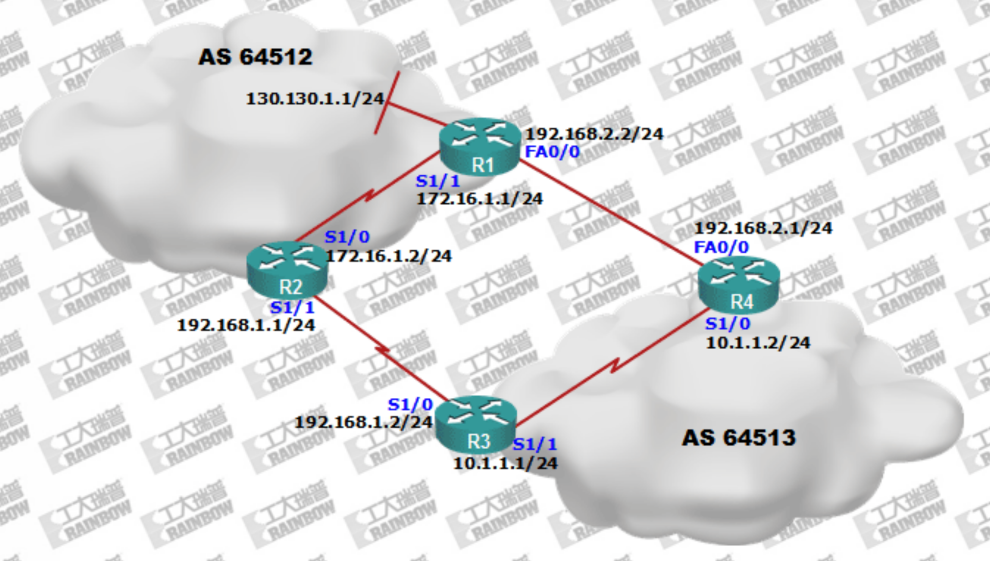

 
 

### 案例8: 使用Route-map配置本地优先属性
- 实验目的:
  - 掌握基于route-map的本地优先配置方法
  - 使用route-map配置可以定置基于目标网络的本地优先
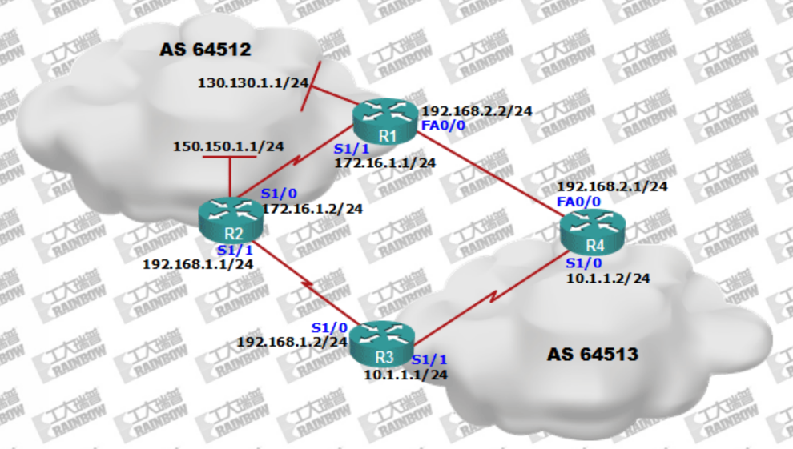

 
 

### 案例9: BGP Med属性
- 实验目的:
  - 理解MED属性能够影响,其它的自治系统的数据流如何流入本地自治系统
  - 掌握基于route-map的MED配置方法
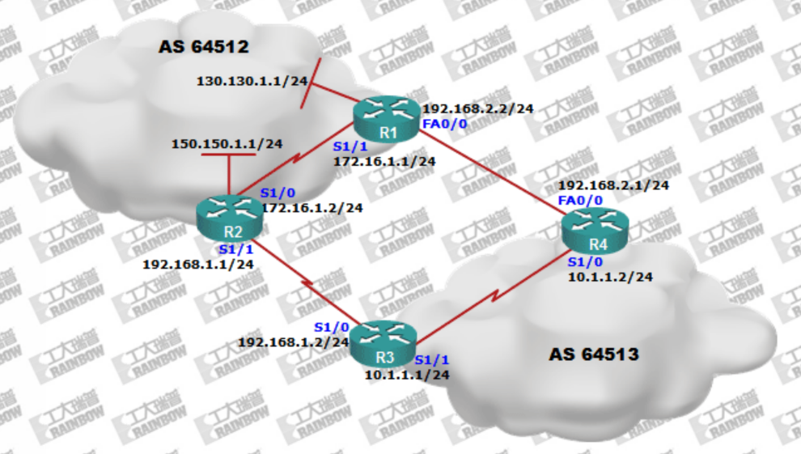

 
 

### 案例10: BGP weight属性
- 实验目的：
  - 当本地出口路由器,有多条外出自治系统的链路时,应用权重(Weight)属性能够决定数据流从本地路由器哪条出口链路流出本地自治系统
  - 权重(Weight)属性为Cisco私有属性
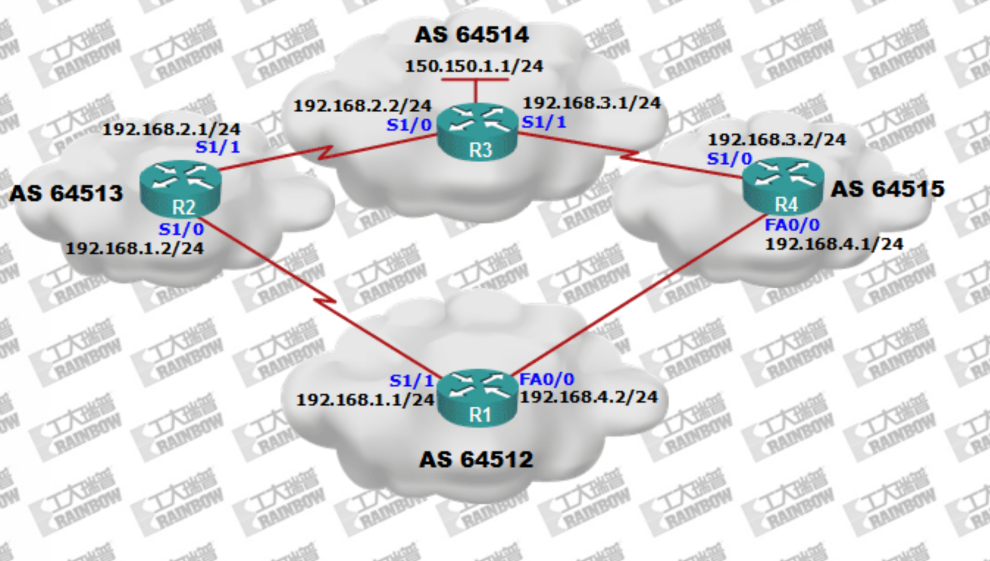

 
 

### 案例11: BGP AS-path属性
- 实验目的:
  - 掌握如何配置路径欺骗影响BGP的路由选择
  - 理解BGP的路径欺骗是MED的替代解决方法,但是其适用范围较小,只能在有限的网络环境下配置使用
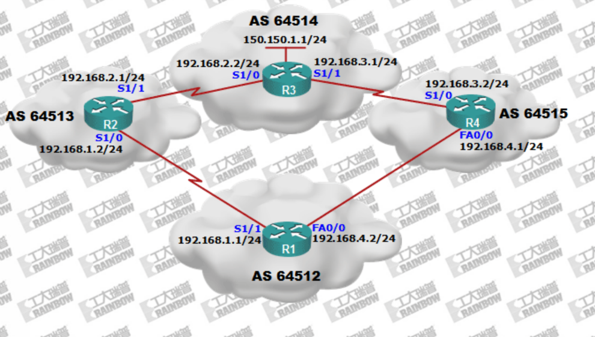

 
 

### 案例12: 使用路由标记保存BGP的 AS-path属性
- 实验目的:
  - 解决BGP与IGP在做路由重发布时,BGP AS-PATH属性丢失的问题
  - 掌握使用路由标记存储BGP路径属性配置方法
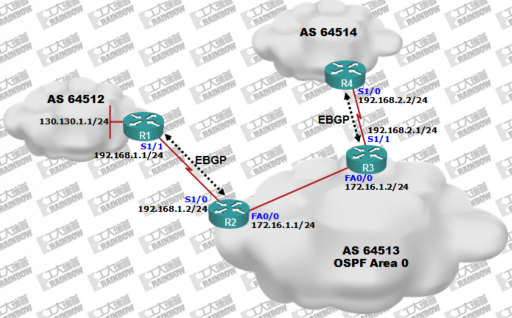

 
 

### 案例13: 使用Distribute-list过滤 BGP 路由
- 实验目的:
  - 掌握使用distribute-list过滤BGP的路由
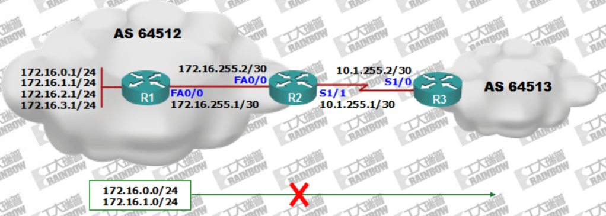

 
 

### 案例14: 使用 Route-map 过滤 BGP 路由
- 实验目的:
  - 掌握使用Route-Map过滤BGP的路由
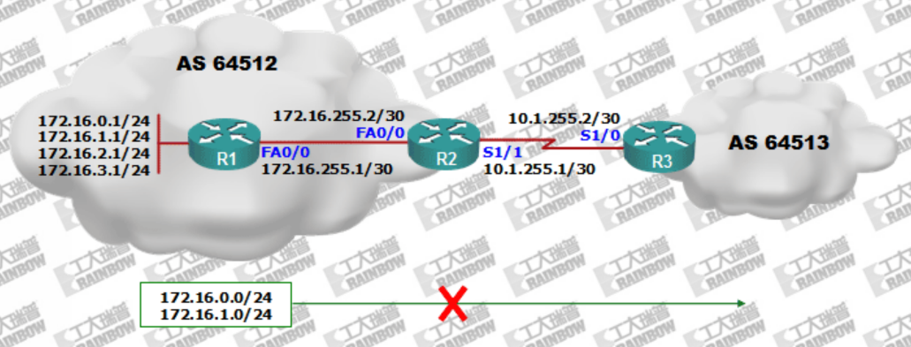

 
 

### 案例15: 使用 Prefix-List 过滤 BGP 路由
- 实验目的:
  - 掌握基于Prefix-List的过滤配置方法
  - 掌握Prefix-List针对路由的子网掩码长度的选择性过滤配置
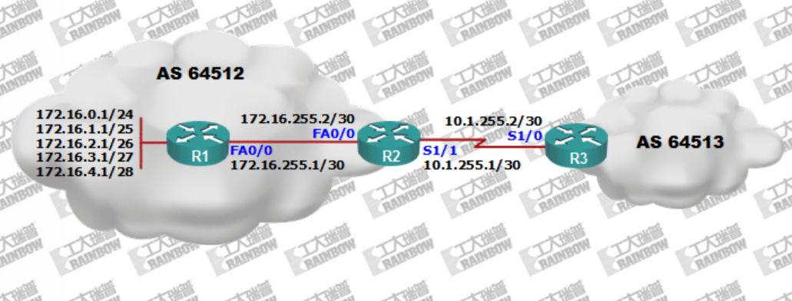