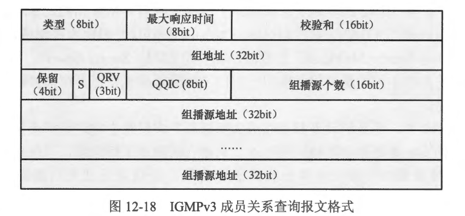
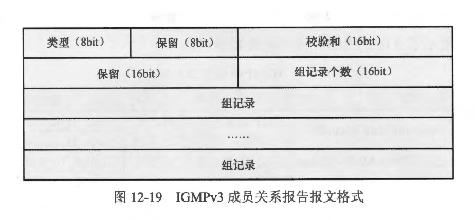
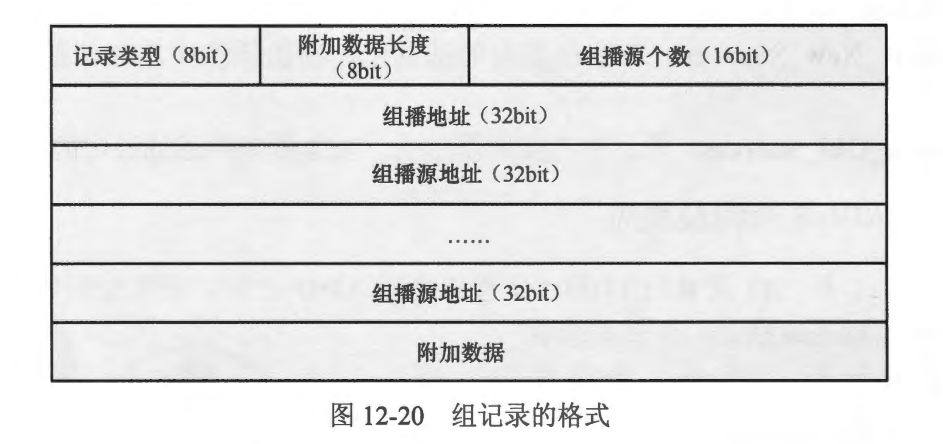
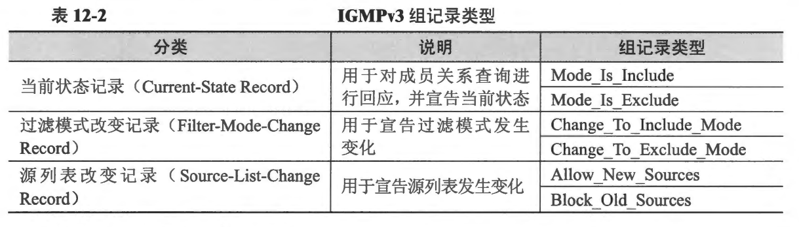
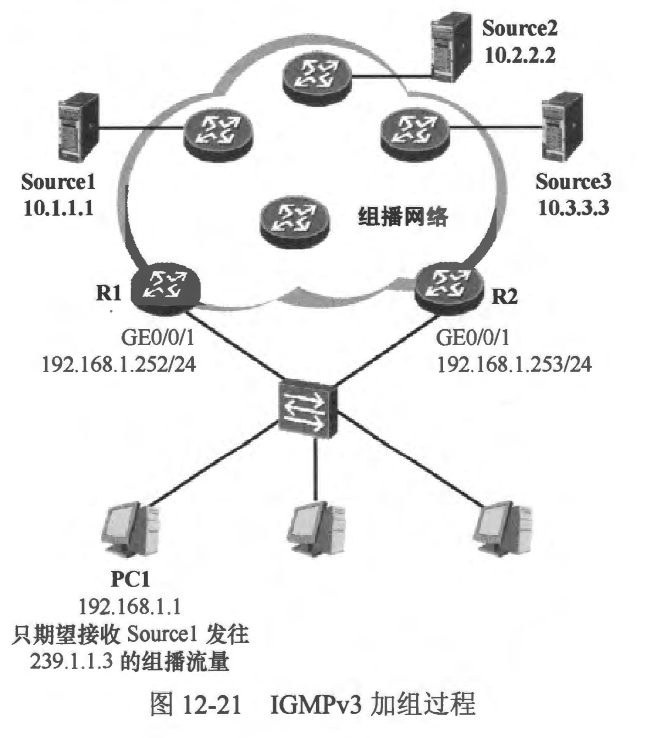
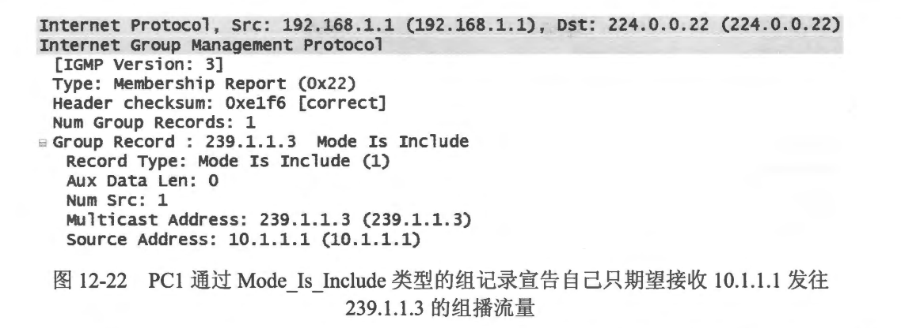
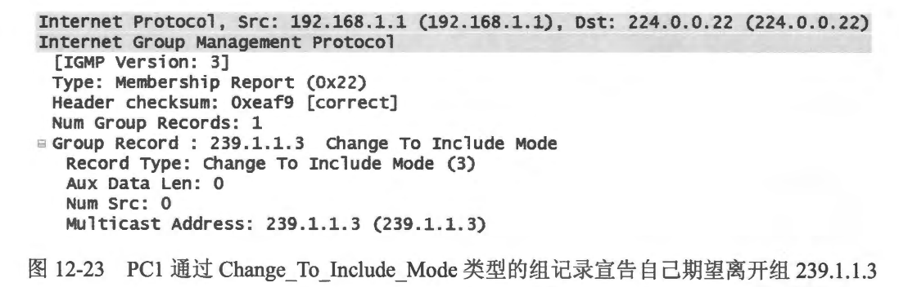

### IGMPV3

- IGMPV3 在IGMPV2 的基础上主要增加了组播接收者对组播源的过滤功能，简单地说就是主机可以通过 IGMPv3 宣告自己期望加入的组播组，并限定或过滤特定的组播源。
- ASM (Any-Source Multicast， 任意源组播)及 SSM (Source-Specific Multicast， 特定源组播)是两种不同的组播服务模型，它们之问的差异主要在于组播接收者对于组播源的选择能力。
  - 在 ASM 中，任意的设备都可以成为组播源并向网络中发送组播流量，对于接收者而言，它们事先并不知晓组播源的地址，只要它们加入了组播组，当任意的源向该组播组发送组播流量时，接收者即会收到这些流量，接收者无法对组播源进行选择。IGMPV1、 IGMPV2 及 IGMPv3 都支持 ASM
  - 在 SSM 中，组播接收者加入组播组时，可指定接收或者拒绝特定组播源发往某个组播组的流量，特定源组播因此得名。当然，对于 SSM 而言，组播接收者要求事先知道组播源的地址。IGMPV3 是 SSM 的重要组件之一，而 IGMPv1 及 IGMPv2 则需借助其他手段才能够在 SSM 中应用。

### 12.4.1 报文类型
- IGMPV3 定义了两种类型的协议报文（除去用于兼容 IGMPv1 及 IGMPv2 的几种报文)。
- 成员关系查询( Membership Query)
  - 图 12-18 显示了IGMPv3 成员关系查询报文格式，其中各个字段的含义如下。
  - 类型 (Type)：对于 IGMPV3 成员关系查询报文，该字段的值为 0x11。
  - 校验和 （Checksum)：校验和。
  - 最大响应时间 (Max Response Time)：主机使用 IGMPv3 成员关系报告来响应该成员关系查询报文的最长等待时间。
  - 组地址 (Group Address )：对于常规查询报文，该宇段值被设置为 0.0.0.0；对于特定组查询报文及特定组/源查询报文，该字段值被设置为所查询的特定组播组的地址。
  - S (Suppress Router-Side Proeessing，抑制路由器侧处理，标志位：这是一个特殊的标志位，其值为1或0时具有不同的功能。关于该标志位的介绍超出了本书的范围。
  - QRV (Querier's Reobustness Variable，查询器健壮系数）：健壮系数是一个变量，这个变量将影响组成员关系的超时时间等。IGMPv3 查询器在自己发送的查询报文中设置 QRV，缺省时，QRV 被设置为2。
  - OOIC (Ouerier's Ouery Interval Code， 查询器查询间隔)：IGMPv3 查询器发送常规查询的时间间隔，缺省时该值为 60秒。
  - 组播源个数 (Number of Sources )：该查询报文中所包含的组播源个数。在常规查询报文或特定组查询报文中，该字段的值为 0，此时该报文将不包含任何组播源地址信息。而在特定组/源查询报文中，该字段的值为非 0，此时该报文所包含的组播源地址个数取决于本字段。
  - 组播源地址 (Source Address)：组播源地址。
  
  - IGMPv3 成员关系查询报文共包含如下三种类型，RFC3376 详细地描述了这些报文及其功能。
    - 常规查询 (General Query)：IGMPV3 查询器周期性地发送常规查询报文，对网络中的所有组播组进行查询，以便维护组成员关系。由于该报文被用于查询任意的组播组中是否存在成员，因此也被称为普遍组查询报文。在IGMPv3 常规查询报文中，“组地址”宇段的值为0.0.0.0，另外“组播源个数”字段的值也为 0。
    - 特定组查询(Group-Specific Query)：特定组查询报文只针对特定的组播组进行查询。在该报文中，“组地址”字段的值为该组播组的地址，另外“组播源个数” 宇段的值也为0。
    - 特定组/源查询 (Group-and-Source-Specific Ouerv)：特定组/源查询报文用于查询网络中是否存在期望接收特定组播源发往特定组播组的流量的组成员。在该报文中，“组地址” 字段的值为该组播组的地址，另外，“组播源个数” 字段填充的是报文所包含的组播源地址个数，而“组播源地址〞 字段则填充的是报文所查询的组播源。
- 成员关系报告 (Membership Report)
  - 当主机加入组播组时，或者当其收到路由器发送的成员关系查询报文时，主机将发送成员关系报告报文，该报文的目的卫地址是 224.0.0.22，这是 IANA 分配给 IGMP 协议的组播地址。IGMPV3 中没有专门定义离组报文，IGMPv3 组成员离开组播组时，使用特殊的成员关系报告报文宣告自己离开，具体的操作将在 12.4.3 节中介绍。图 12-19 展示了 IGMPv3 成员关系报告报文的格式。
  - 在IGMPv1 或者 IGMPv2 中，组成员只能使用成员关系报告报文宣告自己期望加入的组播组，而无法对组播源进行指定。IGMPv3 增加了组成员对组播源的过滤模式，因此组成员不仅能够宣告自己期望加入的组播组，还能够对组播源进行指定，例如通过 IGMPv3 成员关系报告宣告自己只接收从源 S1 及 S2 发往组播组 G1 的组播流量，也可宣告自己只接收除了 S3 及 S4之外的其他源发往组播组 G2 的组播流量。
  
- 各字段的含义如下。
  - 类型 (Type）：对于 IGMPv3 成员关系报告报文，该字段的值为0x22。
  - 校验和 (Checksum)：校验和。
  - 组记录个数 (Number of Group Records)：该IGMPv3 成员关系报告报文中所包含的组记录的个数。
  - 组记录(Group Record)：每个组记录实际上包含了多个字段，一个IGMPv3 成员关系报告可能包含多个组记录。图 12-20 展示了组记录的格式。
  
- 组记录中，各字段的含义如下。
   - 记录类型 (Record Type)：指示该组记录的类型。IGMPv3 定义了6种组记录类型，分别用于不同的用途。关于这些记录类型，将在下文介绍。
   - 附加数据长度(AuxiliaryDataLength）：指示本报文中“附加数据”字段的长度，一般而言，该宇段的值为0，因此通常IGMPv3成员关系报告报文不包含附加数据。
   - 组播源个数(NumberofSources)：指示报文中所包含的组播源的个数。
   - 组播地址(MulticastAddress)：组播组地址。
   - 组播源地址(SourceAddress)：组播源地址。
- 在IGMPv3中，组成员使用IGMPv3 成员关系报告报文宣告自己所加入的组播组，以及该组播组的源过滤模式。IGMPV3 定义了Include（包含）及Exclade（排除）两种过滤模式。组成员可以使用成员关系报告宣告自己只希望接收特定源发往某个组播组的流量（过滤模式为 Include ），也可以宣告自己只希望接收除了特定源之外的其他源发往某个组播组的流量（过滤模式为 Exclude)。当然，该组成员也可以在事后对此前宣告的过滤模式进行变更。IGMPv3 在成员关系报告中定义了组记录，用于承载这些信息。
- 表 12-2 展示了 IGMPv3 的6种组记录类型。

- 这六种组记录类型的含义奶下。
  - Mode_ Is_Include: 表示过滤模式为 Include，也就是说该组成员期望只接收该组记录中的组播源（组播源可能有多个，下文不再特别说明）发往特定组播组的流量。
  - Mode_Is_Exclude: 表示过滤模式为 Exclude，也就是说该组成员期望接收除了该组记录中的组播源之外的其他组播源发往特定组播组的流量。
  - Change_ To_Include_Mode: 表示过滤模式由 Exclude 变更为 Include。
  - Change_ To_Exclude_Mode: 表示过滤模式由 Include 变更为 Exclude。
  - Allow_ New_Sources: 表示在当前的基础上，在组播组中增加新的被允许的组播源。
  - Block_Old_Sources: 表示在当前的基础上，在组播组中过滤指定的组播源。

 
 

### 12.4.2 IGMPv3 查询及响应
- 在图12-21 中，R1 及R2 的 GE0/0/1 接口激活 IGMPv3 后，它们便开始在接口上发在图 12-21中，R1 及 R2 的 GE0/0/1 送 IGMPv3 常规查询报文，查询器选举
过程将会被触发，IGMPv3 使用与IGMPv2 相同的查询器选举机制，因此接口IP 地址更小的R1 成为该网段的查询器。随后 R1 将周期性地在 GE0/0/1
接口上发送IGMPv3 常规查询报文。

- PC1 只期望接收组播源 Source 发往组播组 239.1.1.3 的组播流量，因此收到 R1 发送的 IGMPv3 常规查询报文后，它将使用 IGMPv3 成员关系报告进行回应（当然，PC1 也可主动发送成员关系报告）。在 PC1 发送的成员关系报告中，可以包含一个 Mode_Is_Include 类型的组记录，在该组记录中，组地址为 239.1.1.3，组播源只有一个，即 10.1.1.1。图 12-22 显示了 PC1 发送的这个报文。

- R1 收到该成员关系报告后，便知道其 GE0/0/1 接口的直连网段中，存在组播组 239.1.1.3 的成员，并且该成员只接收组播源 10.1.1.1 发往该组播组的流量，当它收到这些组播流量时，便会將这些流量从该接口转发出去。而如果 R1 收到了组播源 10.2.2.2 或 10.3.3.3 发往 239.1.1.3 的组播流量，那么它不会将这些流量从 GE0/0/1 接口转发出去。

 
 

### 12.4.3 IGMPv3 组成员离组
- IGMPv3 没有专门定义离组报文，当组成员想要离开当前的组播组时，使用特殊的组记录来实现。例如 图 12-21 中，假设 PC1 己经是组播组 239.1.1.3 的成员(PC1 通过 Mode_Is_Include 类型的组记录宣告自己只接收 10.1.1.1 发往 239.1.1.3 的组播流量），现在它不再期望接收该组播组的流量，于是它发送一个 IGMPv3 成员关系报告，在该报告中包含 Change_ To_Include_Mode 类型的组记录，并且在该组记录中，组地址为 239.1.1.3、组播源为空。图 12-23 展示了 PC1 所发送的这个IGMPv3 成员关系报告报文。

- R1 收到该报文后，将立即启动特定组/源查询过程，从 GE0/0/1 接口发送 IGMPv3 特定组/源查询报文，以便确认该网段中是否有其他成员期望接收组播源 10.1.1.1 发往 239.1.1.3 的组播流量，由于当前网段中没有其他成员，因此很短的一段时间后，R1 将删除相关 IGMP 组表项，不会再向该网段转发相关组播流量。

 
 

### 12.4.4 案例: IGMPv3基础配置

 
 