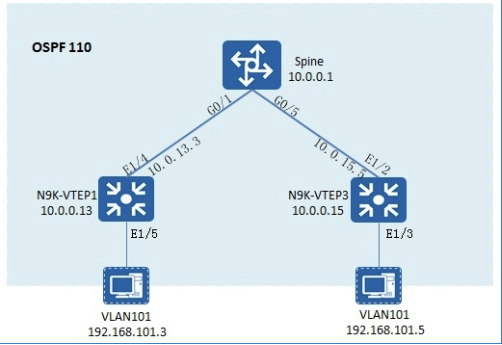

## 基于组播的VXLAN实验


#### 具体配置
```shell
##接口配置

#Spine
Spine(config)#interface loopback 0
Spine(config-if)#ip address10.0.0.1 255.255.255.255

Spine(config)#interface gigabitEthernet 0/1
Spine(config-if)#ip address 10.0.13.1 255.255.255.0

Spine(config)#interface gigabitEthernet 0/4
Spine(config-if)#ip address 10.0.14.1 255.255.255.0

Spine(config)#interface gigabitEthernet 0/5
Spine(config-if)#ip address 10.0.15.1 255.255.255.0

#VTP1
N9K-VTEP1(config)# interface ethernet 1/4
N9K-VTEP1(config-if)# ipaddress 10.0.13.3/24

N9K-VTEP1(config)# interface loopback 0
N9K-VTEP1(config-if)# ip address 10.0.0.13/32

#VTEP3
N9K-VTEP3(config)# interface ethernet 1/2
N9K-VTEP3(config-if)# ip address 10.0.15.5/24

N9K-VTEP3(config)# interface loopback 0
N9K-VTEP3(config-if)# ip address 10.0.0.15/32

##启用IGP配置：

#Spine
Spine(config)#router ospf 110
Spine(config-router)#router-id 10.0.0.1
Spine(config-router)#network 10.0.0.1 0.0.0.0 a 0
Spine(config-router)#network 10.0.13.0 0.0.0.255 a 0
Spine(config-router)#network 10.0.14.0 0.0.0.255 a 0
Spine(config-router)#network 10.0.15.0 0.0.0.255 a 0

#VTEP1
N9K-VTEP1(config)#feature ospf
N9K-VTEP1(config)# router ospf 110
N9K-VTEP1(config-router)#router-id 10.0.0.13

N9K-VTEP1(config)# interface ethernet 1/4
N9K-VTEP1(config-if)# ip router ospf 110 area 0

N9K-VTEP1(config)# interface loopback 0
N9K-VTEP1(config-if)# iprouter ospf 110 area 0

#VTEP2
N9K-VTEP3(config)# feature ospf
N9K-VTEP3(config)# router ospf 110
N9K-VTEP3(config-router)#router-id 10.0.0.15

N9K-VTEP3(config)# interface ethernet 1/2
N9K-VTEP3(config-if)# ip router ospf 110 area 0

N9K-VTEP3(config)# interface loopback 0
N9K-VTEP3(config-if)# ip router ospf 110 area 0

##启用组播配置，Spine为组播RP：
#Spine
Spine(config)#ip multicast-routing
Spine(config)#ip pim bidir-enable
Spine(config)#ip pim rp-address 10.0.0.1 1 bidir
Spine(config)#access-list 1 permit 225.0.0.0 0.0.0.255

Spine(config)#interface loopback 0
Spine(config-if)#ip pim sparse-mode

Spine(config)#interface gigabitEthernet 0/1
Spine(config-if)#ip pim sparse-mode

Spine(config)#interface gigabitEthernet 0/4
Spine(config-if)#ip pim sparse-mode

Spine(config)#interface gigabitEthernet 0/5
Spine(config-if)#ip pim sparse-mode

#VTEP1
N9K-VTEP1(config)#feature pim
N9K-VTEP1(config)# ip pim rp-address 10.0.0.1 group-list 225.0.0.0/24 bidir

N9K-VTEP1(config)# interface ethernet 1/4
N9K-VTEP1(config-if)# ip pim sparse-mode

N9K-VTEP1(config)# interface loopback 0
N9K-VTEP1(config-if)# ip pim sparse-mode

#VTEP3
N9K-VTEP3(config)#feature pim
N9K-VTEP3(config)# ip pim rp-address 10.0.0.1 group-list 225.0.0.0/24 bidir

N9K-VTEP3(config)# interface ethernet 1/2
N9K-VTEP3(config-if)# ip pim sparse-mode

N9K-VTEP3(config)# interface loopback 0
N9K-VTEP3(config-if)# ip pim sparse-mode

##VXLAN配置
#VTEP3
N9K-VTEP3(config)# feature nv overlay
N9K-VTEP3(config)# feature vn-segment-vlan-based

N9K-VTEP3(config)# vlan 101
N9K-VTEP3(config-vlan)#vn-segment 10101

N9K-VTEP3(config)# interface ethernet 1/3
N9K-VTEP3(config-if)#switchport access vlan 101

N9K-VTEP3(config)# interface nve 1
N9K-VTEP3(config-if-nve)#source-interface loopback 0
N9K-VTEP3(config-if-nve)#member vni 10101 mcast-group 225.0.0.101
N9K-VTEP3(config-if-nve)#no shutdown

#VTEP1
N9K-VTEP1(config)# feature nv overlay
N9K-VTEP1(config)# feature vn-segment-vlan-based
N9K-VTEP1(config)# vlan 101
N9K-VTEP1(config-vlan)#vn-segment 10101

N9K-VTEP1(config)# interface ethernet 1/5
N9K-VTEP1(config-if)#switchport mode access
N9K-VTEP1(config-if)#switchport access vlan 101

N9K-VTEP1(config)# interface nve 1
N9K-VTEP1(config-if-nve)#source-interface loopback 0
N9K-VTEP1(config-if-nve)#member vni 10101 mcast-group 225.0.0.101
N9K-VTEP3(config-if-nve)#no shutdown

##查看组播信息:
#VTEP1
N9K-VTEP1# show ip pim neighbor 
PIM Neighbor Status for VRF "default"

Neighbor        Interface    Uptime    Expires    DR       Bidir- BFD                                                   Priority   Capable  State
10.0.13.1          Ethernet1/4    01:29:47     00:01:44      1       yes      n/a

N9K-VTEP1# show ip mroute 
IP Multicast Routing Table for VRF "default"

(*, 225.0.0.0/24), bidir, uptime: 01:31:16, pim ip 
  Incoming interface: Ethernet1/4, RPF nbr: 10.0.13.1, uptime: 01:31:16
  Outgoing interface list: (count: 1)
    Ethernet1/4, uptime: 01:31:16, pim, (RPF)

(*, 225.0.0.101/32), bidir, uptime: 00:26:37, nve ip pim 
  Incoming interface: Ethernet1/4, RPF nbr: 10.0.13.1, uptime: 00:26:37
  Outgoing interface list: (count: 2)
    Ethernet1/4, uptime: 00:26:37, pim, (RPF)
    nve1, uptime: 00:26:37, nve

(10.0.0.13/32, 225.0.0.101/32), bidir, uptime: 00:26:37, nve ip mrib 
  Incoming interface: loopback0, RPF nbr: 10.0.0.13, uptime: 00:26:37
  Outgoing interface list: (count: 1)
    nve1, uptime: 00:26:37, nve

(*, 225.0.0.102/32), bidir, uptime: 00:26:37, nve ip pim 
  Incoming interface: Ethernet1/4, RPF nbr: 10.0.13.1, uptime: 00:26:37
  Outgoing interface list: (count: 2)
    Ethernet1/4, uptime: 00:26:37, pim, (RPF)
    nve1, uptime: 00:26:37, nve

(10.0.0.13/32, 225.0.0.102/32), bidir, uptime: 00:26:37, nve ip mrib 
  Incoming interface: loopback0, RPF nbr: 10.0.0.13, uptime: 00:26:37
  Outgoing interface list: (count: 1)
    nve1, uptime: 00:26:37, nve

(*, 232.0.0.0/8), uptime: 01:32:11, pim ip 
  Incoming interface: Null, RPF nbr: 0.0.0.0, uptime: 01:32:11
  Outgoing interface list: (count: 0

##查看nve
#VTEP1
N9K-VTEP1# show interface nve 1 brief 
--------------------------------------------------------------------------------
Port           Status Reason            MTU  
--------------------------------------------------------------------------------
nve1           up     none            9216  

##测试联通性
VPCS> ping 192.168.101.3
84 bytes from 192.168.101.3 icmp_seq=1 ttl=64 time=39.603 ms
84 bytes from 192.168.101.3 icmp_seq=2 ttl=64 time=46.926 ms
84 bytes from 192.168.101.3 icmp_seq=3 ttl=64 time=36.462 ms
84 bytes from 192.168.101.3 icmp_seq=4 ttl=64 time=33.530 ms
84 bytes from 192.168.101.3 icmp_seq=5 ttl=64 time=39.559 ms
```