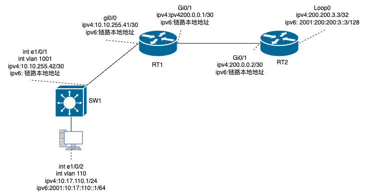

 ## Natpt概念

- IPV6要访问IPV4，必须要知道IPV4映射所形成的IPV6地址是多少，根据NAT-PT规定使用前缀为96的IPV6地址池来表示IPV4，这样每个IPV4就“存在”于IPV6中了。
- IPV4要访问IPV6，必须要知道IPV6映射所形成的IPV4地址是多少，根据NAT-PT规定可以使用任意未占用的IPV4地址池来表示IPV6，这样每个IPV6也就“存在”于IPV4中了。

- 根据上述理解知道，在NAT-PT路由器中必须存在两个地址池:
  - 一个为前缀96的IPV6地址池用于IPV4地址映射
  - 一个为IPV4地址池用于IPV6地址映射

- IPv6的Nat分类
  - 静态NAT-PT
    - 静态模式提供一对一的IPv6地址和IPv4地址的映射。
  - 动态NAT-PT
    - 动态NAT-PT只能单向访问到一边的协议栈，但不能反过来访问。是多对多(指从映射池中取一个空闲的IP地址，当映射池IP用完，就不能再映射即其他内部没有得到映射的IP就无法访问外部)配置。
  - NAPT-PT
    - NAPT-PT也叫做重载，指多对一源地址转换，是v6向v4的单向访问，不能反过来访问v6

- 实验拓扑


- 实验环境基本配置
```shell
#SW1配置
vlan 1;110;1001
!
Interface Ethernet1/0/1
 switchport access vlan 1001
!
Interface Ethernet1/0/2
 switchport access vlan 110
!
interface Vlan110
 ipv6 address 2001:10:17:110::1/64
 ip address 10.17.110.1 255.255.255.0
!
interface Vlan1001
 ip address 10.10.255.42 255.255.255.252
!
ipv6 route ::/0 fe80::203:fff:fedc:400 Vlan1001 #使用本地链路地址作为静态路由下一跳地址必须指定出接口

#RT1配置
interface GigaEthernet0/0
 ip address 10.10.255.41 255.255.255.252
 no ip directed-broadcast
 ipv6 enable
 ipv6 nat
 ip http firewalltype 0
!
interface GigaEthernet0/1
 ip address 200.0.0.1 255.255.255.252
 no ip directed-broadcast
 ipv6 enable
 ipv6 nat
 ip http firewalltype 0
!
ip route default 200.0.0.2
ip route 10.17.110.0 255.255.255.0 10.10.255.42
!
ipv6 route default GigaEthernet0/1 fe80::203:fff:fedc:f26d
ipv6 route 2001:10:17:110::/64 GigaEthernet0/0 fe80::203:fff:fed2:b4f1

#RT2配置
interface Loopback0
 ip address 200.200.3.3 255.255.255.255
 no ip directed-broadcast
 ipv6 address 2001:200:200:3::3/128
!
interface GigaEthernet0/1
 ip address 200.0.0.2 255.255.255.252
 no ip directed-broadcast
 ipv6 enable
 ip http firewalltype 0
```

- 实验1：静态NAT-PT，理解数据流的源IP和目的IP转换过程
```shell
#RT1配置
ipv6 nat prefix 2001::/96
ipv6 nat v4v6 source 200.200.3.3 2001::2 #将v4映射成v6，从而能在ipv6网络中可以访问到ipv4主机。
ipv6 nat v6v4 source 2001:10:17:110::1 200.0.0.1

#配置完成后在RT1上开启ipv6 nat的debug
debug ipv6 nat detailed

#在SW1上测试v6->v4转换是否成功
ping6 src 2001:10:17:110::1 2001::2
```

- 实验2：动态NAT-PT，通过多对多配置加深对NAT-PT的理解
- 实验3.1：NAPT-PT，多对一转换，指多个源v6地址的转换仅一个v4地址
```shell
#RT1配置
ipv6 nat v6v4 source list natt6 interface GigaEthernet0/1
ipv6 nat v4v6 source 200.200.3.3 2001::2
ipv6 nat prefix 2001::/96 
!
ipv6 access-list natt6
 permit ipv6 any 2001::/96 sequence 10
```
- 实验3.2：NAPT-PT，多对一转换，指多个源v6地址的转换仅一个v4地址
- v6要访问到v4，那么必须手动配置每个IVP4地址的静态映射，这样子工作量会比较大，而且难免有错漏。所以下面将介绍一种自动V4映射方法——v4_mapped
```shell
ipv6 nat v6v4 source list natt6 interface GigaEthernet0/1
ipv6 nat prefix 2001::/96 v4-mapped nat4all #启动v4-mapped功能，使用nat4all标识匹配的地址，将从此地址中提取出ipv4并做为转换的目标地址
ipv6 nat log translations
!
ipv6 access-list natt6
 permit ipv6 any 2001::/96 sequence 10
!
ipv6 access-list nat4all
 permit ipv6 any 2001::/96 sequence 10

#从上面配置中看出ipv4没有做映射，那么v6怎么知道目标呢？上面已标明v4-mapped能使v6在访问的目标地址中提取出ipv4并做为转换的目标地址。在RT1查看IPv6的Nat转换
RT-1#show ipv6 nat translations
Prot  V6Src             V6Dst             V4Src             V4Dst
#RT-1路由器的映射表中目前没有任何映射条目
#通过使用v4_mapped功能，在ipv6目标地址就能提取出ipv4地址并作为转换的ipv4目标地址，此表示法将整个ipv4栈地址都“映射”了，从而省去了每个ipv4都配置一条映射命令,具体操作如下：
#假设我们要ping的地址为RT2的回环地址200.200.3.3那么，我们要先将这个地址转换为十六进制为c8c8:0303，然后将这个地址放在ipv6 prefix地址的后32位中。拼接之后地址为2001::c8c8:0303
#在SW1测试联通
ping src 2001:10:17:110::1 2001::c8c8:0303 

```


