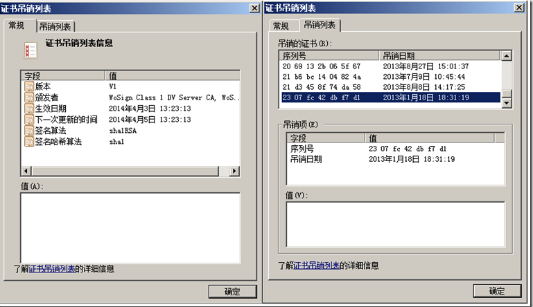

#### 证书吊销列表(CRL)介绍
- 一、证书吊销列表(CRL)
  - 证书吊销列表 (Certificate Revocation List ，简称： CRL) 是 PKI 系统中的一个结构化数据文件，该文件包含了证书颁发机构 (CA) 已经吊销的证书的序列号及其吊销日期。 CRL 文件中还包含证书颁发机构信息、吊销列表失效时间和下一次更新时间，以及采用的签名算法等。证书吊销列表最短的有效期为一个小时，一般为 1 天，甚至一个月不等，由各个证书颁发机构在设置其证书颁发系统时设置。如下图所示：
  
  - 证书吊销列表分发点 (CRL Distribution Point ，简称 CDP) 是含在数字证书中的一个可以共各种应用软件自动下载的最新的 CRL 的位置信息。一个 CDP 通常出现在数字证书的 详细信息 选项卡的 CRL 分发点 域，一般会列出多个使用不同的访问方法，以确保如 Web 浏览器和 Web 服务器程序始终可以获取最新的 CRL 。 CDP 一般是一个可以访问 http 网址， 如下图所示：
  
- 二、证书吊销列表(CRL)与证书状态在线查询协议（OCSP）

  - 讲到吊销列表，就不得不讲讲 OCSP ， Online Certificate Status Protocol, 证书状态在线查询协议， 是 IETF 颁布的用于实时查询数字证书在某一时间是否有效的标准。
  - 上面已经提到，一般 CA 都只是 每隔一定时间 ( 几天或几个月 ) 才发布新的吊销列表，可以看出： CRL 是 不能及时反映证书的实际状态的。而 OCSP 就能满足实时在线查询证书状态的要求。它为电子商务网站提供了一种实时检验数字证书有效性的途径，比下载和处理 CRL 的传统方式更快、更方便和更具独立性。请求者发送查询请求， OCSP 服务器会返回证书可能的三个状态：正常、吊销和未知。
  - OCSP 服务由独立的 OCSP 服务器来提供服务，目前WoSign新证书颁发系统支持 OCSP 方式查询证书状态。 OCSP 也是一个可以访问的 http 网站，如下图所示：
  

- 三、证书吊销列表(CRL)的作用
  - 那么，证书吊销列表起什么作用？为了演示，我们在测试站点上部署了一张吊销了的SSL证书，https://revoked-demo.wosign.com 。上面已经提到是供有关软件查询证书是否被吊销，还是让我们来看看浏览器是如何查询吊销列表的。 浏览器在使用 https:// 访问已经部署了 SSL 证书的网站时，一定会先检查此 SSL 证书是否已经被吊销，也就是说会查询吊销列表或 OCSP 服务， 如果此证书已经被证书颁发机构吊销，则会显示警告信息： “此组织的证书已被吊销。安全证书问题可能显示试图欺骗您或截获您向服务器发送的数据。建议关闭此网页，并且不要继续浏览该网站。 ”
  

- 值得注意的是： 目前有些 CA 颁发的证书和大部分自签SSL证书都没有提供吊销列表 (CRL) 服务或证书 吊销列表分发点是不可访问的 ，当然更别提 OSCP 服务，这是非常危险的，因为如果证书丢失或被盗而无法吊销的话，就极有可能被用于非法用途而让用户蒙受损失。
 